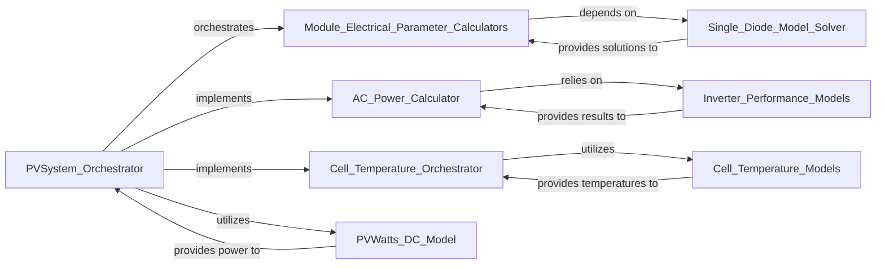

## Details

The pvlib.pvsystem subsystem, centered around the PVSystem_Orchestrator, provides a comprehensive framework for modeling photovoltaic system performance. The PVSystem_Orchestrator acts as the central control point, encapsulating system parameters and orchestrating various calculations. It directly implements functionalities like AC_Power_Calculator and Cell_Temperature_Orchestrator to derive key operational metrics. These internal orchestrators, in turn, leverage specialized external components such as Inverter_Performance_Models and Cell_Temperature_Models. Furthermore, the PVSystem_Orchestrator initiates the calculation of module electrical parameters via Module_Electrical_Parameter_Calculators, which rely on the Single_Diode_Model_Solver for core physics-based computations. The subsystem also integrates simplified models like PVWatts_DC_Model for quick estimations, demonstrating a layered approach to PV system modeling.

### PVSystem_Orchestrator
Acts as the primary orchestrator and data container for a PV system. It encapsulates physical and electrical characteristics (modules, arrays, inverters) and provides high-level methods to initiate various calculations across the system.

**Related Classes/Methods**:

- <a href="https://github.com/pvlib/pvlib-python/blob/main/pvlib/pvsystem.py#L74-L896" target="_blank" rel="noopener noreferrer">`pvlib.pvsystem.PVSystem`:74-896</a>

### Module_Electrical_Parameter_Calculators
These functions are responsible for deriving the electrical parameters (e.g., short-circuit current, open-circuit voltage, maximum power point) of a PV module under specific operating conditions, often by utilizing single-diode models.

**Related Classes/Methods**:

- <a href="https://github.com/pvlib/pvlib-python/blob/main/pvlib/pvsystem.py#L1517-L1729" target="_blank" rel="noopener noreferrer">`pvlib.pvsystem.calcparams_desoto`:1517-1729</a>
- <a href="https://github.com/pvlib/pvlib-python/blob/main/pvlib/pvsystem.py#L1732-L1845" target="_blank" rel="noopener noreferrer">`pvlib.pvsystem.calcparams_cec`:1732-1845</a>
- <a href="https://github.com/pvlib/pvlib-python/blob/main/pvlib/pvsystem.py#L1848-L1983" target="_blank" rel="noopener noreferrer">`pvlib.pvsystem.calcparams_pvsyst`:1848-1983</a>

### Single_Diode_Model_Solver
Implements the core mathematical solution for the single-diode model, which is fundamental for characterizing the current-voltage (IV) behavior of PV modules and determining their maximum power point.

**Related Classes/Methods**:

- <a href="https://github.com/pvlib/pvlib-python/blob/main/pvlib/singlediode.py#L59-L204" target="_blank" rel="noopener noreferrer">`pvlib.singlediode.bishop88`:59-204</a>

### Inverter_Performance_Models
These functions model the performance of PV inverters, converting the DC power generated by the modules into usable AC power, accounting for efficiency and operational limits.

**Related Classes/Methods**:

- <a href="https://github.com/pvlib/pvlib-python/blob/main/pvlib/inverter.py#L53-L137" target="_blank" rel="noopener noreferrer">`pvlib.inverter.sandia`:53-137</a>
- <a href="https://github.com/pvlib/pvlib-python/blob/main/pvlib/inverter.py#L333-L409" target="_blank" rel="noopener noreferrer">`pvlib.inverter.pvwatts`:333-409</a>

### Cell_Temperature_Models
These functions calculate the operating cell temperature of PV modules based on environmental conditions (e.g., irradiance, ambient temperature, wind speed), which is a critical input for accurate electrical performance modeling.

**Related Classes/Methods**:

- <a href="https://github.com/pvlib/pvlib-python/blob/main/pvlib/temperature.py#L58-L162" target="_blank" rel="noopener noreferrer">`pvlib.temperature.sapm_cell`:58-162</a>
- <a href="https://github.com/pvlib/pvlib-python/blob/main/pvlib/temperature.py#L699-L881" target="_blank" rel="noopener noreferrer">`pvlib.temperature.fuentes`:699-881</a>
- <a href="https://github.com/pvlib/pvlib-python/blob/main/pvlib/temperature.py#L894-L987" target="_blank" rel="noopener noreferrer">`pvlib.temperature.noct_sam`:894-987</a>

### AC_Power_Calculator
A method within PVSystem_Orchestrator specifically tasked with calculating the total AC power output of the PV system by leveraging the appropriate inverter models.

**Related Classes/Methods**:

- <a href="https://github.com/pvlib/pvlib-python/blob/main/pvlib/pvsystem.py#L750-L819" target="_blank" rel="noopener noreferrer">`pvlib.pvsystem.get_ac`:750-819</a>

### Cell_Temperature_Orchestrator
A method within PVSystem_Orchestrator responsible for orchestrating the calculation of the PV module's operating cell temperature by calling the relevant temperature models.

**Related Classes/Methods**:

- <a href="https://github.com/pvlib/pvlib-python/blob/main/pvlib/pvsystem.py#L1206-L1291" target="_blank" rel="noopener noreferrer">`pvlib.pvsystem.get_cell_temperature`:1206-1291</a>

### PVWatts_DC_Model
Implements the simplified PVWatts DC power model, providing a quick estimation of DC power output based on module and array characteristics.

**Related Classes/Methods**:

- <a href="https://github.com/pvlib/pvlib-python/blob/main/pvlib/pvsystem.py#L2861-L2910" target="_blank" rel="noopener noreferrer">`pvlib.pvsystem.pvwatts_dc`:2861-2910</a>

### [FAQ](https://github.com/CodeBoarding/GeneratedOnBoardings/tree/main?tab=readme-ov-file#faq)