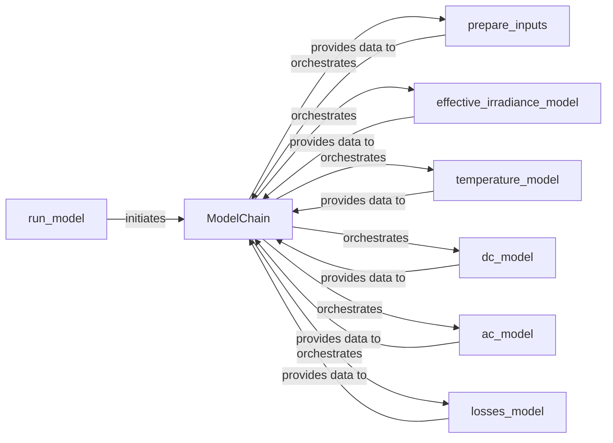

## Details

The `pvlib.modelchain` subsystem is designed around the `ModelChain` class, which acts as the central orchestrator for simulating photovoltaic (PV) system performance. The `run_model` function serves as the primary entry point, typically instantiating and utilizing a `ModelChain` object to execute the entire simulation pipeline. Within the `ModelChain`, a series of interconnected methods—`prepare_inputs`, `effective_irradiance_model`, `temperature_model`, `dc_model`, `ac_model`, and `losses_model`—represent distinct stages of the simulation. `prepare_inputs` handles initial data processing, followed by `effective_irradiance_model` for irradiance calculations, `temperature_model` for cell temperature, `dc_model` for DC power output, `ac_model` for AC power conversion, and finally `losses_model` to account for system losses. This sequential execution within the `ModelChain` forms a clear data flow, where the output of one stage serves as the input for the next, culminating in the final AC power output.

### ModelChain
The central orchestrator and facade for the entire PV system simulation. It initializes and holds references to various sub-model functions, manages the sequential execution of simulation steps, and provides a high-level, configurable interface for users to run complete simulations. It embodies the pipeline pattern by chaining together different processing stages.

**Related Classes/Methods**:

- <a href="https://github.com/pvlib/pvlib-python/blob/main/pvlib/modelchain.py#L287-L1836" target="_blank" rel="noopener noreferrer">`pvlib.modelchain.ModelChain`:287-1836</a>

### run_model
Serves as the main public entry point for initiating a PV system simulation from raw weather data. It typically instantiates and utilizes a `ModelChain` object to execute the full simulation pipeline.

**Related Classes/Methods**:

- <a href="https://github.com/pvlib/pvlib-python/blob/main/pvlib/modelchain.py" target="_blank" rel="noopener noreferrer">`pvlib.modelchain.ModelChain.run_model`</a>

### prepare_inputs
A method of `ModelChain` that pre-processes and validates raw input data (e.g., weather, solar position) to ensure it's in the correct format and contains all necessary information for subsequent modeling stages. This is a critical data preparation step in any data processing pipeline.

**Related Classes/Methods**:

- <a href="https://github.com/pvlib/pvlib-python/blob/main/pvlib/modelchain.py" target="_blank" rel="noopener noreferrer">`pvlib.modelchain.ModelChain.prepare_inputs`</a>

### effective_irradiance_model
A method of `ModelChain` that calculates the effective irradiance incident on the PV module. This is a core scientific computation, transforming raw irradiance data into a usable input for power conversion models.

**Related Classes/Methods**:

- <a href="https://github.com/pvlib/pvlib-python/blob/main/pvlib/modelchain.py" target="_blank" rel="noopener noreferrer">`pvlib.modelchain.ModelChain.effective_irradiance_model`</a>

### temperature_model
A method of `ModelChain` that determines the operating cell temperature of the PV modules, a critical factor influencing module efficiency. This is a key environmental modeling component.

**Related Classes/Methods**:

- <a href="https://github.com/pvlib/pvlib-python/blob/main/pvlib/modelchain.py" target="_blank" rel="noopener noreferrer">`pvlib.modelchain.ModelChain.temperature_model`</a>

### dc_model
A method of `ModelChain` that calculates the DC power output of the PV array based on module characteristics and environmental conditions. This is a central computational component of the PV system model.

**Related Classes/Methods**:

- <a href="https://github.com/pvlib/pvlib-python/blob/main/pvlib/modelchain.py" target="_blank" rel="noopener noreferrer">`pvlib.modelchain.ModelChain.dc_model`</a>

### ac_model
A method of `ModelChain` that calculates the AC power output from the inverter, converting the DC power to usable AC power. This represents a crucial data transformation and final stage in the power output pipeline.

**Related Classes/Methods**:

- <a href="https://github.com/pvlib/pvlib-python/blob/main/pvlib/modelchain.py" target="_blank" rel="noopener noreferrer">`pvlib.modelchain.ModelChain.ac_model`</a>

### losses_model
A method of `ModelChain` that accounts for any additional system losses (e.g., soiling, shading, wiring) not covered by other specific models. This is a final data refinement step in the simulation.

**Related Classes/Methods**:

- <a href="https://github.com/pvlib/pvlib-python/blob/main/pvlib/modelchain.py" target="_blank" rel="noopener noreferrer">`pvlib.modelchain.ModelChain.losses_model`</a>

### [FAQ](https://github.com/CodeBoarding/GeneratedOnBoardings/tree/main?tab=readme-ov-file#faq)