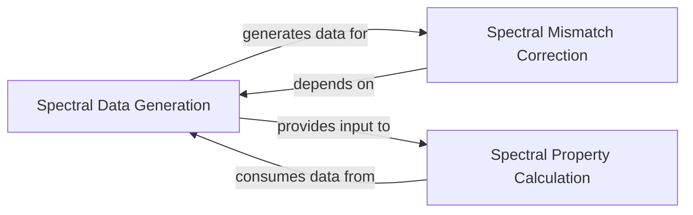

## Details

The `Spectral Modeling` subsystem is encapsulated within the `pvlib.spectrum` module. Its primary responsibility is to model the spectral distribution of sunlight and its influence on photovoltaic (PV) module performance, specifically through the calculation of spectral mismatch. This subsystem acts as a specialized data processing unit, providing spectral data and correction factors for downstream PV performance models.

### Spectral Data Generation
Implements the SPECTRAL2 model, a detailed physical model used to calculate the spectral distribution of direct normal and diffuse horizontal irradiance under various atmospheric conditions. This component is responsible for generating the raw, comprehensive spectral data that serves as input for other spectral analyses.

**Related Classes/Methods**:

- <a href="https://github.com/pvlib/pvlib-python/blob/main/pvlib/spectrum" target="_blank" rel="noopener noreferrer">`pvlib.spectrum.spectrl2`</a>

### Spectral Property Calculation
Calculates properties related to spectral irradiance, such as the average photon energy. This component processes raw spectral data to derive foundational spectral data points and metrics.

**Related Classes/Methods**:

- <a href="https://github.com/pvlib/pvlib-python/blob/main/pvlib/spectrum" target="_blank" rel="noopener noreferrer">`pvlib.spectrum.irradiance`</a>

### Spectral Mismatch Correction
Computes the spectral mismatch factor. This factor is critical for adjusting PV module performance predictions to account for differences between the actual incident solar spectrum and the reference spectrum under which the module was characterized.

**Related Classes/Methods**:

- <a href="https://github.com/pvlib/pvlib-python/blob/main/pvlib/spectrum" target="_blank" rel="noopener noreferrer">`pvlib.spectrum.mismatch`</a>

### [FAQ](https://github.com/CodeBoarding/GeneratedOnBoardings/tree/main?tab=readme-ov-file#faq)