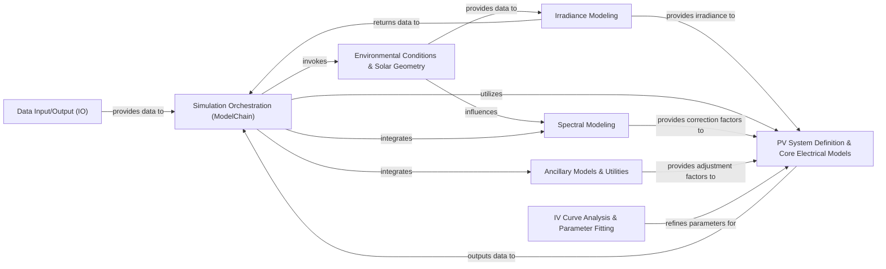

## Details

The `pvlib-python` architecture is designed as a highly modular and extensible data processing pipeline for photovoltaic system simulations. At its core, the `Simulation Orchestration (ModelChain)` component facilitates a configurable workflow, integrating various specialized modules. Data flows primarily from `Data Input/Output (IO)` into the `ModelChain`, which then sequentially invokes and coordinates calculations across `Environmental Conditions & Solar Geometry`, `Irradiance Modeling`, and `PV System Definition & Core Electrical Models`. Supporting components like `Spectral Modeling`, `IV Curve Analysis & Parameter Fitting`, and `Ancillary Models & Utilities` provide crucial adjustments and parameter refinements, ensuring comprehensive and accurate simulation results. This component-based design allows users to construct custom simulation workflows by chaining together different functional blocks, making it ideal for scientific computing and research in renewable energy.

### Data Input/Output (IO) [[Expand]](./Data_Input_Output_IO_.md)
Handles reading and initial structuring of various meteorological and PV system data from external sources (e.g., EPW, TMY, PSM3).

**Related Classes/Methods**:

- <a href="https://github.com/pvlib/pvlib-python/blob/main/pvlib/iotools/epw.py" target="_blank" rel="noopener noreferrer">`pvlib.iotools.epw`</a>
- <a href="https://github.com/pvlib/pvlib-python/blob/main/pvlib/iotools/tmy.py" target="_blank" rel="noopener noreferrer">`pvlib.iotools.tmy`</a>

### Environmental Conditions & Solar Geometry [[Expand]](./Environmental_Conditions_Solar_Geometry.md)
Calculates fundamental environmental parameters crucial for PV modeling, including solar position (zenith, azimuth), airmass, and identifies clearsky conditions.

**Related Classes/Methods**:

- <a href="https://github.com/pvlib/pvlib-python/blob/main/pvlib/solarposition.py" target="_blank" rel="noopener noreferrer">`pvlib.solarposition`</a>
- <a href="https://github.com/pvlib/pvlib-python/blob/main/pvlib/location.py" target="_blank" rel="noopener noreferrer">`pvlib.location`</a>
- <a href="https://github.com/pvlib/pvlib-python/blob/main/pvlib/clearsky.py" target="_blank" rel="noopener noreferrer">`pvlib.clearsky`</a>

### Irradiance Modeling [[Expand]](./Irradiance_Modeling.md)
Transforms global horizontal irradiance (GHI) into its direct, diffuse, and ground-reflected components on a tilted plane (Plane of Array - POA), including specialized models for bifacial PV systems.

**Related Classes/Methods**:

- <a href="https://github.com/pvlib/pvlib-python/blob/main/pvlib/irradiance.py" target="_blank" rel="noopener noreferrer">`pvlib.irradiance`</a>
- <a href="https://github.com/pvlib/pvlib-python/blob/main/pvlib/bifacial/infinite_sheds.py" target="_blank" rel="noopener noreferrer">`pvlib.bifacial.infinite_sheds`</a>

### PV System Definition & Core Electrical Models [[Expand]](./PV_System_Definition_Core_Electrical_Models.md)
Encapsulates the electrical and thermal characteristics of PV modules and inverters, modeling their behavior under varying environmental conditions, including DC power conversion and cell temperature.

**Related Classes/Methods**:

- <a href="https://github.com/pvlib/pvlib-python/blob/main/pvlib/pvsystem.py" target="_blank" rel="noopener noreferrer">`pvlib.pvsystem`</a>
- <a href="https://github.com/pvlib/pvlib-python/blob/main/pvlib/singlediode.py" target="_blank" rel="noopener noreferrer">`pvlib.singlediode`</a>
- <a href="https://github.com/pvlib/pvlib-python/blob/main/pvlib/inverter.py" target="_blank" rel="noopener noreferrer">`pvlib.inverter`</a>
- <a href="https://github.com/pvlib/pvlib-python/blob/main/pvlib/temperature.py" target="_blank" rel="noopener noreferrer">`pvlib.temperature`</a>

### Simulation Orchestration (ModelChain) [[Expand]](./Simulation_Orchestration_ModelChain_.md)
This is the high-level, configurable interface that orchestrates and chains together various PV models into a complete system simulation workflow, from raw weather data inputs to final AC power output.

**Related Classes/Methods**:

- <a href="https://github.com/pvlib/pvlib-python/blob/main/pvlib/modelchain.py" target="_blank" rel="noopener noreferrer">`pvlib.modelchain`</a>

### IV Curve Analysis & Parameter Fitting [[Expand]](./IV_Curve_Analysis_Parameter_Fitting.md)
Provides tools for analyzing current-voltage (IV) curves and fitting single diode model parameters from measured or simulated data, enabling characterization and optimization of PV module performance.

**Related Classes/Methods**:

- <a href="https://github.com/pvlib/pvlib-python/blob/main/pvlib/ivtools/sde.py" target="_blank" rel="noopener noreferrer">`pvlib.ivtools.sde`</a>

### Spectral Modeling [[Expand]](./Spectral_Modeling.md)
Models the spectral distribution of sunlight and its impact on PV module performance, including calculations for spectral mismatch, which adjusts for the module's response to different light wavelengths.

**Related Classes/Methods**:

- <a href="https://github.com/pvlib/pvlib-python/blob/main/pvlib/spectrum" target="_blank" rel="noopener noreferrer">`pvlib.spectrum`</a>

### Ancillary Models & Utilities
Contains various utility functions and specialized models for aspects like shading, snow losses, and solar tracking. These models often provide adjustments or additional inputs to the core PV system models.

**Related Classes/Methods**:

- <a href="https://github.com/pvlib/pvlib-python/blob/main/pvlib/shading.py" target="_blank" rel="noopener noreferrer">`pvlib.shading`</a>
- <a href="https://github.com/pvlib/pvlib-python/blob/main/pvlib/tracking.py" target="_blank" rel="noopener noreferrer">`pvlib.tracking`</a>

### [FAQ](https://github.com/CodeBoarding/GeneratedOnBoardings/tree/main?tab=readme-ov-file#faq)