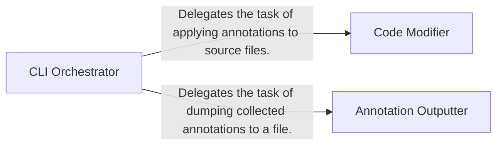

## Details

The `CLI Orchestrator` operates within the `pyannotate_tools.annotations` subsystem, which is responsible for the static code transformation phase of `pyannotate`.

### CLI Orchestrator [[Expand]](./CLI_Orchestrator.md)
The central control point for the `pyannotate_tools.annotations` subsystem. It parses command-line arguments, determines the execution mode (either dumping collected type information or applying static annotations to source files), and orchestrates the flow between the different processing stages of the static code transformation phase.

**Related Classes/Methods**:

- <a href="https://github.com/dropbox/pyannotate/blob/master/pyannotate_tools/annotations/__main__.py#L90-L149" target="_blank" rel="noopener noreferrer">`pyannotate_tools.annotations.__main__.main`:90-149</a>

### Code Modifier
Applies type annotations to source code files based on the collected type information. It leverages the `lib2to3` framework for robust code refactoring, ensuring correct and safe modifications.

**Related Classes/Methods**:

- <a href="https://github.com/dropbox/pyannotate/blob/master/pyannotate_tools/annotations/__main__.py#L51-L62" target="_blank" rel="noopener noreferrer">`pyannotate_tools.annotations.__main__.ModifiedRefactoringTool`:51-62</a>
- <a href="https://github.com/dropbox/pyannotate/blob/master/pyannotate_tools/fixes/fix_annotate_json.py" target="_blank" rel="noopener noreferrer">`pyannotate_tools.fixes.fix_annotate_json`</a>
- <a href="https://github.com/dropbox/pyannotate/blob/master/pyannotate_tools/fixes/fix_annotate.py" target="_blank" rel="noopener noreferrer">`pyannotate_tools.fixes.fix_annotate`</a>

### Annotation Outputter
Writes collected type information to a specified output, typically a JSON file, for persistence, debugging, or as an intermediate artifact for other tools.

**Related Classes/Methods**:

- <a href="https://github.com/dropbox/pyannotate/blob/master/pyannotate_tools/annotations/__main__.py#L65-L87" target="_blank" rel="noopener noreferrer">`pyannotate_tools.annotations.__main__.dump_annotations`:65-87</a>

### [FAQ](https://github.com/CodeBoarding/GeneratedOnBoardings/tree/main?tab=readme-ov-file#faq)