```mermaid
graph LR
    Type_Collection_Orchestrator["Type Collection Orchestrator"]
    Runtime_Event_Interceptor["Runtime Event Interceptor"]
    Type_Resolver["Type Resolver"]
    Type_Data_Aggregator["Type Data Aggregator"]
    Type_Data_Exporter["Type Data Exporter"]
    Type_Collection_Orchestrator -- "initiates" --> Runtime_Event_Interceptor
    Type_Collection_Orchestrator -- "triggers output via" --> Type_Data_Exporter
    Runtime_Event_Interceptor -- "sends raw type information to" --> Type_Resolver
    Type_Resolver -- "sends normalized type data to" --> Type_Data_Aggregator
    Type_Data_Aggregator -- "provides aggregated type statistics to" --> Type_Data_Exporter
```

## Details

The `pyannotate_runtime` subsystem is designed to dynamically collect and aggregate type information during Python program execution. The `Type Collection Orchestrator` initiates and manages this process by activating the `Runtime Event Interceptor`. The Interceptor captures raw runtime events and extracts unnormalized type data, which it then forwards to the `Type Resolver`. The `Type Resolver` is responsible for recursively analyzing and normalizing these raw types into a canonical form. The normalized type data is then sent to the `Type Data Aggregator`, which stores and merges the collected information, building a comprehensive type profile. Finally, the `Type Data Exporter` provides the interface to output the aggregated type statistics, applying filters and formatting for external consumption.

### Type Collection Orchestrator
Manages the overall lifecycle of runtime type collection. It initiates and halts the tracing mechanism by setting and unsetting `sys.settrace`, effectively starting and stopping the collection process. It orchestrates the flow from collection to data export.

**Related Classes/Methods**:

- <a href="https://github.com/dropbox/pyannotate/blob/master/pyannotate_runtime/collect_types.py#L741-L748" target="_blank" rel="noopener noreferrer">`pyannotate_runtime.collect_types.collect`:741-748</a>
- <a href="https://github.com/dropbox/pyannotate/blob/master/pyannotate_runtime/collect_types.py#L777-L784" target="_blank" rel="noopener noreferrer">`pyannotate_runtime.collect_types.start`:777-784</a>
- <a href="https://github.com/dropbox/pyannotate/blob/master/pyannotate_runtime/collect_types.py#L759-L766" target="_blank" rel="noopener noreferrer">`pyannotate_runtime.collect_types.stop`:759-766</a>

### Runtime Event Interceptor
This is the core instrumentation component. Registered with `sys.settrace`, it intercepts Python runtime events (e.g., function calls, returns) and extracts raw type information from function arguments and return values. It also handles initial argument preparation before type resolution.

**Related Classes/Methods**:

- <a href="https://github.com/dropbox/pyannotate/blob/master/pyannotate_runtime/collect_types.py#L821-L903" target="_blank" rel="noopener noreferrer">`pyannotate_runtime.collect_types._trace_dispatch`:821-903</a>
- <a href="https://github.com/dropbox/pyannotate/blob/master/pyannotate_runtime/collect_types.py#L552-L583" target="_blank" rel="noopener noreferrer">`pyannotate_runtime.collect_types.prep_args`:552-583</a>

### Type Resolver
Recursively analyzes and normalizes Python types encountered during execution. It handles various type constructs (e.g., basic types, lists, dictionaries, tuples, generics) to convert them into a canonical, annotatable form suitable for static analysis.

**Related Classes/Methods**:

- <a href="https://github.com/dropbox/pyannotate/blob/master/pyannotate_runtime/collect_types.py#L498-L549" target="_blank" rel="noopener noreferrer">`pyannotate_runtime.collect_types.resolve_type`:498-549</a>

### Type Data Aggregator
Stores and combines the collected type information. It manages a global dictionary of function signatures and their observed argument/return types, merging new observations with existing ones (e.g., forming union types for polymorphic functions) to build a comprehensive type profile.

**Related Classes/Methods**:

- <a href="https://github.com/dropbox/pyannotate/blob/master/pyannotate_runtime/collect_types.py#L336-L367" target="_blank" rel="noopener noreferrer">`pyannotate_runtime.collect_types.add`:336-367</a>
- <a href="https://github.com/dropbox/pyannotate/blob/master/pyannotate_runtime/collect_types.py#L369-L377" target="_blank" rel="noopener noreferrer">`pyannotate_runtime.collect_types.merge`:369-377</a>

### Type Data Exporter
Provides the public API for outputting the aggregated type statistics. It handles the internal logic for formatting and serializing the collected type data into a structured output (e.g., JSON), applying filters based on exclusion rules (e.g., ignoring types from specific modules or paths) before the final output.

**Related Classes/Methods**:

- <a href="https://github.com/dropbox/pyannotate/blob/master/pyannotate_runtime/collect_types.py#L942-L953" target="_blank" rel="noopener noreferrer">`pyannotate_runtime.collect_types.dump_stats`:942-953</a>
- <a href="https://github.com/dropbox/pyannotate/blob/master/pyannotate_runtime/collect_types.py#L956-L962" target="_blank" rel="noopener noreferrer">`pyannotate_runtime.collect_types.dumps_stats`:956-962</a>
- <a href="https://github.com/dropbox/pyannotate/blob/master/pyannotate_runtime/collect_types.py#L921-L939" target="_blank" rel="noopener noreferrer">`pyannotate_runtime.collect_types._dump_impl`:921-939</a>
- <a href="https://github.com/dropbox/pyannotate/blob/master/pyannotate_runtime/collect_types.py#L909-L918" target="_blank" rel="noopener noreferrer">`pyannotate_runtime.collect_types._filter_types`:909-918</a>

### [FAQ](https://github.com/CodeBoarding/GeneratedOnBoardings/tree/main?tab=readme-ov-file#faq)