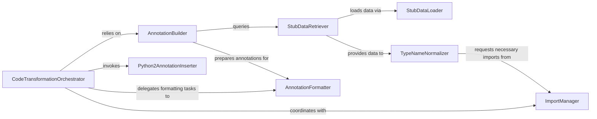

## Details

The `Source Code Annotator` is a core subsystem within `pyannotate`, responsible for the "Static Code Transformation" phase. It modifies Python source files by inserting inferred type annotations directly into the code, leveraging Python's `lib2to3` for Abstract Syntax Tree (AST) manipulation.

### CodeTransformationOrchestrator
Manages the overall process of applying type annotations to a Python source file's Abstract Syntax Tree (AST), adapting to Python 2 or Python 3 syntax. It is the core logic driver for the code modification.

**Related Classes/Methods**:

- <a href="https://github.com/dropbox/pyannotate/blob/master/pyannotate_tools/fixes/fix_annotate.py#L61-L188" target="_blank" rel="noopener noreferrer">`pyannotate_tools.fixes.fix_annotate.transform`:61-188</a>

### StubDataLoader
Initializes and loads the raw annotation data from the JSON stub file into internal data structures, making it accessible for retrieval by other components.

**Related Classes/Methods**:

- <a href="https://github.com/dropbox/pyannotate/blob/master/pyannotate_tools/fixes/fix_annotate_json.py#L217-L220" target="_blank" rel="noopener noreferrer">`pyannotate_tools.fixes.fix_annotate_json.init_stub_json`:217-220</a>

### StubDataRetriever
Fetches specific type annotations for functions and methods from the pre-generated JSON stub data. It acts as the interface to the collected type information.

**Related Classes/Methods**:

- <a href="https://github.com/dropbox/pyannotate/blob/master/pyannotate_tools/fixes/fix_annotate_json.py#L222-L295" target="_blank" rel="noopener noreferrer">`pyannotate_tools.fixes.fix_annotate_json.get_annotation_from_stub`:222-295</a>

### TypeNameNormalizer
Iterates through and transforms type names retrieved from the stub, ensuring consistency, correctness, and proper formatting (e.g., adding `typing` module prefixes where required).

**Related Classes/Methods**:

- <a href="https://github.com/dropbox/pyannotate/blob/master/pyannotate_tools/fixes/fix_annotate_json.py#L297-L300" target="_blank" rel="noopener noreferrer">`pyannotate_tools.fixes.fix_annotate_json.update_type_names`:297-300</a>

### ImportManager
Manages the addition of necessary import statements (e.g., `typing`) to the source file's AST based on the types being annotated. It ensures the modified code remains syntactically correct and runnable.

**Related Classes/Methods**:

- <a href="https://github.com/dropbox/pyannotate/blob/master/pyannotate_tools/fixes/fix_annotate.py#L344-L348" target="_blank" rel="noopener noreferrer">`pyannotate_tools.fixes.fix_annotate.patch_imports`:344-348</a>
- <a href="https://github.com/dropbox/pyannotate/blob/master/pyannotate_tools/fixes/fix_annotate_json.py#L159-L164" target="_blank" rel="noopener noreferrer">`pyannotate_tools.fixes.fix_annotate_json.add_import`:159-164</a>

### AnnotationBuilder
Constructs the complete annotation structure for a given function or method, primarily by querying the stub data for type information and preparing it for formatting.

**Related Classes/Methods**:

- <a href="https://github.com/dropbox/pyannotate/blob/master/pyannotate_tools/fixes/fix_annotate_json.py#L179-L196" target="_blank" rel="noopener noreferrer">`pyannotate_tools.fixes.fix_annotate_json.make_annotation`:179-196</a>

### AnnotationFormatter
Prepares and formats the annotation details into the correct string representation (e.g., `-> int`, `: str`) before they are inserted into the code's AST.

**Related Classes/Methods**:

- <a href="https://github.com/dropbox/pyannotate/blob/master/pyannotate_tools/fixes/fix_annotate.py#L350-L411" target="_blank" rel="noopener noreferrer">`pyannotate_tools.fixes.fix_annotate.make_annotation`:350-411</a>

### Python2AnnotationInserter
Specifically handles the insertion of Python 2 style type comments (e.g., `# type: (str) -> None`) into the source code's AST. This component addresses backward compatibility.

**Related Classes/Methods**:

- <a href="https://github.com/dropbox/pyannotate/blob/master/pyannotate_tools/fixes/fix_annotate.py#L259-L285" target="_blank" rel="noopener noreferrer">`pyannotate_tools.fixes.fix_annotate.add_py2_annot`:259-285</a>

### [FAQ](https://github.com/CodeBoarding/GeneratedOnBoardings/tree/main?tab=readme-ov-file#faq)