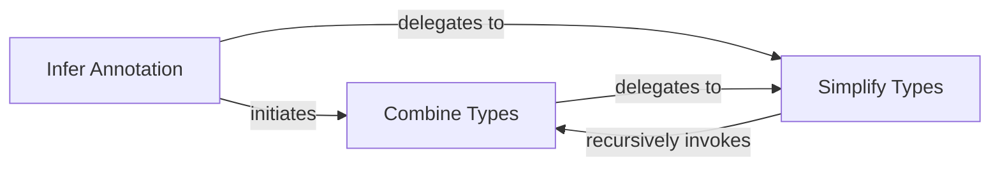

## Details

The `pyannotate_tools` subsystem for type inference is structured around a core flow that processes and refines type information. The `Infer Annotation` component acts as the initial orchestrator, taking raw type data and preparing it for further processing. It delegates to both `Combine Types` and `Simplify Types` to achieve its goal. The `Combine Types` component is crucial for consolidating disparate type suggestions into a unified representation, often by leveraging `Simplify Types` to refine the individual types before combination. Conversely, `Simplify Types` is responsible for the core static analysis, reducing complex type structures and eliminating redundancies. This component can recursively invoke `Combine Types` when it encounters scenarios where multiple simplified types need to be merged, creating a tightly coupled feedback loop that ensures robust and accurate type inference. This iterative refinement process is central to the subsystem's ability to generate precise and consistent type annotations.

### Infer Annotation
Serves as the primary entry point for the type inference process within the `pyannotate_tools` phase. It orchestrates the initial consolidation and preparation of raw type data received from the runtime collection phase. This component acts as the initial processing unit, preparing the data for subsequent simplification.

**Related Classes/Methods**:

- <a href="https://github.com/dropbox/pyannotate/blob/master/pyannotate_tools/annotations/infer.py#L32-L66" target="_blank" rel="noopener noreferrer">`pyannotate_tools.annotations.infer.infer_annotation`:32-66</a>

### Combine Types
Responsible for consolidating multiple type suggestions for a given entity (e.g., a variable, parameter, or return value) into a single, coherent, and unified type representation. It ensures that various observed types are merged logically, resolving potential conflicts or overlaps by simplifying them and forming unions when necessary.

**Related Classes/Methods**:

- <a href="https://github.com/dropbox/pyannotate/blob/master/pyannotate_tools/annotations/infer.py#L81-L92" target="_blank" rel="noopener noreferrer">`pyannotate_tools.annotations.infer.combine_types`:81-92</a>

### Simplify Types
This is the core component responsible for refining and simplifying inferred types. It applies a set of rules and heuristics to eliminate redundancies, resolve complex type structures (e.g., nested unions), and ensure the consistency and precision of the final type annotation. It embodies the "Static Analysis" aspect by transforming raw data into a more usable and correct form.

**Related Classes/Methods**:

- <a href="https://github.com/dropbox/pyannotate/blob/master/pyannotate_tools/annotations/infer.py#L95-L109" target="_blank" rel="noopener noreferrer">`pyannotate_tools.annotations.infer.simplify_types`:95-109</a>

### [FAQ](https://github.com/CodeBoarding/GeneratedOnBoardings/tree/main?tab=readme-ov-file#faq)