```mermaid
graph LR
    CLI_Orchestrator["CLI Orchestrator"]
    Runtime_Type_Collector["Runtime Type Collector"]
    Type_Data_Persister["Type Data Persister"]
    Type_Data_Loader["Type Data Loader"]
    Type_Annotation_Inferer["Type Annotation Inferer"]
    Source_Code_Annotator["Source Code Annotator"]
    File_System_Manager["File System Manager"]
    CLI_Orchestrator -- "initiates" --> Runtime_Type_Collector
    Runtime_Type_Collector -- "generates data for" --> Type_Data_Persister
    Type_Data_Persister -- "outputs JSON to" --> File_System_Manager
    File_System_Manager -- "provides JSON to" --> Type_Data_Loader
    Type_Data_Loader -- "feeds data to" --> Type_Annotation_Inferer
    Type_Annotation_Inferer -- "provides annotations to" --> Source_Code_Annotator
    Source_Code_Annotator -- "modifies files in" --> File_System_Manager
    CLI_Orchestrator -- "orchestrates" --> Type_Data_Loader
    CLI_Orchestrator -- "orchestrates" --> Source_Code_Annotator
    click CLI_Orchestrator href "https://github.com/CodeBoarding/GeneratedOnBoardings/blob/main/pyannotate/CLI_Orchestrator.md" "Details"
    click Runtime_Type_Collector href "https://github.com/CodeBoarding/GeneratedOnBoardings/blob/main/pyannotate/Runtime_Type_Collector.md" "Details"
    click Type_Annotation_Inferer href "https://github.com/CodeBoarding/GeneratedOnBoardings/blob/main/pyannotate/Type_Annotation_Inferer.md" "Details"
    click Source_Code_Annotator href "https://github.com/CodeBoarding/GeneratedOnBoardings/blob/main/pyannotate/Source_Code_Annotator.md" "Details"
```

## Details

The `pyannotate` architecture is designed around a clear separation of concerns, facilitating both dynamic type collection and static code transformation. The `CLI Orchestrator` acts as the system's entry point, directing the flow between the `Runtime Type Collector` and the subsequent `Type Data Persister` for runtime analysis, or the `Type Data Loader`, `Type Annotation Inferer`, and `Source Code Annotator` for static analysis. The `File System Manager` serves as a crucial conceptual component, abstracting the persistent storage and retrieval operations for both intermediate type data (JSON) and the Python source files themselves, ensuring data continuity across different stages of the annotation process. This modular design allows for independent development and testing of each stage, contributing to a robust and maintainable system.

### CLI Orchestrator [[Expand]](./CLI_Orchestrator.md)
The central control point for `pyannotate`. It parses command-line arguments, determines the execution mode (runtime collection or static annotation application), and orchestrates the flow between the different processing stages.

**Related Classes/Methods**:

- <a href="https://github.com/dropbox/pyannotate/blob/master/pyannotate_tools/annotations/__main__.py#L90-L149" target="_blank" rel="noopener noreferrer">`pyannotate_tools.annotations.__main__.main`:90-149</a>

### Runtime Type Collector [[Expand]](./Runtime_Type_Collector.md)
Responsible for dynamically observing and gathering type information from Python programs during their execution. This component instruments the runtime environment to capture type details.

**Related Classes/Methods**:

- <a href="https://github.com/dropbox/pyannotate/blob/master/pyannotate_runtime/collect_types.py#L741-L748" target="_blank" rel="noopener noreferrer">`pyannotate_runtime.collect_types.collect`:741-748</a>
- <a href="https://github.com/dropbox/pyannotate/blob/master/pyannotate_runtime/collect_types.py#L821-L903" target="_blank" rel="noopener noreferrer">`pyannotate_runtime.collect_types._trace_dispatch`:821-903</a>
- <a href="https://github.com/dropbox/pyannotate/blob/master/pyannotate_runtime/collect_types.py#L498-L549" target="_blank" rel="noopener noreferrer">`pyannotate_runtime.collect_types.resolve_type`:498-549</a>

### Type Data Persister
Converts the raw, collected runtime type data into a structured, persistent JSON format. This component acts as the output gateway for the runtime collection phase.

**Related Classes/Methods**:

- <a href="https://github.com/dropbox/pyannotate/blob/master/pyannotate_runtime/collect_types.py#L942-L953" target="_blank" rel="noopener noreferrer">`pyannotate_runtime.collect_types.dump_stats`:942-953</a>

### Type Data Loader
Reads and interprets the serialized type data from the JSON file, converting it into an internal representation suitable for static analysis. This is the input gateway for the static transformation phase.

**Related Classes/Methods**:

- <a href="https://github.com/dropbox/pyannotate/blob/master/pyannotate_tools/annotations/parse.py#L96-L133" target="_blank" rel="noopener noreferrer">`pyannotate_tools.annotations.parse.parse_json`:96-133</a>

### Type Annotation Inferer [[Expand]](./Type_Annotation_Inferer.md)
Analyzes the parsed type data to infer more precise, simplified, and consistent type annotations for Python code. This component embodies the core logic for type deduction.

**Related Classes/Methods**:

- <a href="https://github.com/dropbox/pyannotate/blob/master/pyannotate_tools/annotations/infer.py#L32-L66" target="_blank" rel="noopener noreferrer">`pyannotate_tools.annotations.infer.infer_annotation`:32-66</a>
- <a href="https://github.com/dropbox/pyannotate/blob/master/pyannotate_tools/annotations/infer.py#L95-L109" target="_blank" rel="noopener noreferrer">`pyannotate_tools.annotations.infer.simplify_types`:95-109</a>

### Source Code Annotator [[Expand]](./Source_Code_Annotator.md)
Modifies Python source files by inserting the inferred type annotations directly into the code. This component leverages Python's `lib2to3` refactoring capabilities.

**Related Classes/Methods**:

- <a href="https://github.com/dropbox/pyannotate/blob/master/pyannotate_tools/fixes/fix_annotate.py#L61-L188" target="_blank" rel="noopener noreferrer">`pyannotate_tools.fixes.fix_annotate.transform`:61-188</a>
- <a href="https://github.com/dropbox/pyannotate/blob/master/pyannotate_tools/fixes/fix_annotate_json.py#L222-L295" target="_blank" rel="noopener noreferrer">`pyannotate_tools.fixes.fix_annotate_json.get_annotation_from_stub`:222-295</a>

### File System Manager
A conceptual component representing the interactions with the underlying file system for persistent storage and retrieval of files, including intermediate JSON data and source code files.

**Related Classes/Methods**:

- <a href="https://github.com/dropbox/pyannotate/blob/master/pyannotate_runtime/collect_types.py#L942-L953" target="_blank" rel="noopener noreferrer">`pyannotate_runtime.collect_types.dump_stats`:942-953</a>
- <a href="https://github.com/dropbox/pyannotate/blob/master/pyannotate_tools/annotations/parse.py#L96-L133" target="_blank" rel="noopener noreferrer">`pyannotate_tools.annotations.parse.parse_json`:96-133</a>

### [FAQ](https://github.com/CodeBoarding/GeneratedOnBoardings/tree/main?tab=readme-ov-file#faq)