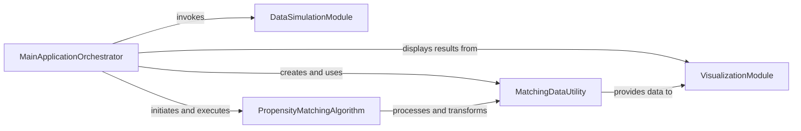

## Component Details

The Application Orchestrator is the central control unit of the pybalance application. It manages the entire workflow, from user interaction and data input (either simulated or uploaded) to initiating the propensity score matching process and finally visualizing the results. It coordinates the interactions between data generation, data handling, matching algorithms, and visualization components to provide a complete end-to-end solution for propensity score matching.

### MainApplicationOrchestrator
This component acts as the primary entry point and orchestrator for the pybalance application. It handles user interactions, triggers data generation or loading, and initiates the propensity score matching process. It manages the overall flow of the application, from data input to displaying results.

**Related Classes/Methods**:

- <a href="https://github.com/Bayer-Group/pybalance/blob/master/bin/main.py#L27-L33" target="_blank" rel="noopener noreferrer">`pybalance.bin.main:generate_data` (27:33)</a>
- <a href="https://github.com/Bayer-Group/pybalance/blob/master/bin/main.py#L36-L59" target="_blank" rel="noopener noreferrer">`pybalance.bin.main:load_data` (36:59)</a>
- <a href="https://github.com/Bayer-Group/pybalance/blob/master/bin/main.py#L62-L78" target="_blank" rel="noopener noreferrer">`pybalance.bin.main:match` (62:78)</a>

### DataSimulationModule
This module is responsible for generating synthetic datasets for testing and demonstration purposes. It provides functions to create toy datasets with specified characteristics, including different population sizes and feature distributions, which are then used by the main application.

**Related Classes/Methods**:

- <a href="https://github.com/Bayer-Group/pybalance/blob/master/pybalance/sim/rng.py#L169-L183" target="_blank" rel="noopener noreferrer">`pybalance.sim.rng.generate_toy_dataset` (169:183)</a>

### MatchingDataUtility
This component provides core data structures and utility functions for handling and manipulating matching-related data. It defines the MatchingData class, which wraps pandas DataFrames with additional metadata like population columns and feature headers, and includes functions for splitting data into target and pool populations.

**Related Classes/Methods**:

- <a href="https://github.com/Bayer-Group/pybalance/blob/master/pybalance/utils/matching_data.py#L101-L367" target="_blank" rel="noopener noreferrer">`pybalance.utils.matching_data.MatchingData` (101:367)</a>
- <a href="https://github.com/Bayer-Group/pybalance/blob/master/pybalance/utils/matching_data.py#L370-L418" target="_blank" rel="noopener noreferrer">`pybalance.utils.matching_data.split_target_pool` (370:418)</a>

### PropensityMatchingAlgorithm
This component encapsulates the logic for performing propensity score matching. It includes the PropensityScoreMatcher class, which trains propensity score models, searches for optimal hyperparameters, and applies various matching methods (greedy, linear sum assignment) to balance populations.

**Related Classes/Methods**:

- <a href="https://github.com/Bayer-Group/pybalance/blob/master/pybalance/propensity/matcher.py#L36-L269" target="_blank" rel="noopener noreferrer">`pybalance.propensity.matcher.PropensityScoreMatcher` (36:269)</a>

### VisualizationModule
This module is responsible for generating various plots and visualizations to display the results of the matching process, including numeric and categorical feature distributions, and per-feature loss.

**Related Classes/Methods**:

- `pybalance.visualization.plot_numeric_features` (full file reference)
- `pybalance.visualization.plot_categoric_features` (full file reference)
- `pybalance.visualization.plot_per_feature_loss` (full file reference)

### [FAQ](https://github.com/CodeBoarding/GeneratedOnBoardings/tree/main?tab=readme-ov-file#faq)