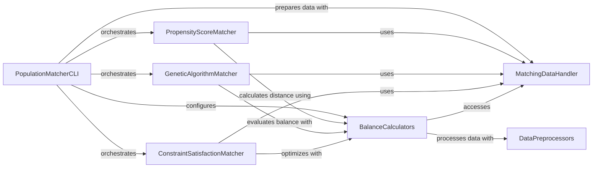

## Component Details

The system aims to match patient populations using various algorithms, evaluating the quality of matches with balance metrics. The `PopulationMatcherCLI` acts as the central orchestrator, handling data preparation via `MatchingDataHandler`, and then delegating the matching task to specialized matchers like `PropensityScoreMatcher`, `GeneticAlgorithmMatcher`, or `ConstraintSatisfactionMatcher`. All matching algorithms rely on `BalanceCalculators` to assess the similarity between matched groups, and `DataPreprocessors` assist in preparing the data for these calculations.

### PopulationMatcherCLI
This component serves as the command-line interface and orchestrator for the entire patient population matching process. It handles argument parsing, sets up the input data, selects the appropriate matching algorithm (Propensity Score, Genetic Algorithm, or Constraint Satisfaction), and manages the saving of the final matched population.

**Related Classes/Methods**:

- <a href="https://github.com/Bayer-Group/pybalance/blob/master/bin/population_match.py#L369-L385" target="_blank" rel="noopener noreferrer">`pybalance.bin.population_match:main` (369:385)</a>
- <a href="https://github.com/Bayer-Group/pybalance/blob/master/bin/population_match.py#L32-L68" target="_blank" rel="noopener noreferrer">`pybalance.bin.population_match:_setup_matching_data` (32:68)</a>
- <a href="https://github.com/Bayer-Group/pybalance/blob/master/bin/population_match.py#L71-L87" target="_blank" rel="noopener noreferrer">`pybalance.bin.population_match:duplicate_target` (71:87)</a>
- <a href="https://github.com/Bayer-Group/pybalance/blob/master/bin/population_match.py#L345-L363" target="_blank" rel="noopener noreferrer">`pybalance.bin.population_match:get_balance_calculator` (345:363)</a>
- <a href="https://github.com/Bayer-Group/pybalance/blob/master/bin/population_match.py#L334-L342" target="_blank" rel="noopener noreferrer">`pybalance.bin.population_match:save_match` (334:342)</a>
- <a href="https://github.com/Bayer-Group/pybalance/blob/master/bin/population_match.py#L192-L331" target="_blank" rel="noopener noreferrer">`pybalance.bin.population_match:parse_command_line` (192:331)</a>
- <a href="https://github.com/Bayer-Group/pybalance/blob/master/bin/population_match.py#L90-L131" target="_blank" rel="noopener noreferrer">`pybalance.bin.population_match:ea_train` (90:131)</a>
- <a href="https://github.com/Bayer-Group/pybalance/blob/master/bin/population_match.py#L134-L164" target="_blank" rel="noopener noreferrer">`pybalance.bin.population_match:lp_train` (134:164)</a>
- <a href="https://github.com/Bayer-Group/pybalance/blob/master/bin/population_match.py#L167-L189" target="_blank" rel="noopener noreferrer">`pybalance.bin.population_match:ps_train` (167:189)</a>

### MatchingDataHandler
This component is responsible for the core functionalities related to managing and manipulating the input data for the matching process. It includes loading data from various sources, splitting the data into target and pool populations, and providing a structured representation of the matching data.

**Related Classes/Methods**:

- <a href="https://github.com/Bayer-Group/pybalance/blob/master/pybalance/utils/matching_data.py#L101-L367" target="_blank" rel="noopener noreferrer">`pybalance.utils.matching_data.MatchingData` (101:367)</a>
- <a href="https://github.com/Bayer-Group/pybalance/blob/master/pybalance/utils/matching_data.py#L91-L98" target="_blank" rel="noopener noreferrer">`pybalance.utils.matching_data._load_matching_data` (91:98)</a>
- <a href="https://github.com/Bayer-Group/pybalance/blob/master/pybalance/utils/matching_data.py#L370-L418" target="_blank" rel="noopener noreferrer">`pybalance.utils.matching_data.split_target_pool` (370:418)</a>

### BalanceCalculators
This component provides a comprehensive set of objective functions and methods to quantify the balance or similarity between different patient populations. It includes a base class for common functionalities and various specialized implementations for different balance metrics, often used by matching algorithms to evaluate the quality of a match.

**Related Classes/Methods**:

- <a href="https://github.com/Bayer-Group/pybalance/blob/master/pybalance/utils/balance_calculators.py#L74-L322" target="_blank" rel="noopener noreferrer">`pybalance.utils.balance_calculators.BaseBalanceCalculator` (74:322)</a>
- <a href="https://github.com/Bayer-Group/pybalance/blob/master/pybalance/utils/balance_calculators.py#L643-L716" target="_blank" rel="noopener noreferrer">`pybalance.utils.balance_calculators.BatchedBalanceCaclulator` (643:716)</a>
- <a href="https://github.com/Bayer-Group/pybalance/blob/master/pybalance/utils/balance_calculators.py#L618-L640" target="_blank" rel="noopener noreferrer">`pybalance.utils.balance_calculators._get_batch_size` (618:640)</a>
- <a href="https://github.com/Bayer-Group/pybalance/blob/master/pybalance/utils/balance_calculators.py#L24-L61" target="_blank" rel="noopener noreferrer">`pybalance.utils.balance_calculators.map_input_output_weights` (24:61)</a>
- <a href="https://github.com/Bayer-Group/pybalance/blob/master/pybalance/utils/balance_calculators.py#L736-L759" target="_blank" rel="noopener noreferrer">`pybalance.utils.balance_calculators.BalanceCalculator` (736:759)</a>
- <a href="https://github.com/Bayer-Group/pybalance/blob/master/pybalance/utils/balance_calculators.py#L325-L352" target="_blank" rel="noopener noreferrer">`pybalance.utils.balance_calculators.BetaBalance` (325:352)</a>
- <a href="https://github.com/Bayer-Group/pybalance/blob/master/pybalance/utils/balance_calculators.py#L355-L382" target="_blank" rel="noopener noreferrer">`pybalance.utils.balance_calculators.BetaSquaredBalance` (355:382)</a>
- <a href="https://github.com/Bayer-Group/pybalance/blob/master/pybalance/utils/balance_calculators.py#L385-L414" target="_blank" rel="noopener noreferrer">`pybalance.utils.balance_calculators.BetaXBalance` (385:414)</a>
- <a href="https://github.com/Bayer-Group/pybalance/blob/master/pybalance/utils/balance_calculators.py#L417-L444" target="_blank" rel="noopener noreferrer">`pybalance.utils.balance_calculators.BetaXSquaredBalance` (417:444)</a>
- <a href="https://github.com/Bayer-Group/pybalance/blob/master/pybalance/utils/balance_calculators.py#L447-L488" target="_blank" rel="noopener noreferrer">`pybalance.utils.balance_calculators.BetaMaxBalance` (447:488)</a>
- <a href="https://github.com/Bayer-Group/pybalance/blob/master/pybalance/utils/balance_calculators.py#L491-L522" target="_blank" rel="noopener noreferrer">`pybalance.utils.balance_calculators.GammaBalance` (491:522)</a>
- <a href="https://github.com/Bayer-Group/pybalance/blob/master/pybalance/utils/balance_calculators.py#L525-L554" target="_blank" rel="noopener noreferrer">`pybalance.utils.balance_calculators.GammaSquaredBalance` (525:554)</a>
- <a href="https://github.com/Bayer-Group/pybalance/blob/master/pybalance/utils/balance_calculators.py#L557-L592" target="_blank" rel="noopener noreferrer">`pybalance.utils.balance_calculators.GammaXBalance` (557:592)</a>
- <a href="https://github.com/Bayer-Group/pybalance/blob/master/pybalance/utils/balance_calculators.py#L595-L615" target="_blank" rel="noopener noreferrer">`pybalance.utils.balance_calculators.GammaXTreeBalance` (595:615)</a>

### PropensityScoreMatcher
This component implements a specific matching strategy based on propensity scores. It trains preprocessors to estimate propensity scores, calculates these scores for individuals, and then performs matching by minimizing differences in these scores, often with additional constraints like calipers.

**Related Classes/Methods**:

- <a href="https://github.com/Bayer-Group/pybalance/blob/master/pybalance/propensity/matcher.py#L36-L269" target="_blank" rel="noopener noreferrer">`pybalance.propensity.matcher.PropensityScoreMatcher` (36:269)</a>
- <a href="https://github.com/Bayer-Group/pybalance/blob/master/pybalance/propensity/matcher.py#L216-L230" target="_blank" rel="noopener noreferrer">`pybalance.propensity.matcher.PropensityScoreMatcher._preprocess_data_for_sklearn` (216:230)</a>
- <a href="https://github.com/Bayer-Group/pybalance/blob/master/pybalance/propensity/matcher.py#L232-L246" target="_blank" rel="noopener noreferrer">`pybalance.propensity.matcher.PropensityScoreMatcher._get_hyperparams` (232:246)</a>
- <a href="https://github.com/Bayer-Group/pybalance/blob/master/pybalance/propensity/matcher.py#L248-L269" target="_blank" rel="noopener noreferrer">`pybalance.propensity.matcher.PropensityScoreMatcher.get_propensity_score` (248:269)</a>
- <a href="https://github.com/Bayer-Group/pybalance/blob/master/pybalance/propensity/matcher.py#L320-L365" target="_blank" rel="noopener noreferrer">`pybalance.propensity.matcher.propensity_score_match` (320:365)</a>
- <a href="https://github.com/Bayer-Group/pybalance/blob/master/pybalance/propensity/matcher.py#L146-L157" target="_blank" rel="noopener noreferrer">`pybalance.propensity.matcher.PropensityScoreMatcher._update_best_match` (146:157)</a>
- <a href="https://github.com/Bayer-Group/pybalance/blob/master/pybalance/propensity/matcher.py#L159-L164" target="_blank" rel="noopener noreferrer">`pybalance.propensity.matcher.PropensityScoreMatcher.get_best_match` (159:164)</a>
- <a href="https://github.com/Bayer-Group/pybalance/blob/master/pybalance/propensity/matcher.py#L211-L214" target="_blank" rel="noopener noreferrer">`pybalance.propensity.matcher.PropensityScoreMatcher._train_preprocessors` (211:214)</a>
- <a href="https://github.com/Bayer-Group/pybalance/blob/master/pybalance/propensity/matcher.py#L129-L135" target="_blank" rel="noopener noreferrer">`pybalance.propensity.matcher.PropensityScoreMatcher._reset_best_match` (129:135)</a>

### GeneticAlgorithmMatcher
This component utilizes a genetic algorithm to search for optimal patient matches that satisfy predefined balance criteria. It evolves populations of candidate matches over generations, using balance calculations as a fitness function to guide the search towards better solutions.

**Related Classes/Methods**:

- <a href="https://github.com/Bayer-Group/pybalance/blob/master/pybalance/genetic/matcher.py#L79-L387" target="_blank" rel="noopener noreferrer">`pybalance.genetic.matcher.GeneticMatcher` (79:387)</a>
- <a href="https://github.com/Bayer-Group/pybalance/blob/master/pybalance/genetic/matcher.py#L352-L353" target="_blank" rel="noopener noreferrer">`pybalance.genetic.matcher.GeneticMatcher._calculate_balance` (352:353)</a>
- <a href="https://github.com/Bayer-Group/pybalance/blob/master/pybalance/genetic/matcher.py#L356-L357" target="_blank" rel="noopener noreferrer">`pybalance.genetic.matcher.GeneticMatcher.candidate_populations` (356:357)</a>
- <a href="https://github.com/Bayer-Group/pybalance/blob/master/pybalance/genetic/matcher.py#L129-L149" target="_blank" rel="noopener noreferrer">`pybalance.genetic.matcher.GeneticMatcher._check_params` (129:149)</a>
- <a href="https://github.com/Bayer-Group/pybalance/blob/master/pybalance/genetic/matcher.py#L151-L154" target="_blank" rel="noopener noreferrer">`pybalance.genetic.matcher.GeneticMatcher.set_params` (151:154)</a>
- <a href="https://github.com/Bayer-Group/pybalance/blob/master/pybalance/genetic/matcher.py#L159-L166" target="_blank" rel="noopener noreferrer">`pybalance.genetic.matcher.GeneticMatcher._reset_best_match` (159:166)</a>

### ConstraintSatisfactionMatcher
This component solves the patient matching problem as a constraint satisfaction problem, typically leveraging linear programming techniques. It aims to find a match that satisfies a set of constraints while optimizing an objective function, often related to balance.

**Related Classes/Methods**:

- <a href="https://github.com/Bayer-Group/pybalance/blob/master/pybalance/lp/matcher.py#L148-L637" target="_blank" rel="noopener noreferrer">`pybalance.lp.matcher.ConstraintSatisfactionMatcher` (148:637)</a>
- <a href="https://github.com/Bayer-Group/pybalance/blob/master/pybalance/lp/matcher.py#L350-L362" target="_blank" rel="noopener noreferrer">`pybalance.lp.matcher.ConstraintSatisfactionMatcher.get_weights` (350:362)</a>
- <a href="https://github.com/Bayer-Group/pybalance/blob/master/pybalance/lp/matcher.py#L31-L72" target="_blank" rel="noopener noreferrer">`pybalance.lp.matcher._rescale_for_discretization` (31:72)</a>
- <a href="https://github.com/Bayer-Group/pybalance/blob/master/pybalance/lp/matcher.py#L279-L330" target="_blank" rel="noopener noreferrer">`pybalance.lp.matcher.ConstraintSatisfactionMatcher._get_pool_size_target_size` (279:330)</a>
- <a href="https://github.com/Bayer-Group/pybalance/blob/master/pybalance/lp/matcher.py#L345-L348" target="_blank" rel="noopener noreferrer">`pybalance.lp.matcher.ConstraintSatisfactionMatcher._reset_best_match` (345:348)</a>

### DataPreprocessors
This component provides various data transformation and encoding utilities. These preprocessors are often used to prepare raw patient data into a suitable format for balance calculations or for input into machine learning models within the matching algorithms.

**Related Classes/Methods**:

- <a href="https://github.com/Bayer-Group/pybalance/blob/master/pybalance/utils/preprocess.py#L603-L616" target="_blank" rel="noopener noreferrer">`pybalance.utils.preprocess.StandardMatchingPreprocessor` (603:616)</a>
- <a href="https://github.com/Bayer-Group/pybalance/blob/master/pybalance/utils/preprocess.py#L640-L656" target="_blank" rel="noopener noreferrer">`pybalance.utils.preprocess.BetaXPreprocessor` (640:656)</a>
- <a href="https://github.com/Bayer-Group/pybalance/blob/master/pybalance/utils/preprocess.py#L619-L637" target="_blank" rel="noopener noreferrer">`pybalance.utils.preprocess.GammaPreprocessor` (619:637)</a>
- <a href="https://github.com/Bayer-Group/pybalance/blob/master/pybalance/utils/preprocess.py#L659-L681" target="_blank" rel="noopener noreferrer">`pybalance.utils.preprocess.GammaXPreprocessor` (659:681)</a>
- <a href="https://github.com/Bayer-Group/pybalance/blob/master/pybalance/utils/preprocess.py#L503-L567" target="_blank" rel="noopener noreferrer">`pybalance.utils.preprocess.DecisionTreeEncoder` (503:567)</a>

### [FAQ](https://github.com/CodeBoarding/GeneratedOnBoardings/tree/main?tab=readme-ov-file#faq)