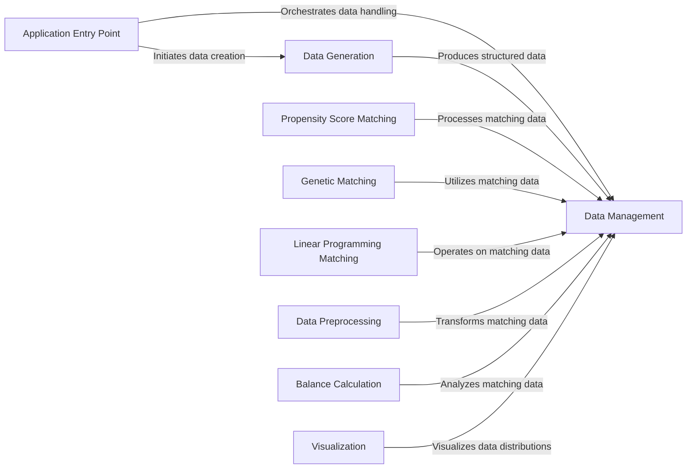

## Component Details

This graph represents the Data Manager & Simulator subsystem of the pybalance project. It encompasses components responsible for generating, loading, structuring, and preprocessing data, as well as various matching algorithms and utilities for balance calculation and visualization. The Application Entry Point orchestrates the overall flow, initiating data generation or loading, and then leveraging other components for data management, preprocessing, and the core matching processes.

### Data Management
Handles the loading, structuring, and basic manipulation of matching data. It defines how data is represented for matching operations, including identifying numeric and categorical features and splitting data into target and pool populations.

**Related Classes/Methods**:

- <a href="https://github.com/Bayer-Group/pybalance/blob/master/pybalance/utils/matching_data.py#L101-L367" target="_blank" rel="noopener noreferrer">`pybalance.utils.matching_data.MatchingData` (101:367)</a>
- <a href="https://github.com/Bayer-Group/pybalance/blob/master/pybalance/utils/matching_data.py#L370-L418" target="_blank" rel="noopener noreferrer">`pybalance.utils.matching_data.split_target_pool` (370:418)</a>
- <a href="https://github.com/Bayer-Group/pybalance/blob/master/pybalance/utils/matching_data.py#L91-L98" target="_blank" rel="noopener noreferrer">`pybalance.utils.matching_data._load_matching_data` (91:98)</a>
- <a href="https://github.com/Bayer-Group/pybalance/blob/master/pybalance/utils/matching_data.py#L36-L72" target="_blank" rel="noopener noreferrer">`pybalance.pybalance.utils.matching_data.infer_matching_headers` (36:72)</a>
- <a href="https://github.com/Bayer-Group/pybalance/blob/master/pybalance/utils/matching_data.py#L12-L33" target="_blank" rel="noopener noreferrer">`pybalance.pybalance.utils.matching_data.MatchingHeaders` (12:33)</a>
- <a href="https://github.com/Bayer-Group/pybalance/blob/master/pybalance/utils/matching_data.py#L75-L88" target="_blank" rel="noopener noreferrer">`pybalance.pybalance.utils.matching_data._make_quantile_function` (75:88)</a>

### Data Generation
Responsible for creating synthetic datasets for testing and simulation purposes. It includes functions for generating random feature data with specified distributions and correlations, and for loading pre-defined datasets.

**Related Classes/Methods**:

- <a href="https://github.com/Bayer-Group/pybalance/blob/master/pybalance/sim/rng.py#L33-L49" target="_blank" rel="noopener noreferrer">`pybalance.pybalance.sim.rng.multivariate_truncnorm` (33:49)</a>
- <a href="https://github.com/Bayer-Group/pybalance/blob/master/pybalance/sim/rng.py#L74-L118" target="_blank" rel="noopener noreferrer">`pybalance.pybalance.sim.rng.generate_random_feature_data_rct` (74:118)</a>
- <a href="https://github.com/Bayer-Group/pybalance/blob/master/pybalance/sim/rng.py#L121-L166" target="_blank" rel="noopener noreferrer">`pybalance.pybalance.sim.rng.generate_random_feature_data_rwd` (121:166)</a>
- <a href="https://github.com/Bayer-Group/pybalance/blob/master/pybalance/sim/rng.py#L169-L183" target="_blank" rel="noopener noreferrer">`pybalance.pybalance.sim.rng.generate_toy_dataset` (169:183)</a>
- <a href="https://github.com/Bayer-Group/pybalance/blob/master/pybalance/sim/rng.py#L198-L204" target="_blank" rel="noopener noreferrer">`pybalance.pybalance.sim.rng.load_paper_dataset` (198:204)</a>
- <a href="https://github.com/Bayer-Group/pybalance/blob/master/pybalance/sim/rng.py#L62-L71" target="_blank" rel="noopener noreferrer">`pybalance.sim.rng.correlate_vars` (62:71)</a>
- <a href="https://github.com/Bayer-Group/pybalance/blob/master/pybalance/sim/rng.py#L9-L30" target="_blank" rel="noopener noreferrer">`pybalance.sim.rng.generate_truncated_distributions` (9:30)</a>
- <a href="https://github.com/Bayer-Group/pybalance/blob/master/pybalance/sim/rng.py#L186-L195" target="_blank" rel="noopener noreferrer">`pybalance.sim.rng.get_paper_dataset_path` (186:195)</a>

### Application Entry Point
Contains the main execution logic for the pybalance application, including data generation, loading, and orchestrating the population matching process.

**Related Classes/Methods**:

- <a href="https://github.com/Bayer-Group/pybalance/blob/master/bin/main.py#L27-L33" target="_blank" rel="noopener noreferrer">`pybalance.bin.main.generate_data` (27:33)</a>
- <a href="https://github.com/Bayer-Group/pybalance/blob/master/bin/main.py#L36-L59" target="_blank" rel="noopener noreferrer">`pybalance.bin.main.load_data` (36:59)</a>
- <a href="https://github.com/Bayer-Group/pybalance/blob/master/bin/population_match.py#L369-L385" target="_blank" rel="noopener noreferrer">`pybalance.bin.population_match.main` (369:385)</a>
- <a href="https://github.com/Bayer-Group/pybalance/blob/master/bin/population_match.py#L32-L68" target="_blank" rel="noopener noreferrer">`pybalance.bin.population_match._setup_matching_data` (32:68)</a>
- <a href="https://github.com/Bayer-Group/pybalance/blob/master/bin/population_match.py#L71-L87" target="_blank" rel="noopener noreferrer">`pybalance.bin.population_match.duplicate_target` (71:87)</a>
- <a href="https://github.com/Bayer-Group/pybalance/blob/master/bin/population_match.py#L90-L131" target="_blank" rel="noopener noreferrer">`pybalance.bin.population_match.ea_train` (90:131)</a>
- <a href="https://github.com/Bayer-Group/pybalance/blob/master/bin/population_match.py#L134-L164" target="_blank" rel="noopener noreferrer">`pybalance.bin.population_match.lp_train` (134:164)</a>

### Data Preprocessing
Provides various encoders and preprocessors to transform raw data into a suitable format for matching algorithms. This includes handling float, categorical, numeric binning, cross-terms, and decision tree-based encoding.

**Related Classes/Methods**:

- <a href="https://github.com/Bayer-Group/pybalance/blob/master/pybalance/utils/preprocess.py#L144-L196" target="_blank" rel="noopener noreferrer">`pybalance.utils.preprocess.FloatEncoder` (144:196)</a>
- <a href="https://github.com/Bayer-Group/pybalance/blob/master/pybalance/utils/preprocess.py#L199-L278" target="_blank" rel="noopener noreferrer">`pybalance.utils.preprocess.CategoricOneHotEncoder` (199:278)</a>
- <a href="https://github.com/Bayer-Group/pybalance/blob/master/pybalance/utils/preprocess.py#L281-L405" target="_blank" rel="noopener noreferrer">`pybalance.utils.preprocess.NumericBinsEncoder` (281:405)</a>
- <a href="https://github.com/Bayer-Group/pybalance/blob/master/pybalance/utils/preprocess.py#L408-L500" target="_blank" rel="noopener noreferrer">`pybalance.utils.preprocess.CrossTermsPreprocessor` (408:500)</a>
- <a href="https://github.com/Bayer-Group/pybalance/blob/master/pybalance/utils/preprocess.py#L503-L567" target="_blank" rel="noopener noreferrer">`pybalance.utils.preprocess.DecisionTreeEncoder` (503:567)</a>

### Propensity Score Matching
Implements matching algorithms based on propensity scores, which are used to balance covariates between treatment and control groups. It also includes utilities for visualizing propensity score distributions.

**Related Classes/Methods**:

- <a href="https://github.com/Bayer-Group/pybalance/blob/master/pybalance/propensity/matcher.py#L36-L269" target="_blank" rel="noopener noreferrer">`pybalance.propensity.matcher.PropensityScoreMatcher` (36:269)</a>
- <a href="https://github.com/Bayer-Group/pybalance/blob/master/pybalance/propensity/matcher.py#L368-L431" target="_blank" rel="noopener noreferrer">`pybalance.propensity.matcher.plot_propensity_score_match_distributions` (368:431)</a>

### Genetic Matching
Provides functionalities for genetic algorithm-based matching, including initialization strategies and the core genetic matching algorithm to find optimal matches.

**Related Classes/Methods**:

- <a href="https://github.com/Bayer-Group/pybalance/blob/master/pybalance/genetic/initialization.py#L14-L175" target="_blank" rel="noopener noreferrer">`pybalance.genetic.initialization.GeneticMatcherInitializer` (14:175)</a>
- <a href="https://github.com/Bayer-Group/pybalance/blob/master/pybalance/genetic/matcher.py#L79-L387" target="_blank" rel="noopener noreferrer">`pybalance.genetic.matcher.GeneticMatcher` (79:387)</a>

### Linear Programming Matching
Implements matching algorithms using linear programming to satisfy constraints and find optimal matches between populations.

**Related Classes/Methods**:

- <a href="https://github.com/Bayer-Group/pybalance/blob/master/pybalance/lp/matcher.py#L148-L637" target="_blank" rel="noopener noreferrer">`pybalance.lp.matcher.ConstraintSatisfactionMatcher` (148:637)</a>

### Balance Calculation
Offers tools to calculate and assess the balance of covariates between matched groups, which is crucial for evaluating the quality of matching.

**Related Classes/Methods**:

- <a href="https://github.com/Bayer-Group/pybalance/blob/master/pybalance/utils/balance_calculators.py#L74-L322" target="_blank" rel="noopener noreferrer">`pybalance.utils.balance_calculators.BaseBalanceCalculator` (74:322)</a>

### Visualization
Provides utilities for visualizing aspects of the matching process, such as population distributions.

**Related Classes/Methods**:

- <a href="https://github.com/Bayer-Group/pybalance/blob/master/pybalance/visualization/distributions.py#L28-L49" target="_blank" rel="noopener noreferrer">`pybalance.visualization.distributions._get_reference_population` (28:49)</a>

### [FAQ](https://github.com/CodeBoarding/GeneratedOnBoardings/tree/main?tab=readme-ov-file#faq)