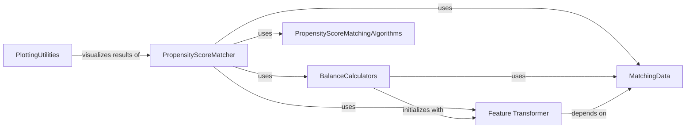

## Component Details

This architecture describes the core components involved in propensity score matching within the `pybalance` library. It highlights how data is preprocessed, propensity scores are calculated and matched, and the results are evaluated and visualized.

### PropensityScoreMatcher
This component is responsible for matching two populations using propensity scores. It performs a hyperparameter search for the propensity score model to find the best match based on a given optimization objective. It supports different matching methods like 'greedy' and 'linear_sum_assignment' and can apply a caliper to restrict matches. It also handles preprocessing of data for model training and provides methods to retrieve propensity scores and the best match.

**Related Classes/Methods**:

- <a href="https://github.com/Bayer-Group/pybalance/blob/master/pybalance/propensity/matcher.py#L36-L269" target="_blank" rel="noopener noreferrer">`pybalance.propensity.matcher.PropensityScoreMatcher` (36:269)</a>
- <a href="https://github.com/Bayer-Group/pybalance/blob/master/pybalance/propensity/matcher.py#L94-L123" target="_blank" rel="noopener noreferrer">`pybalance.propensity.matcher.PropensityScoreMatcher:__init__` (94:123)</a>
- <a href="https://github.com/Bayer-Group/pybalance/blob/master/pybalance/propensity/matcher.py#L211-L214" target="_blank" rel="noopener noreferrer">`pybalance.propensity.matcher.PropensityScoreMatcher._train_preprocessors` (211:214)</a>
- <a href="https://github.com/Bayer-Group/pybalance/blob/master/pybalance/propensity/matcher.py#L166-L209" target="_blank" rel="noopener noreferrer">`pybalance.propensity.matcher.PropensityScoreMatcher.match` (166:209)</a>
- <a href="https://github.com/Bayer-Group/pybalance/blob/master/pybalance/propensity/matcher.py#L248-L269" target="_blank" rel="noopener noreferrer">`pybalance.propensity.matcher.PropensityScoreMatcher.get_propensity_score` (248:269)</a>

### BalanceCalculators
This component encompasses various balance calculation methods used to evaluate the quality of matches. Different balance calculators like BetaBalance, BetaSquaredBalance, GammaBalance, etc., are available, each potentially using different preprocessing techniques. These calculators inherit from BaseBalanceCalculator and are used by the PropensityScoreMatcher to determine the 'score' of a match.

**Related Classes/Methods**:

- <a href="https://github.com/Bayer-Group/pybalance/blob/master/pybalance/utils/balance_calculators.py#L336-L352" target="_blank" rel="noopener noreferrer">`pybalance.utils.balance_calculators.BetaBalance:__init__` (336:352)</a>
- <a href="https://github.com/Bayer-Group/pybalance/blob/master/pybalance/utils/balance_calculators.py#L366-L382" target="_blank" rel="noopener noreferrer">`pybalance.utils.balance_calculators.BetaSquaredBalance:__init__` (366:382)</a>
- <a href="https://github.com/Bayer-Group/pybalance/blob/master/pybalance/utils/balance_calculators.py#L395-L414" target="_blank" rel="noopener noreferrer">`pybalance.utils.balance_calculators.BetaXBalance:__init__` (395:414)</a>
- <a href="https://github.com/Bayer-Group/pybalance/blob/master/pybalance/utils/balance_calculators.py#L425-L444" target="_blank" rel="noopener noreferrer">`pybalance.utils.balance_calculators.BetaXSquaredBalance:__init__` (425:444)</a>
- <a href="https://github.com/Bayer-Group/pybalance/blob/master/pybalance/utils/balance_calculators.py#L460-L476" target="_blank" rel="noopener noreferrer">`pybalance.utils.balance_calculators.BetaMaxBalance:__init__` (460:476)</a>
- <a href="https://github.com/Bayer-Group/pybalance/blob/master/pybalance/utils/balance_calculators.py#L501-L522" target="_blank" rel="noopener noreferrer">`pybalance.utils.balance_calculators.GammaBalance:__init__` (501:522)</a>
- <a href="https://github.com/Bayer-Group/pybalance/blob/master/pybalance/utils/balance_calculators.py#L533-L554" target="_blank" rel="noopener noreferrer">`pybalance.utils.balance_calculators.GammaSquaredBalance:__init__` (533:554)</a>
- <a href="https://github.com/Bayer-Group/pybalance/blob/master/pybalance/utils/balance_calculators.py#L567-L592" target="_blank" rel="noopener noreferrer">`pybalance.utils.balance_calculators.GammaXBalance:__init__` (567:592)</a>
- <a href="https://github.com/Bayer-Group/pybalance/blob/master/pybalance/utils/balance_calculators.py#L598-L615" target="_blank" rel="noopener noreferrer">`pybalance.utils.balance_calculators.GammaXTreeBalance:__init__` (598:615)</a>
- <a href="https://github.com/Bayer-Group/pybalance/blob/master/pybalance/utils/balance_calculators.py#L115-L159" target="_blank" rel="noopener noreferrer">`pybalance.utils.balance_calculators.BaseBalanceCalculator.__init__` (115:159)</a>

### Feature Transformer
Provides a suite of tools for preprocessing raw data features into suitable formats for downstream components, including encoding, binning, and cross-term generation.

**Related Classes/Methods**:

- <a href="https://github.com/Bayer-Group/pybalance/blob/master/pybalance/utils/preprocess.py#L26-L141" target="_blank" rel="noopener noreferrer">`pybalance.utils.preprocess.BaseMatchingPreprocessor` (26:141)</a>
- <a href="https://github.com/Bayer-Group/pybalance/blob/master/pybalance/utils/preprocess.py#L603-L616" target="_blank" rel="noopener noreferrer">`pybalance.utils.preprocess.StandardMatchingPreprocessor` (603:616)</a>
- <a href="https://github.com/Bayer-Group/pybalance/blob/master/pybalance/utils/preprocess.py#L144-L196" target="_blank" rel="noopener noreferrer">`pybalance.utils.preprocess.FloatEncoder` (144:196)</a>
- <a href="https://github.com/Bayer-Group/pybalance/blob/master/pybalance/utils/preprocess.py#L199-L278" target="_blank" rel="noopener noreferrer">`pybalance.utils.preprocess.CategoricOneHotEncoder` (199:278)</a>
- <a href="https://github.com/Bayer-Group/pybalance/blob/master/pybalance/utils/preprocess.py#L619-L637" target="_blank" rel="noopener noreferrer">`pybalance.utils.preprocess.GammaPreprocessor` (619:637)</a>
- <a href="https://github.com/Bayer-Group/pybalance/blob/master/pybalance/utils/preprocess.py#L281-L405" target="_blank" rel="noopener noreferrer">`pybalance.utils.preprocess.NumericBinsEncoder` (281:405)</a>
- <a href="https://github.com/Bayer-Group/pybalance/blob/master/pybalance/utils/preprocess.py#L640-L656" target="_blank" rel="noopener noreferrer">`pybalance.utils.preprocess.BetaXPreprocessor` (640:656)</a>
- <a href="https://github.com/Bayer-Group/pybalance/blob/master/pybalance/utils/preprocess.py#L408-L500" target="_blank" rel="noopener noreferrer">`pybalance.utils.preprocess.CrossTermsPreprocessor` (408:500)</a>
- <a href="https://github.com/Bayer-Group/pybalance/blob/master/pybalance/utils/preprocess.py#L659-L681" target="_blank" rel="noopener noreferrer">`pybalance.utils.preprocess.GammaXPreprocessor` (659:681)</a>
- <a href="https://github.com/Bayer-Group/pybalance/blob/master/pybalance/utils/preprocess.py#L503-L567" target="_blank" rel="noopener noreferrer">`pybalance.utils.preprocess.DecisionTreeEncoder` (503:567)</a>
- <a href="https://github.com/Bayer-Group/pybalance/blob/master/pybalance/utils/preprocess.py#L570-L600" target="_blank" rel="noopener noreferrer">`pybalance.utils.preprocess.ChainPreprocessor` (570:600)</a>

### PropensityScoreMatchingAlgorithms
This component encapsulates the core algorithms for performing propensity score matching. It includes different strategies such as 'greedy', 'greedy_prio', and 'linear_sum_assignment', each with its own approach to pairing individuals based on their propensity scores. These functions are called by the PropensityScoreMatcher to execute the actual matching process.

**Related Classes/Methods**:

- <a href="https://github.com/Bayer-Group/pybalance/blob/master/pybalance/propensity/matcher.py#L320-L365" target="_blank" rel="noopener noreferrer">`pybalance.propensity.matcher.propensity_score_match` (320:365)</a>
- <a href="https://github.com/Bayer-Group/pybalance/blob/master/pybalance/propensity/matcher.py#L272-L294" target="_blank" rel="noopener noreferrer">`pybalance.propensity.matcher.propensity_score_match_greedy` (272:294)</a>
- <a href="https://github.com/Bayer-Group/pybalance/blob/master/pybalance/propensity/matcher.py#L297-L310" target="_blank" rel="noopener noreferrer">`pybalance.propensity.matcher.propensity_score_match_greedy_prio` (297:310)</a>
- <a href="https://github.com/Bayer-Group/pybalance/blob/master/pybalance/propensity/matcher.py#L313-L317" target="_blank" rel="noopener noreferrer">`pybalance.propensity.matcher.propensity_score_match_linear_sum_assignment` (313:317)</a>

### PlottingUtilities
This component provides utility functions for visualizing the results of propensity score matching. It includes functions to plot the distributions of propensity scores before and after matching, and to visualize the matched pairs. These utilities help in understanding the effectiveness of the matching process.

**Related Classes/Methods**:

- <a href="https://github.com/Bayer-Group/pybalance/blob/master/pybalance/propensity/matcher.py#L368-L431" target="_blank" rel="noopener noreferrer">`pybalance.propensity.matcher.plot_propensity_score_match_distributions` (368:431)</a>
- <a href="https://github.com/Bayer-Group/pybalance/blob/master/pybalance/propensity/matcher.py#L434-L453" target="_blank" rel="noopener noreferrer">`pybalance.propensity.matcher.plot_propensity_score_match_pairs` (434:453)</a>

### MatchingData
This component represents the data structure used for matching operations, encapsulating treatment, control, and covariate information. It provides methods for accessing and manipulating this data, serving as a central data model for various matching algorithms and balance calculations.

**Related Classes/Methods**:

- <a href="https://github.com/Bayer-Group/pybalance/blob/master/pybalance/utils/matching_data.py#L101-L367" target="_blank" rel="noopener noreferrer">`pybalance.utils.matching_data.MatchingData` (101:367)</a>

### [FAQ](https://github.com/CodeBoarding/GeneratedOnBoardings/tree/main?tab=readme-ov-file#faq)