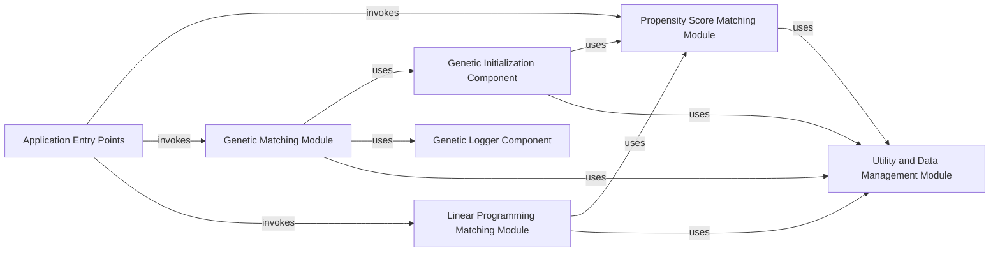

## Component Details

The Matching Algorithms subsystem in pybalance provides core logic for various matching strategies, including Propensity Score Matching, Linear Programming, and Genetic Algorithms. It processes data to find optimal matches, leveraging balance metrics for optimization. The system is structured into distinct modules for each matching approach, along with supporting components for initialization, logging, and general utilities. Application entry points orchestrate the execution of these algorithms.

### Propensity Score Matching Module
This module provides functionalities for performing propensity score matching. It includes the core `PropensityScoreMatcher` class which handles hyperparameter search, model training (using scikit-learn classifiers), propensity score estimation, and various matching algorithms (greedy, greedy with priority, linear sum assignment). It also offers utility functions for plotting the results of propensity score matching.

**Related Classes/Methods**:

- <a href="https://github.com/Bayer-Group/pybalance/blob/master/pybalance/propensity/matcher.py#L36-L269" target="_blank" rel="noopener noreferrer">`pybalance.propensity.matcher.PropensityScoreMatcher` (36:269)</a>
- <a href="https://github.com/Bayer-Group/pybalance/blob/master/pybalance/propensity/matcher.py#L368-L431" target="_blank" rel="noopener noreferrer">`pybalance.propensity.matcher.plot_propensity_score_match_distributions` (368:431)</a>
- <a href="https://github.com/Bayer-Group/pybalance/blob/master/pybalance/propensity/matcher.py#L434-L453" target="_blank" rel="noopener noreferrer">`pybalance.propensity.matcher.plot_propensity_score_match_pairs` (434:453)</a>
- <a href="https://github.com/Bayer-Group/pybalance/blob/master/pybalance/propensity/matcher.py#L320-L365" target="_blank" rel="noopener noreferrer">`pybalance.propensity.matcher.propensity_score_match` (320:365)</a>
- <a href="https://github.com/Bayer-Group/pybalance/blob/master/pybalance/propensity/matcher.py#L297-L310" target="_blank" rel="noopener noreferrer">`pybalance.propensity.matcher.propensity_score_match_greedy_prio` (297:310)</a>
- <a href="https://github.com/Bayer-Group/pybalance/blob/master/pybalance/propensity/matcher.py#L313-L317" target="_blank" rel="noopener noreferrer">`pybalance.propensity.matcher.propensity_score_match_linear_sum_assignment` (313:317)</a>
- <a href="https://github.com/Bayer-Group/pybalance/blob/master/pybalance/propensity/matcher.py#L31-L33" target="_blank" rel="noopener noreferrer">`pybalance.propensity.matcher._check_fitted` (31:33)</a>

### Linear Programming Matching Module
This module provides a constraint satisfaction matcher based on linear programming. The `ConstraintSatisfactionMatcher` class is responsible for setting up the matching problem, including defining weights and handling data discretization. It can leverage propensity scores from the Propensity Score Matching Module to inform its matching process.

**Related Classes/Methods**:

- <a href="https://github.com/Bayer-Group/pybalance/blob/master/pybalance/lp/matcher.py#L148-L637" target="_blank" rel="noopener noreferrer">`pybalance.lp.matcher.ConstraintSatisfactionMatcher` (148:637)</a>
- <a href="https://github.com/Bayer-Group/pybalance/blob/master/pybalance/lp/matcher.py#L31-L72" target="_blank" rel="noopener noreferrer">`pybalance.lp.matcher._rescale_for_discretization` (31:72)</a>
- <a href="https://github.com/Bayer-Group/pybalance/blob/master/pybalance/lp/matcher.py#L27-L28" target="_blank" rel="noopener noreferrer">`pybalance.lp.matcher.compute_truncation_error` (27:28)</a>
- <a href="https://github.com/Bayer-Group/pybalance/blob/master/pybalance/lp/matcher.py#L75-L145" target="_blank" rel="noopener noreferrer">`pybalance.lp.matcher.SolutionPrinter` (75:145)</a>
- <a href="https://github.com/Bayer-Group/pybalance/blob/master/pybalance/lp/matcher.py#L22-L24" target="_blank" rel="noopener noreferrer">`pybalance.lp.matcher._check_fitted` (22:24)</a>

### Genetic Matching Module
This module implements genetic algorithm-based matching. The `GeneticMatcher` class orchestrates the genetic matching process, including initialization of the first generation, checking stopping conditions, generating offspring through mutation and mating, and logging the progress. It relies on a separate initializer component to set up the initial populations.

**Related Classes/Methods**:

- <a href="https://github.com/Bayer-Group/pybalance/blob/master/pybalance/genetic/matcher.py#L79-L387" target="_blank" rel="noopener noreferrer">`pybalance.genetic.matcher.GeneticMatcher` (79:387)</a>
- <a href="https://github.com/Bayer-Group/pybalance/blob/master/pybalance/genetic/matcher.py#L30-L76" target="_blank" rel="noopener noreferrer">`pybalance.genetic.matcher.get_global_defaults` (30:76)</a>

### Genetic Initialization Component
This component is responsible for initializing the populations for the genetic matching algorithm. It includes methods for computing benchmark populations, splitting samples among different methods, and sampling patients to create the initial set of individuals for the genetic algorithm.

**Related Classes/Methods**:

- <a href="https://github.com/Bayer-Group/pybalance/blob/master/pybalance/genetic/initialization.py#L14-L175" target="_blank" rel="noopener noreferrer">`pybalance.genetic.initialization.GeneticMatcherInitializer` (14:175)</a>

### Genetic Logger Component
This component handles logging for the genetic matching process. It provides functionalities to set up directories for logging and to save results locally at the end of the matching process or at the end of each generation.

**Related Classes/Methods**:

- <a href="https://github.com/Bayer-Group/pybalance/blob/master/pybalance/genetic/logger.py#L10-L76" target="_blank" rel="noopener noreferrer">`pybalance.genetic.logger.BasicLogger` (10:76)</a>

### Utility and Data Management Module
This module provides common utilities, balance calculation functionalities, and data structures for matching, used across various matching algorithms.

**Related Classes/Methods**: _None_

### Application Entry Points
These modules serve as the main entry points for different matching tasks within the pybalance system. They orchestrate the creation and execution of the various matching algorithms based on user-defined parameters or specific training scenarios.

**Related Classes/Methods**: _None_

### [FAQ](https://github.com/CodeBoarding/GeneratedOnBoardings/tree/main?tab=readme-ov-file#faq)