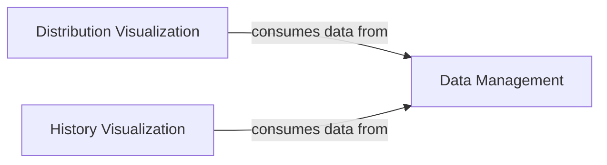

## Component Details

The Results Visualizer subsystem is responsible for generating comprehensive graphical representations to aid in the analysis and reporting of data characteristics, matching outcomes, and the historical progression of balance metrics. It achieves this by leveraging data structured by the Data Management component and utilizing specialized visualization modules for feature distributions and historical metric trends.

### Data Management
This component is responsible for handling and structuring the input data for balance calculations and visualizations. It defines the MatchingData class, which encapsulates the dataset, identifies numeric and categorical features, and provides methods for accessing and manipulating population-specific data. It also includes utilities for splitting data into target and pool populations.

**Related Classes/Methods**:

- <a href="https://github.com/Bayer-Group/pybalance/blob/master/pybalance/utils/matching_data.py#L101-L367" target="_blank" rel="noopener noreferrer">`pybalance.utils.matching_data:MatchingData` (101:367)</a>
- <a href="https://github.com/Bayer-Group/pybalance/blob/master/pybalance/utils/matching_data.py#L370-L418" target="_blank" rel="noopener noreferrer">`pybalance.utils.matching_data:split_target_pool` (370:418)</a>
- <a href="https://github.com/Bayer-Group/pybalance/blob/master/pybalance/utils/matching_data.py#L36-L72" target="_blank" rel="noopener noreferrer">`pybalance.utils.matching_data:infer_matching_headers` (36:72)</a>
- <a href="https://github.com/Bayer-Group/pybalance/blob/master/pybalance/utils/matching_data.py#L91-L98" target="_blank" rel="noopener noreferrer">`pybalance.utils.matching_data:_load_matching_data` (91:98)</a>

### Distribution Visualization
This component focuses on generating various plots to visualize the distributions of features (numeric, categorical, binary) across different populations. It provides functions for plotting one-dimensional marginals, joint distributions, and per-feature loss, aiding in the assessment of data balance.

**Related Classes/Methods**:

- <a href="https://github.com/Bayer-Group/pybalance/blob/master/pybalance/visualization/distributions.py#L88-L138" target="_blank" rel="noopener noreferrer">`pybalance.pybalance.visualization.distributions.plot_categoric_features` (88:138)</a>
- <a href="https://github.com/Bayer-Group/pybalance/blob/master/pybalance/visualization/distributions.py#L141-L183" target="_blank" rel="noopener noreferrer">`pybalance.pybalance.visualization.distributions.plot_numeric_features` (141:183)</a>
- <a href="https://github.com/Bayer-Group/pybalance/blob/master/pybalance/visualization/distributions.py#L186-L384" target="_blank" rel="noopener noreferrer">`pybalance.pybalance.visualization.distributions.plot_binary_features` (186:384)</a>
- <a href="https://github.com/Bayer-Group/pybalance/blob/master/pybalance/visualization/distributions.py#L387-L503" target="_blank" rel="noopener noreferrer">`pybalance.pybalance.visualization.distributions.plot_per_feature_loss` (387:503)</a>
- <a href="https://github.com/Bayer-Group/pybalance/blob/master/pybalance/visualization/distributions.py#L506-L557" target="_blank" rel="noopener noreferrer">`pybalance.pybalance.visualization.distributions.plot_joint_numeric_categoric_distributions` (506:557)</a>
- <a href="https://github.com/Bayer-Group/pybalance/blob/master/pybalance/visualization/distributions.py#L560-L597" target="_blank" rel="noopener noreferrer">`pybalance.pybalance.visualization.distributions.plot_joint_numeric_distributions` (560:597)</a>
- <a href="https://github.com/Bayer-Group/pybalance/blob/master/pybalance/visualization/distributions.py#L28-L49" target="_blank" rel="noopener noreferrer">`pybalance.pybalance.visualization.distributions._get_reference_population` (28:49)</a>
- <a href="https://github.com/Bayer-Group/pybalance/blob/master/pybalance/visualization/distributions.py#L24-L25" target="_blank" rel="noopener noreferrer">`pybalance.pybalance.visualization.distributions._get_default_hue_order` (24:25)</a>
- <a href="https://github.com/Bayer-Group/pybalance/blob/master/pybalance/visualization/distributions.py#L65-L85" target="_blank" rel="noopener noreferrer">`pybalance.pybalance.visualization.distributions._plot_1d_marginals` (65:85)</a>
- <a href="https://github.com/Bayer-Group/pybalance/blob/master/pybalance/visualization/distributions.py#L52-L62" target="_blank" rel="noopener noreferrer">`pybalance.pybalance.visualization.distributions._debin_features` (52:62)</a>

### History Visualization
This component is dedicated to visualizing the historical progression of metrics, particularly in the context of genetic algorithms or optimization processes. It provides functions to plot the density history of metrics like beta and gamma, and to visualize the convergence of best scores over generations.

**Related Classes/Methods**:

- <a href="https://github.com/Bayer-Group/pybalance/blob/master/pybalance/visualization/history.py#L21-L29" target="_blank" rel="noopener noreferrer">`pybalance.pybalance.visualization.history.plot_history_of_beta_and_gamma` (21:29)</a>
- <a href="https://github.com/Bayer-Group/pybalance/blob/master/pybalance/visualization/history.py#L32-L55" target="_blank" rel="noopener noreferrer">`pybalance.pybalance.visualization.history.plot_density_history_of_metric` (32:55)</a>
- <a href="https://github.com/Bayer-Group/pybalance/blob/master/pybalance/visualization/history.py#L58-L75" target="_blank" rel="noopener noreferrer">`pybalance.pybalance.visualization.history.plot_convergence` (58:75)</a>
- <a href="https://github.com/Bayer-Group/pybalance/blob/master/pybalance/visualization/history.py#L14-L18" target="_blank" rel="noopener noreferrer">`pybalance.pybalance.visualization.history.get_n_colors` (14:18)</a>

### [FAQ](https://github.com/CodeBoarding/GeneratedOnBoardings/tree/main?tab=readme-ov-file#faq)