```mermaid
graph LR
    Application_Orchestrator["Application Orchestrator"]
    Data_Manager_Simulator["Data Manager & Simulator"]
    Matching_Algorithms["Matching Algorithms"]
    Feature_Transformer["Feature Transformer"]
    Balance_Evaluator["Balance Evaluator"]
    Results_Visualizer["Results Visualizer"]
    Application_Orchestrator -- "manages workflow for" --> Data_Manager_Simulator
    Application_Orchestrator -- "initiates execution of" --> Matching_Algorithms
    Data_Manager_Simulator -- "provides raw data to" --> Feature_Transformer
    Data_Manager_Simulator -- "provides raw data to" --> Results_Visualizer
    Feature_Transformer -- "transforms data from" --> Data_Manager_Simulator
    Feature_Transformer -- "supplies processed data to" --> Matching_Algorithms
    Feature_Transformer -- "supplies processed data to" --> Balance_Evaluator
    Matching_Algorithms -- "consumes processed data from" --> Feature_Transformer
    Matching_Algorithms -- "requests evaluation from" --> Balance_Evaluator
    Matching_Algorithms -- "generates outcomes for" --> Results_Visualizer
    Balance_Evaluator -- "evaluates processed data from" --> Feature_Transformer
    Balance_Evaluator -- "provides metrics to" --> Matching_Algorithms
    Results_Visualizer -- "displays raw data from" --> Data_Manager_Simulator
    Results_Visualizer -- "displays outcomes from" --> Matching_Algorithms
    Results_Visualizer -- "displays metrics from" --> Balance_Evaluator
    click Application_Orchestrator href "https://github.com/CodeBoarding/GeneratedOnBoardings/blob/main/pybalance/Application Orchestrator.md" "Details"
    click Data_Manager_Simulator href "https://github.com/CodeBoarding/GeneratedOnBoardings/blob/main/pybalance/Data Manager & Simulator.md" "Details"
    click Matching_Algorithms href "https://github.com/CodeBoarding/GeneratedOnBoardings/blob/main/pybalance/Matching Algorithms.md" "Details"
    click Feature_Transformer href "https://github.com/CodeBoarding/GeneratedOnBoardings/blob/main/pybalance/Feature Transformer.md" "Details"
    click Balance_Evaluator href "https://github.com/CodeBoarding/GeneratedOnBoardings/blob/main/pybalance/Balance Evaluator.md" "Details"
    click Results_Visualizer href "https://github.com/CodeBoarding/GeneratedOnBoardings/blob/main/pybalance/Results Visualizer.md" "Details"
```

## Component Details

This graph illustrates the high-level architecture of the `pybalance` project, a library designed for causal inference matching. It depicts the primary components involved in data handling, feature transformation, various matching algorithms, balance evaluation, and result visualization, all orchestrated by a central application flow.

### Application Orchestrator
The central control unit, responsible for initiating the application's workflow, managing data flow, and coordinating the execution of matching, balance calculation, and visualization processes.

**Related Classes/Methods**:

- `pybalance.bin.main` (full file reference)

### Data Manager & Simulator
Handles all aspects of data, including loading, splitting, and managing datasets. It also provides functionalities for generating synthetic data for testing and simulation.

**Related Classes/Methods**:

- <a href="https://github.com/Bayer-Group/pybalance/blob/master/pybalance/sim/rng.py#L33-L49" target="_blank" rel="noopener noreferrer">`pybalance.pybalance.sim.rng.multivariate_truncnorm` (33:49)</a>
- <a href="https://github.com/Bayer-Group/pybalance/blob/master/pybalance/sim/rng.py#L74-L118" target="_blank" rel="noopener noreferrer">`pybalance.pybalance.sim.rng.generate_random_feature_data_rct` (74:118)</a>
- <a href="https://github.com/Bayer-Group/pybalance/blob/master/pybalance/sim/rng.py#L121-L166" target="_blank" rel="noopener noreferrer">`pybalance.pybalance.sim.rng.generate_random_feature_data_rwd` (121:166)</a>
- <a href="https://github.com/Bayer-Group/pybalance/blob/master/pybalance/sim/rng.py#L169-L183" target="_blank" rel="noopener noreferrer">`pybalance.pybalance.sim.rng.generate_toy_dataset` (169:183)</a>
- <a href="https://github.com/Bayer-Group/pybalance/blob/master/pybalance/sim/rng.py#L198-L204" target="_blank" rel="noopener noreferrer">`pybalance.pybalance.sim.rng.load_paper_dataset` (198:204)</a>
- <a href="https://github.com/Bayer-Group/pybalance/blob/master/pybalance/utils/matching_data.py#L101-L367" target="_blank" rel="noopener noreferrer">`pybalance.utils.matching_data.MatchingData` (101:367)</a>
- <a href="https://github.com/Bayer-Group/pybalance/blob/master/pybalance/utils/matching_data.py#L370-L418" target="_blank" rel="noopener noreferrer">`pybalance.utils.matching_data.split_target_pool` (370:418)</a>
- <a href="https://github.com/Bayer-Group/pybalance/blob/master/pybalance/utils/matching_data.py#L91-L98" target="_blank" rel="noopener noreferrer">`pybalance.utils.matching_data._load_matching_data` (91:98)</a>
- <a href="https://github.com/Bayer-Group/pybalance/blob/master/pybalance/utils/matching_data.py#L36-L72" target="_blank" rel="noopener noreferrer">`pybalance.pybalance.utils.matching_data.infer_matching_headers` (36:72)</a>
- <a href="https://github.com/Bayer-Group/pybalance/blob/master/pybalance/utils/matching_data.py#L12-L33" target="_blank" rel="noopener noreferrer">`pybalance.pybalance.utils.matching_data.MatchingHeaders` (12:33)</a>
- <a href="https://github.com/Bayer-Group/pybalance/blob/master/pybalance/utils/matching_data.py#L75-L88" target="_blank" rel="noopener noreferrer">`pybalance.pybalance.utils.matching_data._make_quantile_function` (75:88)</a>

### Matching Algorithms
Contains the core logic for various matching strategies (Propensity Score, Linear Programming, Genetic Algorithm). It processes data to find optimal matches and relies on balance metrics for optimization.

**Related Classes/Methods**:

- <a href="https://github.com/Bayer-Group/pybalance/blob/master/pybalance/propensity/matcher.py#L36-L269" target="_blank" rel="noopener noreferrer">`pybalance.propensity.matcher.PropensityScoreMatcher` (36:269)</a>
- <a href="https://github.com/Bayer-Group/pybalance/blob/master/pybalance/propensity/matcher.py#L368-L431" target="_blank" rel="noopener noreferrer">`pybalance.propensity.matcher.plot_propensity_score_match_distributions` (368:431)</a>
- <a href="https://github.com/Bayer-Group/pybalance/blob/master/pybalance/propensity/matcher.py#L434-L453" target="_blank" rel="noopener noreferrer">`pybalance.propensity.matcher.plot_propensity_score_match_pairs` (434:453)</a>
- <a href="https://github.com/Bayer-Group/pybalance/blob/master/pybalance/propensity/matcher.py#L320-L365" target="_blank" rel="noopener noreferrer">`pybalance.pybalance.propensity.matcher.propensity_score_match` (320:365)</a>
- <a href="https://github.com/Bayer-Group/pybalance/blob/master/pybalance/propensity/matcher.py#L297-L310" target="_blank" rel="noopener noreferrer">`pybalance.pybalance.propensity.matcher.propensity_score_match_greedy_prio` (297:310)</a>
- <a href="https://github.com/Bayer-Group/pybalance/blob/master/pybalance/propensity/matcher.py#L313-L317" target="_blank" rel="noopener noreferrer">`pybalance.pybalance.propensity.matcher.propensity_score_match_linear_sum_assignment` (313:317)</a>
- <a href="https://github.com/Bayer-Group/pybalance/blob/master/pybalance/propensity/matcher.py#L31-L33" target="_blank" rel="noopener noreferrer">`pybalance.pybalance.propensity.matcher._check_fitted` (31:33)</a>
- <a href="https://github.com/Bayer-Group/pybalance/blob/master/pybalance/lp/matcher.py#L148-L637" target="_blank" rel="noopener noreferrer">`pybalance.lp.matcher.ConstraintSatisfactionMatcher` (148:637)</a>
- <a href="https://github.com/Bayer-Group/pybalance/blob/master/pybalance/lp/matcher.py#L31-L72" target="_blank" rel="noopener noreferrer">`pybalance.pybalance.lp.matcher._rescale_for_discretization` (31:72)</a>
- <a href="https://github.com/Bayer-Group/pybalance/blob/master/pybalance/lp/matcher.py#L27-L28" target="_blank" rel="noopener noreferrer">`pybalance.pybalance.lp.matcher.compute_truncation_error` (27:28)</a>
- <a href="https://github.com/Bayer-Group/pybalance/blob/master/pybalance/lp/matcher.py#L75-L145" target="_blank" rel="noopener noreferrer">`pybalance.pybalance.lp.matcher.SolutionPrinter` (75:145)</a>
- <a href="https://github.com/Bayer-Group/pybalance/blob/master/pybalance/lp/matcher.py#L22-L24" target="_blank" rel="noopener noreferrer">`pybalance.pybalance.lp.matcher._check_fitted` (22:24)</a>
- <a href="https://github.com/Bayer-Group/pybalance/blob/master/pybalance/genetic/matcher.py#L79-L387" target="_blank" rel="noopener noreferrer">`pybalance.genetic.matcher.GeneticMatcher` (79:387)</a>
- <a href="https://github.com/Bayer-Group/pybalance/blob/master/pybalance/genetic/matcher.py#L30-L76" target="_blank" rel="noopener noreferrer">`pybalance.pybalance.genetic.matcher.get_global_defaults` (30:76)</a>
- <a href="https://github.com/Bayer-Group/pybalance/blob/master/pybalance/genetic/initialization.py#L14-L175" target="_blank" rel="noopener noreferrer">`pybalance.genetic.initialization.GeneticMatcherInitializer` (14:175)</a>
- <a href="https://github.com/Bayer-Group/pybalance/blob/master/pybalance/genetic/logger.py#L10-L76" target="_blank" rel="noopener noreferrer">`pybalance.genetic.logger.BasicLogger` (10:76)</a>

### Feature Transformer
Provides a suite of tools for preprocessing raw data features into suitable formats for downstream components, including encoding, binning, and cross-term generation.

**Related Classes/Methods**:

- <a href="https://github.com/Bayer-Group/pybalance/blob/master/pybalance/utils/preprocess.py#L26-L141" target="_blank" rel="noopener noreferrer">`pybalance.utils.preprocess.BaseMatchingPreprocessor` (26:141)</a>
- <a href="https://github.com/Bayer-Group/pybalance/blob/master/pybalance/utils/preprocess.py#L603-L616" target="_blank" rel="noopener noreferrer">`pybalance.utils.preprocess.StandardMatchingPreprocessor` (603:616)</a>
- <a href="https://github.com/Bayer-Group/pybalance/blob/master/pybalance/utils/preprocess.py#L144-L196" target="_blank" rel="noopener noreferrer">`pybalance.pybalance.utils.preprocess.FloatEncoder` (144:196)</a>
- <a href="https://github.com/Bayer-Group/pybalance/blob/master/pybalance/utils/preprocess.py#L199-L278" target="_blank" rel="noopener noreferrer">`pybalance.pybalance.utils.preprocess.CategoricOneHotEncoder` (199:278)</a>
- <a href="https://github.com/Bayer-Group/pybalance/blob/master/pybalance/utils/preprocess.py#L619-L637" target="_blank" rel="noopener noreferrer">`pybalance.utils.preprocess.GammaPreprocessor` (619:637)</a>
- <a href="https://github.com/Bayer-Group/pybalance/blob/master/pybalance/utils/preprocess.py#L281-L405" target="_blank" rel="noopener noreferrer">`pybalance.pybalance.utils.preprocess.NumericBinsEncoder` (281:405)</a>
- <a href="https://github.com/Bayer-Group/pybalance/blob/master/pybalance/utils/preprocess.py#L640-L656" target="_blank" rel="noopener noreferrer">`pybalance.pybalance.utils.preprocess.BetaXPreprocessor` (640:656)</a>
- <a href="https://github.com/Bayer-Group/pybalance/blob/master/pybalance/utils/preprocess.py#L408-L500" target="_blank" rel="noopener noreferrer">`pybalance.pybalance.utils.preprocess.CrossTermsPreprocessor` (408:500)</a>
- <a href="https://github.com/Bayer-Group/pybalance/blob/master/pybalance/utils/preprocess.py#L659-L681" target="_blank" rel="noopener noreferrer">`pybalance.pybalance.utils.preprocess.GammaXPreprocessor` (659:681)</a>
- <a href="https://github.com/Bayer-Group/pybalance/blob/master/pybalance/utils/preprocess.py#L503-L567" target="_blank" rel="noopener noreferrer">`pybalance.pybalance.utils.preprocess.DecisionTreeEncoder` (503:567)</a>
- <a href="https://github.com/Bayer-Group/pybalance/blob/master/pybalance/utils/preprocess.py#L570-L600" target="_blank" rel="noopener noreferrer">`pybalance.utils.preprocess.ChainPreprocessor` (570:600)</a>

### Balance Evaluator
Implements various metrics to quantify the balance and similarity between matched populations, crucial for assessing matching quality and guiding iterative algorithms.

**Related Classes/Methods**:

- <a href="https://github.com/Bayer-Group/pybalance/blob/master/pybalance/utils/balance_calculators.py#L74-L322" target="_blank" rel="noopener noreferrer">`pybalance.utils.balance_calculators.BaseBalanceCalculator` (74:322)</a>
- <a href="https://github.com/Bayer-Group/pybalance/blob/master/pybalance/utils/balance_calculators.py#L643-L716" target="_blank" rel="noopener noreferrer">`pybalance.pybalance.utils.balance_calculators.BatchedBalanceCaclulator` (643:716)</a>
- <a href="https://github.com/Bayer-Group/pybalance/blob/master/pybalance/utils/balance_calculators.py#L618-L640" target="_blank" rel="noopener noreferrer">`pybalance.pybalance.utils.balance_calculators._get_batch_size` (618:640)</a>
- <a href="https://github.com/Bayer-Group/pybalance/blob/master/pybalance/utils/balance_calculators.py#L24-L61" target="_blank" rel="noopener noreferrer">`pybalance.pybalance.utils.balance_calculators.map_input_output_weights` (24:61)</a>
- <a href="https://github.com/Bayer-Group/pybalance/blob/master/pybalance/utils/balance_calculators.py#L736-L759" target="_blank" rel="noopener noreferrer">`pybalance.utils.balance_calculators.BalanceCalculator` (736:759)</a>
- <a href="https://github.com/Bayer-Group/pybalance/blob/master/pybalance/utils/balance_calculators.py#L325-L352" target="_blank" rel="noopener noreferrer">`pybalance.pybalance.utils.balance_calculators.BetaBalance` (325:352)</a>
- <a href="https://github.com/Bayer-Group/pybalance/blob/master/pybalance/utils/balance_calculators.py#L355-L382" target="_blank" rel="noopener noreferrer">`pybalance.pybalance.utils.balance_calculators.BetaSquaredBalance` (355:382)</a>
- <a href="https://github.com/Bayer-Group/pybalance/blob/master/pybalance/utils/balance_calculators.py#L385-L414" target="_blank" rel="noopener noreferrer">`pybalance.pybalance.utils.balance_calculators.BetaXBalance` (385:414)</a>
- <a href="https://github.com/Bayer-Group/pybalance/blob/master/pybalance/utils/balance_calculators.py#L417-L444" target="_blank" rel="noopener noreferrer">`pybalance.pybalance.utils.balance_calculators.BetaXSquaredBalance` (417:444)</a>
- <a href="https://github.com/Bayer-Group/pybalance/blob/master/pybalance/utils/balance_calculators.py#L447-L488" target="_blank" rel="noopener noreferrer">`pybalance.pybalance.utils.balance_calculators.BetaMaxBalance` (447:488)</a>
- <a href="https://github.com/Bayer-Group/pybalance/blob/master/pybalance/utils/balance_calculators.py#L491-L522" target="_blank" rel="noopener noreferrer">`pybalance.pybalance.utils.balance_calculators.GammaBalance` (491:522)</a>
- <a href="https://github.com/Bayer-Group/pybalance/blob/master/pybalance/utils/balance_calculators.py#L525-L554" target="_blank" rel="noopener noreferrer">`pybalance.pybalance.utils.balance_calculators.GammaSquaredBalance` (525:554)</a>
- <a href="https://github.com/Bayer-Group/pybalance/blob/master/pybalance/utils/balance_calculators.py#L557-L592" target="_blank" rel="noopener noreferrer">`pybalance.pybalance.utils.balance_calculators.GammaXBalance` (557:592)</a>
- <a href="https://github.com/Bayer-Group/pybalance/blob/master/pybalance/utils/balance_calculators.py#L595-L615" target="_blank" rel="noopener noreferrer">`pybalance.pybalance.utils.balance_calculators.GammaXTreeBalance` (595:615)</a>

### Results Visualizer
Generates graphical representations of data characteristics, matching outcomes, and the historical progression of balance metrics for analysis and reporting.

**Related Classes/Methods**:

- <a href="https://github.com/Bayer-Group/pybalance/blob/master/pybalance/visualization/distributions.py#L88-L138" target="_blank" rel="noopener noreferrer">`pybalance.pybalance.visualization.distributions.plot_categoric_features` (88:138)</a>
- <a href="https://github.com/Bayer-Group/pybalance/blob/master/pybalance/visualization/distributions.py#L141-L183" target="_blank" rel="noopener noreferrer">`pybalance.pybalance.visualization.distributions.plot_numeric_features` (141:183)</a>
- <a href="https://github.com/Bayer-Group/pybalance/blob/master/pybalance/visualization/distributions.py#L186-L384" target="_blank" rel="noopener noreferrer">`pybalance.pybalance.visualization.distributions.plot_binary_features` (186:384)</a>
- <a href="https://github.com/Bayer-Group/pybalance/blob/master/pybalance/visualization/distributions.py#L387-L503" target="_blank" rel="noopener noreferrer">`pybalance.pybalance.visualization.distributions.plot_per_feature_loss` (387:503)</a>
- <a href="https://github.com/Bayer-Group/pybalance/blob/master/pybalance/visualization/distributions.py#L506-L557" target="_blank" rel="noopener noreferrer">`pybalance.pybalance.visualization.distributions.plot_joint_numeric_categoric_distributions` (506:557)</a>
- <a href="https://github.com/Bayer-Group/pybalance/blob/master/pybalance/visualization/distributions.py#L560-L597" target="_blank" rel="noopener noreferrer">`pybalance.pybalance.visualization.distributions.plot_joint_numeric_distributions` (560:597)</a>
- <a href="https://github.com/Bayer-Group/pybalance/blob/master/pybalance/visualization/distributions.py#L28-L49" target="_blank" rel="noopener noreferrer">`pybalance.pybalance.visualization.distributions._get_reference_population` (28:49)</a>
- <a href="https://github.com/Bayer-Group/pybalance/blob/master/pybalance/visualization/distributions.py#L24-L25" target="_blank" rel="noopener noreferrer">`pybalance.pybalance.visualization.distributions._get_default_hue_order` (24:25)</a>
- <a href="https://github.com/Bayer-Group/pybalance/blob/master/pybalance/visualization/distributions.py#L65-L85" target="_blank" rel="noopener noreferrer">`pybalance.pybalance.visualization.distributions._plot_1d_marginals` (65:85)</a>
- <a href="https://github.com/Bayer-Group/pybalance/blob/master/pybalance/visualization/distributions.py#L52-L62" target="_blank" rel="noopener noreferrer">`pybalance.pybalance.visualization.distributions._debin_features` (52:62)</a>
- <a href="https://github.com/Bayer-Group/pybalance/blob/master/pybalance/visualization/history.py#L21-L29" target="_blank" rel="noopener noreferrer">`pybalance.pybalance.visualization.history.plot_history_of_beta_and_gamma` (21:29)</a>
- <a href="https://github.com/Bayer-Group/pybalance/blob/master/pybalance/visualization/history.py#L32-L55" target="_blank" rel="noopener noreferrer">`pybalance.pybalance.visualization.history.plot_density_history_of_metric` (32:55)</a>
- <a href="https://github.com/Bayer-Group/pybalance/blob/master/pybalance/visualization/history.py#L58-L75" target="_blank" rel="noopener noreferrer">`pybalance.pybalance.visualization.history.plot_convergence` (58:75)</a>
- <a href="https://github.com/Bayer-Group/pybalance/blob/master/pybalance/visualization/history.py#L14-L18" target="_blank" rel="noopener noreferrer">`pybalance.pybalance.visualization.history.get_n_colors` (14:18)</a>

### [FAQ](https://github.com/CodeBoarding/GeneratedOnBoardings/tree/main?tab=readme-ov-file#faq)