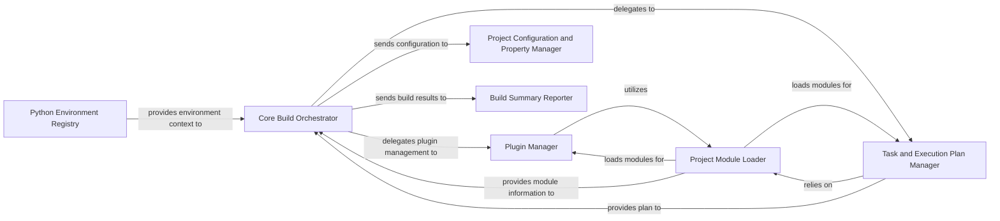

## Details

The PyBuilder `reactor` module serves as the core orchestration engine for the build process. The `Core Build Orchestrator` component initiates and manages the entire build lifecycle, delegating key responsibilities to specialized components. The `Plugin Manager` handles the dynamic loading and integration of plugins, leveraging the `Project Module Loader` to discover and import necessary modules. Concurrently, the `Task and Execution Plan Manager` identifies build tasks, resolves their dependencies, and constructs an optimized execution plan, also relying on the `Project Module Loader` for module introspection. Build configurations and properties are managed by the `Project Configuration and Property Manager`, which ensures consistent application across the project. Throughout the build, the `Python Environment Registry` provides necessary environment contexts. Finally, the `Build Summary Reporter` compiles and presents the build's outcome, offering a concise overview of the process. This modular design allows for extensibility through plugins and a clear separation of concerns in managing the build workflow.

### Core Build Orchestrator
The central component responsible for managing the entire build lifecycle, from initialization and configuration loading to plugin discovery, task execution, and final reporting. It acts as the primary coordinator for all build activities.

**Related Classes/Methods**:

- <a href="https://github.com/pybuilder/pybuilder/blob/master/src/main/python/pybuilder/reactor.py#L176-L222" target="_blank" rel="noopener noreferrer">`src.main.python.pybuilder.reactor.prepare_build`:176-222</a>
- <a href="https://github.com/pybuilder/pybuilder/blob/master/src/main/python/pybuilder/reactor.py#L224-L237" target="_blank" rel="noopener noreferrer">`src.main.python.pybuilder.reactor.build`:224-237</a>

### Plugin Manager
Manages the discovery, loading, and integration of PyBuilder plugins. It ensures that required plugins are available and their functionalities are hooked into the build process, extending PyBuilder's core capabilities.

**Related Classes/Methods**:

- <a href="https://github.com/pybuilder/pybuilder/blob/master/src/main/python/pybuilder/reactor.py#L157-L163" target="_blank" rel="noopener noreferrer">`src.main.python.pybuilder.reactor.require_plugin`:157-163</a>
- <a href="https://github.com/pybuilder/pybuilder/blob/master/src/main/python/pybuilder/reactor.py#L306-L317" target="_blank" rel="noopener noreferrer">`src.main.python.pybuilder.reactor.import_plugin`:306-317</a>
- <a href="https://github.com/pybuilder/pybuilder/blob/master/src/main/python/pybuilder/reactor.py#L547-L561" target="_blank" rel="noopener noreferrer">`src.main.python.pybuilder.reactor._load_deferred_plugins`:547-561</a>
- <a href="https://github.com/pybuilder/pybuilder/blob/master/src/main/python/pybuilder/reactor.py#L60-L70" target="_blank" rel="noopener noreferrer">`src.main.python.pybuilder.reactor.add_plugin`:60-70</a>

### Task and Execution Plan Manager
Responsible for identifying build tasks (often via annotations), defining their interdependencies, and constructing an optimized, ordered execution plan that respects these dependencies, ensuring tasks run in the correct sequence.

**Related Classes/Methods**:

- <a href="https://github.com/pybuilder/pybuilder/blob/master/src/main/python/pybuilder/reactor.py#L319-L396" target="_blank" rel="noopener noreferrer">`src.main.python.pybuilder.reactor.collect_project_annotations`:319-396</a>
- <a href="https://github.com/pybuilder/pybuilder/blob/master/src/main/python/pybuilder/reactor.py#L322-L328" target="_blank" rel="noopener noreferrer">`src.main.python.pybuilder.reactor.add_task_dependency`:322-328</a>
- <a href="https://github.com/pybuilder/pybuilder/blob/master/src/main/python/pybuilder/reactor.py#L239-L255" target="_blank" rel="noopener noreferrer">`src.main.python.pybuilder.reactor.create_execution_plan`:239-255</a>

### Project Configuration and Property Manager
Handles the application of project-specific attributes and the propagation of build properties across different stages and components. It ensures a consistent build environment by making configuration values accessible where needed.

**Related Classes/Methods**:

- <a href="https://github.com/pybuilder/pybuilder/blob/master/src/main/python/pybuilder/reactor.py#L398-L413" target="_blank" rel="noopener noreferrer">`src.main.python.pybuilder.reactor.apply_project_attributes`:398-413</a>
- <a href="https://github.com/pybuilder/pybuilder/blob/master/src/main/python/pybuilder/reactor.py#L415-L418" target="_blank" rel="noopener noreferrer">`src.main.python.pybuilder.reactor.propagate_property`:415-418</a>

### Project Module Loader
Manages the dynamic loading of Python modules, including project-specific build files and plugin code. It handles module resolution, naming normalization, and traversal to discover build elements.

**Related Classes/Methods**:

- <a href="https://github.com/pybuilder/pybuilder/blob/master/src/main/python/pybuilder/reactor.py#L457-L463" target="_blank" rel="noopener noreferrer">`src.main.python.pybuilder.reactor.load_project_module`:457-463</a>
- <a href="https://github.com/pybuilder/pybuilder/blob/master/src/main/python/pybuilder/reactor.py#L94-L95" target="_blank" rel="noopener noreferrer">`src.main.python.pybuilder.reactor.get_mods`:94-95</a>
- <a href="https://github.com/pybuilder/pybuilder/blob/master/src/main/python/pybuilder/reactor.py#L72-L74" target="_blank" rel="noopener noreferrer">`src.main.python.pybuilder.reactor.set_module`:72-74</a>
- <a href="https://github.com/pybuilder/pybuilder/blob/master/src/main/python/pybuilder/reactor.py#L453-L455" target="_blank" rel="noopener noreferrer">`src.main.python.pybuilder.reactor.normalize_candidate_name`:453-455</a>
- <a href="https://github.com/pybuilder/pybuilder/blob/master/src/main/python/pybuilder/reactor.py#L53-L113" target="_blank" rel="noopener noreferrer">`pybuilder.reactor.ModuleTraversalTree`:53-113</a>

### Build Summary Reporter
Gathers and presents a concise summary of the build process, including its outcome (success/failure), execution time, and other relevant statistics, providing essential feedback to the user.

**Related Classes/Methods**:

- <a href="https://github.com/pybuilder/pybuilder/blob/master/src/main/python/pybuilder/reactor.py#L47-L50" target="_blank" rel="noopener noreferrer">`pybuilder.reactor.BuildSummary`:47-50</a>

### Python Environment Registry
Manages and provides access to different Python environments that might be required for specific build steps or plugin executions, ensuring dependency isolation and correct environment setup.

**Related Classes/Methods**:

- <a href="https://github.com/pybuilder/pybuilder/blob/master/src/main/python/pybuilder/reactor.py#L496-L498" target="_blank" rel="noopener noreferrer">`pybuilder.reactor.python_env_registry`:496-498</a>

### [FAQ](https://github.com/CodeBoarding/GeneratedOnBoardings/tree/main?tab=readme-ov-file#faq)