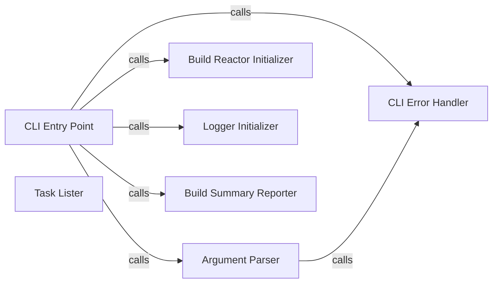

## Details

The `CLI Interface` subsystem serves as the primary user interaction point for PyBuilder, responsible for parsing command-line arguments, initiating core build operations, and presenting build feedback.

### CLI Entry Point
The core orchestrator of the command-line interface. It manages the overall flow, from parsing arguments and initializing the logger to setting up the build reactor and executing build tasks or displaying information.

**Related Classes/Methods**:

- <a href="https://github.com/pybuilder/pybuilder/blob/master/src/main/python/pybuilder/cli.py" target="_blank" rel="noopener noreferrer">`pybuilder.cli:main`</a>

### Argument Parser
Responsible for parsing and validating command-line arguments and options provided by the user. It translates raw input into structured configuration that guides the build process.

**Related Classes/Methods**:

- <a href="https://github.com/pybuilder/pybuilder/blob/master/src/main/python/pybuilder/cli.py" target="_blank" rel="noopener noreferrer">`pybuilder.cli:parse_options`</a>

### Build Reactor Initializer
Initializes and configures the PyBuilder build reactor, which is the core engine for managing the build lifecycle, plugins, and tasks. This component is the crucial link between the CLI and the underlying build execution framework.

**Related Classes/Methods**:

- <a href="https://github.com/pybuilder/pybuilder/blob/master/src/main/python/pybuilder/cli.py" target="_blank" rel="noopener noreferrer">`pybuilder.cli:init_reactor`</a>

### Logger Initializer
Sets up and configures the logging system, ensuring that build output, warnings, and errors are displayed to the user in a consistent and readable format.

**Related Classes/Methods**:

- <a href="https://github.com/pybuilder/pybuilder/blob/master/src/main/python/pybuilder/cli.py" target="_blank" rel="noopener noreferrer">`pybuilder.cli:init_logger`</a>

### Build Summary Reporter
Displays a high-level summary of the build process, including its final outcome (success/failure) and other relevant build statistics. It often leverages other printing utilities for detailed output.

**Related Classes/Methods**:

- <a href="https://github.com/pybuilder/pybuilder/blob/master/src/main/python/pybuilder/cli.py" target="_blank" rel="noopener noreferrer">`pybuilder.cli:print_summary`</a>

### Task Lister
A utility specifically designed for formatting and displaying a list of available build tasks to the user, typically invoked when a task listing option is requested via the CLI.

**Related Classes/Methods**:

- <a href="https://github.com/pybuilder/pybuilder/blob/master/src/main/python/pybuilder/cli.py" target="_blank" rel="noopener noreferrer">`pybuilder.cli:print_task_list`</a>

### CLI Error Handler
Manages and reports exceptions or invalid usage scenarios that occur within the command-line interface, providing user-friendly error messages and guidance.

**Related Classes/Methods**:

- <a href="https://github.com/pybuilder/pybuilder/blob/master/src/main/python/pybuilder/cli.py" target="_blank" rel="noopener noreferrer">`pybuilder.cli:error`</a>

### [FAQ](https://github.com/CodeBoarding/GeneratedOnBoardings/tree/main?tab=readme-ov-file#faq)