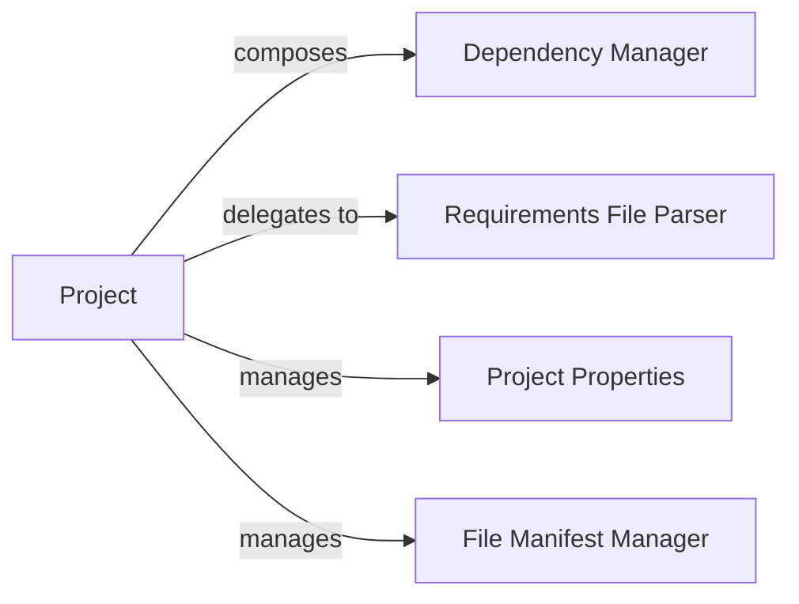

## Details

The `pybuilder` project's core architecture revolves around the `Project` component, which acts as the central configuration and lifecycle manager. The `Project` component internally `manages` its `Project Properties` for flexible configuration and `manages` the `File Manifest Manager` functionality to control build artifact inclusion. For external dependencies, the `Project` `composes` a `Dependency Manager` to track individual dependencies and `delegates to` the `Requirements File Parser` for interpreting external dependency declarations. This design centralizes project configuration and dependency management within the `Project` entity, ensuring a cohesive and controlled build process.

### Project
The core entity representing the build project. It acts as the central hub for all project configuration, metadata, and lifecycle management. It aggregates and provides access to all other configuration-related aspects.

**Related Classes/Methods**:

- <a href="https://github.com/pybuilder/pybuilder/blob/master/src/main/python/pybuilder/core.py#L429-L732" target="_blank" rel="noopener noreferrer">`pybuilder.core.Project`:429-732</a>

### Project Properties
An internal mechanism within the `Project` object for storing and retrieving arbitrary key-value configuration settings. This allows for flexible and dynamic project-specific configurations.

**Related Classes/Methods**:

- <a href="https://github.com/pybuilder/pybuilder/blob/master/src/main/python/pybuilder/core.py" target="_blank" rel="noopener noreferrer">`pybuilder.core.Project.properties`</a>

### Dependency Manager
Manages individual project dependencies, encapsulating details such as name, version, and type. It's responsible for tracking and providing access to the project's required external libraries or modules.

**Related Classes/Methods**:

- <a href="https://github.com/pybuilder/pybuilder/blob/master/src/main/python/pybuilder/core.py" target="_blank" rel="noopener noreferrer">`pybuilder.core.Dependency`</a>

### Requirements File Parser
Facilitates the parsing and interpretation of external dependency files (e.g., `requirements.txt`). It translates external dependency declarations into internal `Dependency` objects for the project.

**Related Classes/Methods**:

- <a href="https://github.com/pybuilder/pybuilder/blob/master/src/main/python/pybuilder/core.py#L341-L371" target="_blank" rel="noopener noreferrer">`pybuilder.core.RequirementsFile`:341-371</a>

### File Manifest Manager
A set of internal methods and logic within the `Project` class responsible for defining and processing file inclusion/exclusion patterns for the project's build artifacts. This ensures that only relevant files are included in distributions or packages.

**Related Classes/Methods**:

- <a href="https://github.com/pybuilder/pybuilder/blob/master/src/main/python/pybuilder/core.py" target="_blank" rel="noopener noreferrer">`pybuilder.core.Project._manifest_include`</a>
- <a href="https://github.com/pybuilder/pybuilder/blob/master/src/main/python/pybuilder/core.py" target="_blank" rel="noopener noreferrer">`pybuilder.core.Project._add_package_data`</a>
- <a href="https://github.com/pybuilder/pybuilder/blob/master/src/main/python/pybuilder/core.py" target="_blank" rel="noopener noreferrer">`pybuilder.core.Project.files_to_install`</a>

### [FAQ](https://github.com/CodeBoarding/GeneratedOnBoardings/tree/main?tab=readme-ov-file#faq)