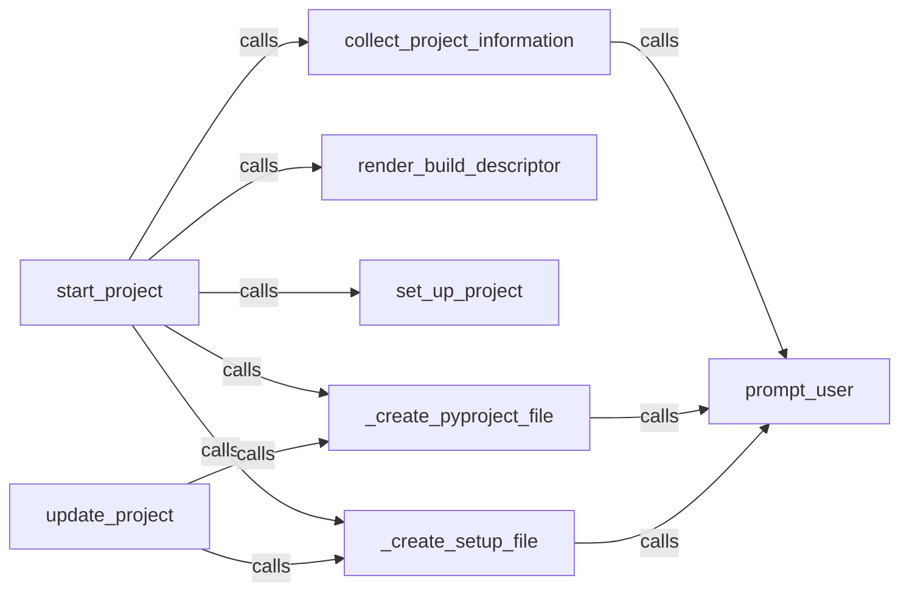

## Details

The `Project Scaffolding Tool` subsystem within PyBuilder is responsible for interactively guiding users through the creation and initial setup of new PyBuilder projects, generating the necessary project structure and build configuration files.

### start_project
The primary orchestrator for creating new PyBuilder projects. It sequences the steps of information collection, directory setup, and file generation, embodying the "Pipeline/Workflow" pattern. This component is fundamental as it defines the overall flow of project creation.

**Related Classes/Methods**:

- <a href="https://github.com/pybuilder/pybuilder/blob/master/src/main/python/pybuilder/scaffolding.py#L75-L90" target="_blank" rel="noopener noreferrer">`pybuilder.scaffolding.start_project`:75-90</a>

### collect_project_information
Gathers essential project details from the user through interactive prompts, crucial for customizing the build process and aligning with configuration management. This component is vital for tailoring the project to user needs.

**Related Classes/Methods**:

- <a href="https://github.com/pybuilder/pybuilder/blob/master/src/main/python/pybuilder/scaffolding.py#L39-L61" target="_blank" rel="noopener noreferrer">`pybuilder.scaffolding.collect_project_information`:39-61</a>

### render_build_descriptor
Generates the content of the `build.py` file, which defines the project's build logic, properties, and plugin integrations, serving as a fundamental output for the build automation tool. This is the core configuration file for PyBuilder.

**Related Classes/Methods**:

- <a href="https://github.com/pybuilder/pybuilder/blob/master/src/main/python/pybuilder/scaffolding.py#L248-L252" target="_blank" rel="noopener noreferrer">`pybuilder.scaffolding.render_build_descriptor`:248-252</a>

### set_up_project
Creates the necessary project directories (e.g., `src/main/python`, `src/unittest/python`) as part of the initial project setup, establishing the foundational structure. This component ensures the physical layout of the new project.

**Related Classes/Methods**:

- <a href="https://github.com/pybuilder/pybuilder/blob/master/src/main/python/pybuilder/scaffolding.py#L290-L296" target="_blank" rel="noopener noreferrer">`pybuilder.scaffolding.set_up_project`:290-296</a>

### update_project
Handles the regeneration or update of specific project configuration files, such as `pyproject.toml` and `setup.py`, for existing projects, ensuring project configuration remains current. This component provides flexibility for evolving projects.

**Related Classes/Methods**:

- <a href="https://github.com/pybuilder/pybuilder/blob/master/src/main/python/pybuilder/scaffolding.py#L93-L96" target="_blank" rel="noopener noreferrer">`pybuilder.scaffolding.update_project`:93-96</a>

### _create_pyproject_file
Generates or updates the `pyproject.toml` file, a key configuration file for modern Python projects, aligning with configuration management. This is essential for modern Python packaging and tooling.

**Related Classes/Methods**:

- <a href="https://github.com/pybuilder/pybuilder/blob/master/src/main/python/pybuilder/scaffolding.py#L99-L112" target="_blank" rel="noopener noreferrer">`pybuilder.scaffolding._create_pyproject_file`:99-112</a>

### _create_setup_file
Generates or updates the `setup.py` file, a traditional way to define Python package distribution, ensuring compatibility and proper packaging. This component supports legacy and widely adopted Python packaging standards.

**Related Classes/Methods**:

- <a href="https://github.com/pybuilder/pybuilder/blob/master/src/main/python/pybuilder/scaffolding.py#L115-L214" target="_blank" rel="noopener noreferrer">`pybuilder.scaffolding._create_setup_file`:115-214</a>

### prompt_user
A utility component that handles interactive user input, used by various components to gather information or confirm choices, enabling the interactive nature of the scaffolding tool. This component is crucial for the user-friendly experience of the scaffolding process.

**Related Classes/Methods**:

- <a href="https://github.com/pybuilder/pybuilder/blob/master/src/main/python/pybuilder/scaffolding.py#L34-L36" target="_blank" rel="noopener noreferrer">`pybuilder.scaffolding.prompt_user`:34-36</a>

### [FAQ](https://github.com/CodeBoarding/GeneratedOnBoardings/tree/main?tab=readme-ov-file#faq)