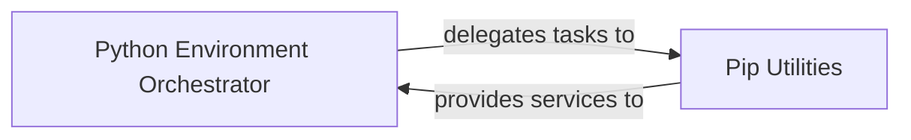

## Details

The `Python Environment Manager` subsystem is primarily responsible for managing Python virtual environments and handling package dependencies within the PyBuilder project. Its core functionality revolves around creating, populating, and maintaining isolated Python environments for build processes.

### Python Environment Orchestrator
This component serves as the central orchestrator for Python virtual environments. It manages the lifecycle of virtual environments, including their creation, recreation, and the execution of commands within them. It ensures that the build process operates within a consistent and isolated Python context, delegating specific dependency installation tasks to the `Pip Utilities`.

**Related Classes/Methods**:

- <a href="https://github.com/pybuilder/pybuilder/blob/master/src/main/python/pybuilder/python_env.py" target="_blank" rel="noopener noreferrer">`pybuilder.python_env`</a>

### Pip Utilities
This component provides a specialized, low-level interface for interacting with the `pip` package installer. It abstracts the complexities of constructing `pip` commands and executing them, serving as a dedicated utility layer for dependency management. It is used by the `Python Environment Orchestrator` to perform actual package installations.

**Related Classes/Methods**:

- <a href="https://github.com/pybuilder/pybuilder/blob/master/src/main/python/pybuilder/pip_utils.py" target="_blank" rel="noopener noreferrer">`pybuilder.pip_utils`</a>

### [FAQ](https://github.com/CodeBoarding/GeneratedOnBoardings/tree/main?tab=readme-ov-file#faq)