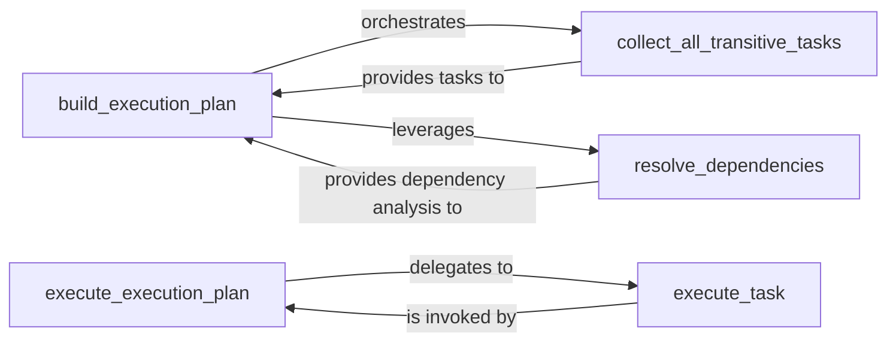

## Details

The `pybuilder.execution` subsystem is the core orchestration engine responsible for transforming a set of desired build tasks into an executable plan and then executing it. It operates in distinct phases: first, identifying all necessary tasks and their dependencies, then constructing a valid, ordered execution plan, and finally, executing each task in sequence. This design ensures that complex build processes are managed efficiently, respecting task interdependencies and preventing circular dependencies.

### build_execution_plan
This central component is responsible for constructing the complete, ordered sequence of tasks (the execution plan) that need to be run. It orchestrates the identification of all necessary tasks, including transitive dependencies, and ensures they are arranged in a valid execution order, including cycle detection. This is a critical part of the "Pipeline/Workflow" orchestration.

**Related Classes/Methods**:

- <a href="https://github.com/pybuilder/pybuilder/blob/master/src/main/python/pybuilder/execution.py#L426-L441" target="_blank" rel="noopener noreferrer">`pybuilder.execution.build_execution_plan`:426-441</a>

### collect_all_transitive_tasks
Recursively identifies and collects all tasks that are directly or indirectly required for the build process. This ensures that the execution plan is comprehensive and includes all prerequisites.

**Related Classes/Methods**:

- <a href="https://github.com/pybuilder/pybuilder/blob/master/src/main/python/pybuilder/execution.py#L418-L424" target="_blank" rel="noopener noreferrer">`pybuilder.execution.collect_all_transitive_tasks`:418-424</a>

### resolve_dependencies
Analyzes the dependencies between various build tasks and determines a valid topological order for their execution. This component is fundamental to the "Dependency-based Programming" aspect of PyBuilder, ensuring tasks are not executed before their prerequisites are met. `build_execution_plan` leverages this component's capabilities for dependency analysis and ordering.

**Related Classes/Methods**:

- <a href="https://github.com/pybuilder/pybuilder/blob/master/src/main/python/pybuilder/execution.py#L492-L542" target="_blank" rel="noopener noreferrer">`pybuilder.execution.resolve_dependencies`:492-542</a>

### execute_execution_plan
This is the orchestrator of the actual build process. It iterates through the prepared execution plan, managing the overall flow and triggering the execution of individual tasks in the determined order. This represents the "Core Engine" aspect of the subsystem.

**Related Classes/Methods**:

- <a href="https://github.com/pybuilder/pybuilder/blob/master/src/main/python/pybuilder/execution.py#L386-L395" target="_blank" rel="noopener noreferrer">`pybuilder.execution.execute_execution_plan`:386-395</a>

### execute_task
Encapsulates the logic for executing a single build task. This is where the specific actions associated with a task (e.g., compiling source code, running tests) are invoked.

**Related Classes/Methods**:

- <a href="https://github.com/pybuilder/pybuilder/blob/master/src/main/python/pybuilder/execution.py#L315-L373" target="_blank" rel="noopener noreferrer">`pybuilder.execution.execute_task`:315-373</a>

### [FAQ](https://github.com/CodeBoarding/GeneratedOnBoardings/tree/main?tab=readme-ov-file#faq)