```mermaid
graph LR
    CLI_Interface["CLI Interface"]
    Build_Reactor_Core_Engine_["Build Reactor (Core Engine)"]
    Project_Configuration_Manager["Project Configuration Manager"]
    Task_Execution_Engine["Task Execution Engine"]
    Plugin_Ecosystem["Plugin Ecosystem"]
    Python_Environment_Manager["Python Environment Manager"]
    Project_Scaffolding_Tool["Project Scaffolding Tool"]
    CLI_Interface -- "initiates build" --> Build_Reactor_Core_Engine_
    CLI_Interface -- "triggers project setup" --> Project_Scaffolding_Tool
    Build_Reactor_Core_Engine_ -- "accesses/updates" --> Project_Configuration_Manager
    Build_Reactor_Core_Engine_ -- "loads plugins via" --> Plugin_Ecosystem
    Build_Reactor_Core_Engine_ -- "submits plan to" --> Task_Execution_Engine
    Build_Reactor_Core_Engine_ -- "manages environment via" --> Python_Environment_Manager
    Project_Configuration_Manager -- "provides project state to" --> Build_Reactor_Core_Engine_
    Project_Configuration_Manager -- "provides task context to" --> Task_Execution_Engine
    Project_Configuration_Manager -- "provides configuration to" --> Plugin_Ecosystem
    Project_Configuration_Manager -- "defines dependencies for" --> Python_Environment_Manager
    Task_Execution_Engine -- "reports results to" --> Build_Reactor_Core_Engine_
    Task_Execution_Engine -- "invokes tasks from" --> Plugin_Ecosystem
    Task_Execution_Engine -- "receives context from" --> Project_Configuration_Manager
    Plugin_Ecosystem -- "registers tasks/hooks with" --> Build_Reactor_Core_Engine_
    Plugin_Ecosystem -- "retrieves configuration from" --> Project_Configuration_Manager
    Plugin_Ecosystem -- "provides tasks to" --> Task_Execution_Engine
    Plugin_Ecosystem -- "utilizes" --> Python_Environment_Manager
    Python_Environment_Manager -- "creates/manages environments for" --> Build_Reactor_Core_Engine_
    Python_Environment_Manager -- "installs dependencies based on" --> Project_Configuration_Manager
    Project_Scaffolding_Tool -- "generates initial configuration for" --> Project_Configuration_Manager
    Project_Scaffolding_Tool -- "responds to" --> CLI_Interface
    click CLI_Interface href "https://github.com/CodeBoarding/GeneratedOnBoardings/blob/main/pybuilder/CLI_Interface.md" "Details"
    click Build_Reactor_Core_Engine_ href "https://github.com/CodeBoarding/GeneratedOnBoardings/blob/main/pybuilder/Build_Reactor_Core_Engine_.md" "Details"
    click Project_Configuration_Manager href "https://github.com/CodeBoarding/GeneratedOnBoardings/blob/main/pybuilder/Project_Configuration_Manager.md" "Details"
    click Task_Execution_Engine href "https://github.com/CodeBoarding/GeneratedOnBoardings/blob/main/pybuilder/Task_Execution_Engine.md" "Details"
    click Plugin_Ecosystem href "https://github.com/CodeBoarding/GeneratedOnBoardings/blob/main/pybuilder/Plugin_Ecosystem.md" "Details"
    click Python_Environment_Manager href "https://github.com/CodeBoarding/GeneratedOnBoardings/blob/main/pybuilder/Python_Environment_Manager.md" "Details"
    click Project_Scaffolding_Tool href "https://github.com/CodeBoarding/GeneratedOnBoardings/blob/main/pybuilder/Project_Scaffolding_Tool.md" "Details"
```

## Details

PyBuilder's architecture is designed around a central `Build Reactor (Core Engine)` that orchestrates the entire build lifecycle. Users interact with the system via the `CLI Interface`, which can either trigger a build process or initiate project setup through the `Project Scaffolding Tool`. The `Project Configuration Manager` serves as the authoritative source for all project-specific metadata and settings, accessed and modified by the `Build Reactor` and various plugins. The `Plugin Ecosystem` provides the primary mechanism for extending PyBuilder's capabilities, with plugins registering tasks and hooks with the `Build Reactor`. Build tasks are executed by the `Task Execution Engine`, which receives its plan from the `Build Reactor` and context from the `Project Configuration Manager`. For managing project dependencies and isolated execution environments, the `Python Environment Manager` is employed. This component-based design ensures a clear separation of responsibilities, facilitating modularity, maintainability, and extensibility, making it well-suited for visual representation as a data flow diagram.

### CLI Interface [[Expand]](./CLI_Interface.md)
The primary user interaction point, responsible for parsing command-line arguments and initiating core operations like building or scaffolding.

**Related Classes/Methods**:

- <a href="https://github.com/pybuilder/pybuilder/blob/master/src/main/python/pybuilder/cli.py" target="_blank" rel="noopener noreferrer">`pybuilder.cli`</a>

### Build Reactor (Core Engine) [[Expand]](./Build_Reactor_Core_Engine_.md)
The central orchestration component of PyBuilder. It manages the build lifecycle, loads project configuration, discovers and loads plugins, collects task annotations, and prepares the execution plan.

**Related Classes/Methods**:

- <a href="https://github.com/pybuilder/pybuilder/blob/master/src/main/python/pybuilder/reactor.py" target="_blank" rel="noopener noreferrer">`pybuilder.reactor`</a>

### Project Configuration Manager [[Expand]](./Project_Configuration_Manager.md)
Manages the project's metadata, properties, dependencies, and file inclusion/exclusion rules. It provides a central object for the Reactor and plugins to interact with project-specific settings.

**Related Classes/Methods**:

- <a href="https://github.com/pybuilder/pybuilder/blob/master/src/main/python/pybuilder/core.py" target="_blank" rel="noopener noreferrer">`pybuilder.core`</a>

### Task Execution Engine [[Expand]](./Task_Execution_Engine.md)
Takes the prepared execution plan from the Reactor, resolves inter-task dependencies, and executes individual build tasks in the correct order.

**Related Classes/Methods**:

- <a href="https://github.com/pybuilder/pybuilder/blob/master/src/main/python/pybuilder/execution.py" target="_blank" rel="noopener noreferrer">`pybuilder.execution`</a>

### Plugin Ecosystem [[Expand]](./Plugin_Ecosystem.md)
Represents the dynamic discovery, loading, and integration of PyBuilder plugins, as well as the functionality provided by standard and custom plugins (e.g., testing, packaging). It registers tasks and hooks with the Reactor.

**Related Classes/Methods**:

- <a href="https://github.com/pybuilder/pybuilder/blob/master/src/main/python/pybuilder/pluginloader.py" target="_blank" rel="noopener noreferrer">`pybuilder.pluginloader`</a>
- <a href="https://github.com/pybuilder/pybuilder/blob/master/src/main/python/pybuilder/plugins/python/distutils_plugin.py" target="_blank" rel="noopener noreferrer">`pybuilder.plugins.python.distutils_plugin`</a>

### Python Environment Manager [[Expand]](./Python_Environment_Manager.md)
Manages Python virtual environments for the build process, including their creation, recreation, and the installation of project and build dependencies using tools like `pip`.

**Related Classes/Methods**:

- <a href="https://github.com/pybuilder/pybuilder/blob/master/src/main/python/pybuilder/python_env.py" target="_blank" rel="noopener noreferrer">`pybuilder.python_env`</a>
- <a href="https://github.com/pybuilder/pybuilder/blob/master/src/main/python/pybuilder/pip_utils.py" target="_blank" rel="noopener noreferrer">`pybuilder.pip_utils`</a>

### Project Scaffolding Tool [[Expand]](./Project_Scaffolding_Tool.md)
Provides interactive functionality to help users set up new PyBuilder projects, generating initial project structures and build descriptors (`build.py`).

**Related Classes/Methods**:

- <a href="https://github.com/pybuilder/pybuilder/blob/master/src/main/python/pybuilder/scaffolding.py" target="_blank" rel="noopener noreferrer">`pybuilder.scaffolding`</a>

### [FAQ](https://github.com/CodeBoarding/GeneratedOnBoardings/tree/main?tab=readme-ov-file#faq)