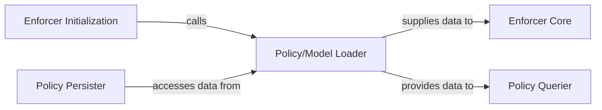

## Details

The `Enforcer Core` subsystem is the heart of the pycasbin library, responsible for evaluating authorization requests. It embodies the Policy Enforcement Point (PEP) pattern, orchestrating the decision-making process based on loaded models and policies.

### Enforcer Core [[Expand]](./Enforcer_Core.md)
The central Policy Enforcement Point (PEP) responsible for evaluating authorization requests against the loaded model and policy. It orchestrates the decision-making process, handling both single and batch enforcement requests.

**Related Classes/Methods**:

- <a href="https://github.com/casbin/pycasbin/blob/master/casbin/enforcer.py" target="_blank" rel="noopener noreferrer">`casbin.enforcer`</a>
- <a href="https://github.com/casbin/pycasbin/blob/master/casbin/core_enforcer.py#L382-L387" target="_blank" rel="noopener noreferrer">`casbin.core_enforcer.enforce`:382-387</a>
- <a href="https://github.com/casbin/pycasbin/blob/master/casbin/core_enforcer.py#L389-L524" target="_blank" rel="noopener noreferrer">`casbin.core_enforcer.enforce_ex`:389-524</a>
- <a href="https://github.com/casbin/pycasbin/blob/master/casbin/core_enforcer.py#L526-L532" target="_blank" rel="noopener noreferrer">`casbin.core_enforcer.batch_enforce`:526-532</a>

### Enforcer Initialization
Manages the lifecycle and setup of the enforcer instance. This includes loading the authorization model and policy during startup and configuring the role manager. It serves as the primary entry point for creating a functional enforcer.

**Related Classes/Methods**:

- <a href="https://github.com/casbin/pycasbin/blob/master/casbin/core_enforcer.py#L58-L75" target="_blank" rel="noopener noreferrer">`casbin.core_enforcer.__init__`:58-75</a>
- <a href="https://github.com/casbin/pycasbin/blob/master/casbin/core_enforcer.py#L77-L80" target="_blank" rel="noopener noreferrer">`casbin.core_enforcer.init_with_file`:77-80</a>
- <a href="https://github.com/casbin/pycasbin/blob/master/casbin/core_enforcer.py#L82-L87" target="_blank" rel="noopener noreferrer">`casbin.core_enforcer.init_with_adapter`:82-87</a>
- <a href="https://github.com/casbin/pycasbin/blob/master/casbin/core_enforcer.py#L89-L105" target="_blank" rel="noopener noreferrer">`casbin.core_enforcer.init_with_model_and_adapter`:89-105</a>

### Policy/Model Loader
Handles the parsing and loading of the authorization model (schema/structure) and policy (rules) from various sources into the enforcer's in-memory representation. It also builds role links for hierarchical roles, ensuring the enforcer has the necessary data for evaluation.

**Related Classes/Methods**:

- <a href="https://github.com/casbin/pycasbin/blob/master/casbin/core_enforcer.py#L219-L252" target="_blank" rel="noopener noreferrer">`casbin.core_enforcer.load_policy`:219-252</a>
- <a href="https://github.com/casbin/pycasbin/blob/master/casbin/core_enforcer.py#L132-L140" target="_blank" rel="noopener noreferrer">`casbin.core_enforcer.load_model`:132-140</a>
- <a href="https://github.com/casbin/pycasbin/blob/master/casbin/core_enforcer.py#L254-L268" target="_blank" rel="noopener noreferrer">`casbin.core_enforcer.load_filtered_policy`:254-268</a>
- <a href="https://github.com/casbin/pycasbin/blob/master/casbin/core_enforcer.py#L270-L278" target="_blank" rel="noopener noreferrer">`casbin.core_enforcer.load_increment_filtered_policy`:270-278</a>

### Policy Persister
Manages the persistence of the current in-memory policy state back to the configured data store, typically via an adapter. This ensures that any runtime modifications to the policy can be saved.

**Related Classes/Methods**:

- <a href="https://github.com/casbin/pycasbin/blob/master/casbin/core_enforcer.py#L285-L295" target="_blank" rel="noopener noreferrer">`casbin.core_enforcer.save_policy`:285-295</a>

### Policy Querier
Provides a public API for querying the loaded policy and role relationships without performing a full enforcement. It allows users to inspect permissions, roles, and implicit relationships, which is valuable for debugging and auditing.

**Related Classes/Methods**:

- <a href="https://github.com/casbin/pycasbin/blob/master/casbin/enforcer.py#L155-L173" target="_blank" rel="noopener noreferrer">`casbin.enforcer.get_implicit_permissions_for_user`:155-173</a>
- <a href="https://github.com/casbin/pycasbin/blob/master/casbin/enforcer.py#L43-L46" target="_blank" rel="noopener noreferrer">`casbin.enforcer.has_role_for_user`:43-46</a>
- <a href="https://github.com/casbin/pycasbin/blob/master/casbin/enforcer.py#L175-L210" target="_blank" rel="noopener noreferrer">`casbin.enforcer.get_named_implicit_permissions_for_user`:175-210</a>

### [FAQ](https://github.com/CodeBoarding/GeneratedOnBoardings/tree/main?tab=readme-ov-file#faq)