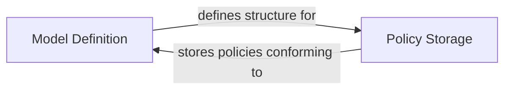

## Details

The Casbin access control system's core functionality is centered around two primary components: `Model Definition` and `Policy Storage`. The `Model Definition` component is foundational, responsible for defining the abstract structure and rules of the access control policy, acting as the schema for the entire system. This definition dictates how policy rules are interpreted and enforced. Complementing this, the `Policy Storage` component serves as the concrete repository for the actual access control rules. It stores and manages the policy data, ensuring that these rules strictly conform to the structural guidelines established by the `Model Definition`. This clear separation of concerns ensures that the system can flexibly define complex access control models while efficiently managing the corresponding policy data.

### Model Definition [[Expand]](./Model_Definition.md)
This is the core component that manages the Casbin model definition. It specifies the structure of the access control policy, including request, policy, matcher, and effect configurations. Its responsibilities include loading model definitions from various sources (files, text), parsing sections and assertions, managing the model's internal structure, and providing utilities for inspection, serialization, and comparison of policy hierarchies. It essentially defines the schema for access control policies.

**Related Classes/Methods**:

- <a href="https://github.com/casbin/pycasbin/blob/master/casbin/model/model.py" target="_blank" rel="noopener noreferrer">`casbin.model.model`</a>

### Policy Storage
This component is responsible for storing and managing the actual policy data (e.g., `p, alice, data1, read`). It acts as the repository for the concrete access control rules that conform to the structure defined by the `Model Definition` component. It provides mechanisms to add, remove, and retrieve policy rules.

**Related Classes/Methods**:

- <a href="https://github.com/casbin/pycasbin/blob/master/casbin/model/policy.py" target="_blank" rel="noopener noreferrer">`casbin.model.policy`</a>

### [FAQ](https://github.com/CodeBoarding/GeneratedOnBoardings/tree/main?tab=readme-ov-file#faq)