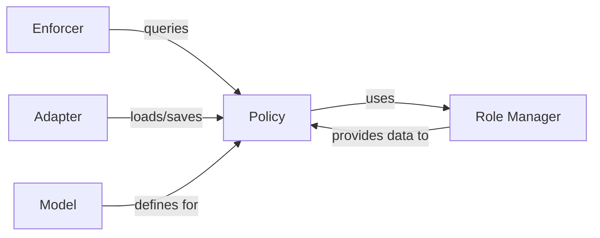

## Details

The `pycasbin` authorization system is built around a core set of interacting components. The `Model` defines the structure of authorization policies, which are then stored and managed by the `Policy` component. The `Enforcer` acts as the central decision-making unit, evaluating access requests by querying the `Policy` for relevant rules. For persistent storage, the `Adapter` handles loading and saving policy rules to and from various backends, ensuring that policies are maintained across sessions. Finally, the `Role Manager` provides robust support for role-based access control, managing complex role hierarchies and relationships that inform the `Policy` and ultimately influence the `Enforcer`'s decisions.

### Policy
The in-memory repository for all authorization policy rules. It provides fast access to policy data during enforcement and handles the addition, removal, and querying of policy rules, including role link management.

**Related Classes/Methods**:

- <a href="https://github.com/casbin/pycasbin/blob/master/casbin/model/policy.py#L20-L320" target="_blank" rel="noopener noreferrer">`casbin.model.policy.Policy`:20-320</a>

### Model
Defines the schema and structure for policy rules, ensuring that policies conform to a predefined format. It dictates how rules are parsed and interpreted by the Enforcer.

**Related Classes/Methods**:

- <a href="https://github.com/casbin/pycasbin/blob/master/casbin/model/model.py#L25-L252" target="_blank" rel="noopener noreferrer">`casbin.model.model.Model`:25-252</a>

### Enforcer
The primary component responsible for evaluating authorization requests. It queries the Policy component to retrieve the necessary policy rules for evaluation during an authorization request.

**Related Classes/Methods**:

- <a href="https://github.com/casbin/pycasbin/blob/master/casbin/enforcer.py#L21-L356" target="_blank" rel="noopener noreferrer">`casbin.enforcer.Enforcer`:21-356</a>

### Adapter
Manages the persistence of policy rules, loading them from and saving them to various storage backends (e.g., files, databases). It acts as an interface between the in-memory Policy and external data sources.

**Related Classes/Methods**:

- <a href="https://github.com/casbin/pycasbin/blob/master/casbin/persist/adapter.py#L78-L101" target="_blank" rel="noopener noreferrer">`casbin.persist.adapter.Adapter`:78-101</a>

### Role Manager [[Expand]](./Role_Manager.md)
Manages role hierarchies and relationships, providing functionality to query and manipulate role-based access control (RBAC) structures. It supports the Policy component by handling role-specific rules and relationships.

**Related Classes/Methods**:

- <a href="https://github.com/casbin/pycasbin/blob/master/casbin/rbac/role_manager.py#L16-L38" target="_blank" rel="noopener noreferrer">`casbin.rbac.role_manager.RoleManager`:16-38</a>

### [FAQ](https://github.com/CodeBoarding/GeneratedOnBoardings/tree/main?tab=readme-ov-file#faq)