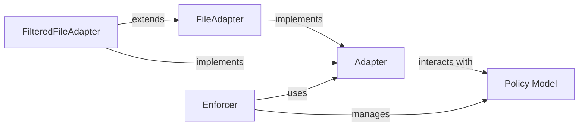

## Details

The Policy Persistence subsystem in Casbin is designed around the Adapter abstract component, which defines the contract for interacting with various policy storage backends. Concrete implementations like FileAdapter and FilteredFileAdapter handle the specifics of reading and writing policy rules to files, with FilteredFileAdapter offering advanced filtering capabilities. The Enforcer acts as the central orchestrator, relying on an Adapter to load and save policy data, which is then managed within the Policy Model. This clear separation of concerns allows for flexible policy storage mechanisms while maintaining a consistent interface for the Enforcer to make authorization decisions. The Enforcer directly manages the Policy Model, which serves as the in-memory representation of the policy rules, facilitating efficient access and manipulation during authorization checks.

### Adapter
This is the central abstract component of the Policy Persistence subsystem. It defines the standard contract for all concrete policy persistence implementations, ensuring seamless integration of different storage backends with the Casbin enforcer. It specifies methods for loading, saving, adding, and removing policy rules.

**Related Classes/Methods**:

- <a href="https://github.com/casbin/pycasbin/blob/master/casbin/persist/adapter.py#L78-L101" target="_blank" rel="noopener noreferrer">`casbin.persist.adapter.Adapter`:78-101</a>

### FileAdapter
A concrete implementation of the Adapter interface designed for persisting and loading policy rules from local files. It handles the direct reading and writing of policy data to a specified file path.

**Related Classes/Methods**:

- <a href="https://github.com/casbin/pycasbin/blob/master/casbin/persist/adapters/file_adapter.py#L20-L82" target="_blank" rel="noopener noreferrer">`casbin.persist.adapters.file_adapter.FileAdapter`:20-82</a>
- <a href="https://github.com/casbin/pycasbin/blob/master/casbin/persist/adapters/asyncio/file_adapter.py" target="_blank" rel="noopener noreferrer">`casbin.persist.adapters.asyncio.file_adapter.FileAdapter`</a>

### FilteredFileAdapter
A specialized concrete implementation that extends file-based persistence by allowing the loading and saving of a subset of policies based on a provided filter. This is crucial for managing large policy sets efficiently.

**Related Classes/Methods**:

- <a href="https://github.com/casbin/pycasbin/blob/master/casbin/persist/adapters/filtered_file_adapter.py#L29-L86" target="_blank" rel="noopener noreferrer">`casbin.persist.adapters.filtered_file_adapter.FilteredFileAdapter`:29-86</a>

### Enforcer
The Enforcer is the primary client that orchestrates authorization decisions. It interacts with the Policy Model to retrieve policy rules and delegates policy loading and saving operations to an instance of a concrete Adapter implementation. It provides methods for managing users, roles, and permissions based on the loaded policy.

**Related Classes/Methods**:

- <a href="https://github.com/casbin/pycasbin/blob/master/casbin/enforcer.py#L21-L356" target="_blank" rel="noopener noreferrer">`casbin.enforcer.Enforcer`:21-356</a>

### Policy Model
Represents the in-memory structure that holds the policy rules. It interacts with concrete Adapter implementations to populate itself with loaded policy data or to provide policy data to be saved. It's the data carrier for policies between the Enforcer and the persistence layer.

**Related Classes/Methods**:

- <a href="https://github.com/casbin/pycasbin/blob/master/" target="_blank" rel="noopener noreferrer">`casbin.model.Model`</a>

### [FAQ](https://github.com/CodeBoarding/GeneratedOnBoardings/tree/main?tab=readme-ov-file#faq)