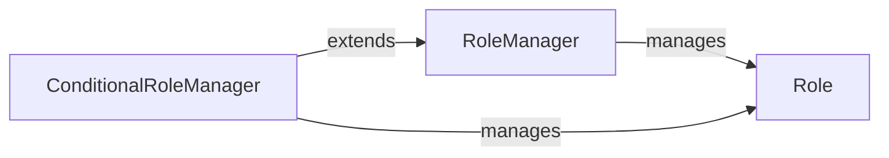

## Details

The `Role Manager` subsystem is a core part of the `pycasbin` library, specifically designed to handle Role-Based Access Control (RBAC) relationships. It centralizes the management of user-role and role-role hierarchies, providing a flexible interface for defining and querying these relationships, including support for conditional links.

### RoleManager
This is the foundational component responsible for managing the core role-based access control (RBAC) relationships. It handles the creation, storage, and retrieval of `Role` objects, and maintains the hierarchical links between users and roles, and roles themselves. It provides core functionalities for adding, deleting, and querying role links, and supports custom matching functions for role names.

**Related Classes/Methods**:

- <a href="https://github.com/casbin/pycasbin/blob/master/casbin/rbac/default_role_manager/role_manager.py" target="_blank" rel="noopener noreferrer">`casbin.rbac.default_role_manager.role_manager:RoleManager`</a>

### Role
Represents an individual role within the RBAC system. It stores its name and maintains direct links to other roles, forming the basis of the role hierarchy. It also holds information related to conditional link functions and their parameters when used with `ConditionalRoleManager`.

**Related Classes/Methods**:

- <a href="https://github.com/casbin/pycasbin/blob/master/casbin/rbac/default_role_manager/role_manager.py" target="_blank" rel="noopener noreferrer">`casbin.rbac.default_role_manager.role_manager:Role`</a>

### ConditionalRoleManager
This component extends the functionality of `RoleManager` by introducing support for conditional role links. It is responsible for evaluating dynamic conditions to determine the validity of a role link during access checks. It manages the storage and retrieval of these conditional link functions and their parameters.

**Related Classes/Methods**:

- <a href="https://github.com/casbin/pycasbin/blob/master/casbin/rbac/default_role_manager/role_manager.py" target="_blank" rel="noopener noreferrer">`casbin.rbac.default_role_manager.role_manager:ConditionalRoleManager`</a>

### [FAQ](https://github.com/CodeBoarding/GeneratedOnBoardings/tree/main?tab=readme-ov-file#faq)