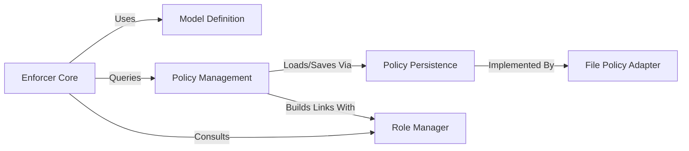

## Details

The `pycasbin` library implements a robust Policy-based Access Control (PBAC) system, with its core functionality residing in the **Enforcer Core**. This central component acts as the decision-making engine, evaluating authorization requests by dynamically referencing the **Model Definition** for policy structure and the **Policy Management** component for the actual policy rules. For complex hierarchical access control, the **Enforcer Core** seamlessly integrates with the **Role Manager**. Data persistence for policies is abstracted through the **Policy Persistence** interface, allowing for various storage backends, exemplified by the **File Policy Adapter**. This architecture promotes a clear separation of concerns, enabling high extensibility and adaptability for diverse authorization requirements, making it ideal for visual representation as a flow graph where data and control flow between distinct, pluggable components.

### Enforcer Core [[Expand]](./Enforcer_Core.md)
The central Policy Enforcement Point (PEP) responsible for evaluating authorization requests against the loaded model and policy. It orchestrates the decision-making process.

**Related Classes/Methods**:

- <a href="https://github.com/casbin/pycasbin/blob/master/casbin/enforcer.py" target="_blank" rel="noopener noreferrer">`casbin.enforcer`</a>

### Model Definition [[Expand]](./Model_Definition.md)
Manages the Casbin model definition, which specifies the structure of the access control policy (e.g., request, policy, matcher, and effect configurations).

**Related Classes/Methods**:

- <a href="https://github.com/casbin/pycasbin/blob/master/casbin/model/model.py" target="_blank" rel="noopener noreferrer">`casbin.model.model`</a>

### Policy Management [[Expand]](./Policy_Management.md)
The in-memory repository for all authorization policy rules. It provides fast access to policy data during enforcement and handles the addition, removal, and querying of policy rules.

**Related Classes/Methods**:

- <a href="https://github.com/casbin/pycasbin/blob/master/casbin/model/policy.py" target="_blank" rel="noopener noreferrer">`casbin.model.policy`</a>

### Policy Persistence [[Expand]](./Policy_Persistence.md)
Defines the standard interface for persisting and loading policy rules from various external storage backends (e.g., files, databases). Concrete adapters implement this interface.

**Related Classes/Methods**:

- <a href="https://github.com/casbin/pycasbin/blob/master/casbin/persist/adapter.py" target="_blank" rel="noopener noreferrer">`casbin.persist.adapter`</a>

### File Policy Adapter
A concrete implementation of the Policy Persistence Adapter Interface specifically for file-based policy storage. This component handles the actual file I/O operations for policy rules.

**Related Classes/Methods**:

- <a href="https://github.com/casbin/pycasbin/blob/master/casbin/persist/adapters/file_adapter.py" target="_blank" rel="noopener noreferrer">`casbin.persist.adapters.file_adapter`</a>

### Role Manager [[Expand]](./Role_Manager.md)
Manages role-based access control (RBAC) relationships, including user-role and role-role hierarchies. It provides an interface for querying and manipulating these relationships.

**Related Classes/Methods**:

- <a href="https://github.com/casbin/pycasbin/blob/master/casbin/rbac/default_role_manager/role_manager.py" target="_blank" rel="noopener noreferrer">`casbin.rbac.default_role_manager.role_manager`</a>

### [FAQ](https://github.com/CodeBoarding/GeneratedOnBoardings/tree/main?tab=readme-ov-file#faq)