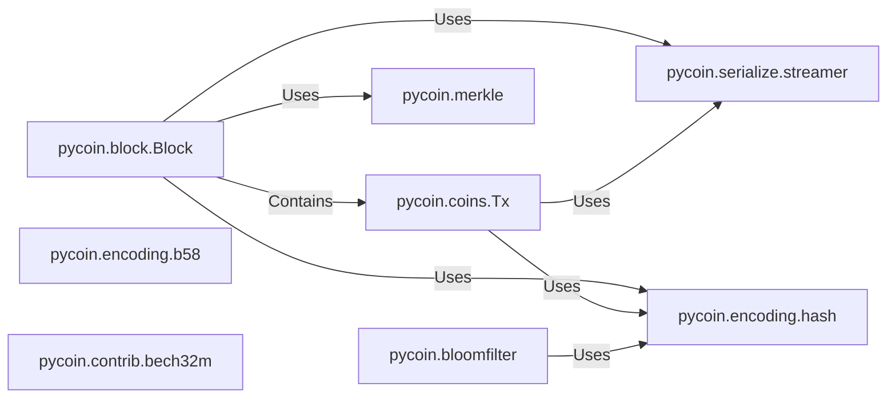

## Details

The `pycoin` core subsystem is designed to handle fundamental blockchain operations, primarily focusing on the structure, serialization, and cryptographic integrity of blocks and transactions. At its heart, the `pycoin.block.Block` component serves as the primary container, encapsulating `pycoin.coins.Tx` instances, which represent individual transactions. The subsystem relies heavily on `pycoin.serialize.streamer` for efficient binary serialization and deserialization of these data structures, enabling their storage and transmission. Cryptographic integrity is maintained through `pycoin.encoding.hash`, which provides essential hashing functions for block headers, transaction IDs, and Merkle tree computations. The `pycoin.merkle` component specifically handles the construction and verification of Merkle roots, ensuring the integrity of transactions within a block. Additionally, the subsystem incorporates `pycoin.encoding.b58` and `pycoin.contrib.bech32m` for address encoding, supporting both traditional and modern Bitcoin address formats. Finally, `pycoin.bloomfilter` offers a probabilistic mechanism for efficient transaction lookups, particularly useful for light clients.

### pycoin.block.Block
Defines the structure and behavior of a blockchain block. Manages the collection of transactions, handles parsing, streaming, hashing, and Merkle root verification.

**Related Classes/Methods**: _None_

### pycoin.coins.Tx
Defines the structure of a blockchain transaction. Handles parsing, streaming, and hash/ID calculation.

**Related Classes/Methods**: _None_

### pycoin.serialize.streamer
Provides a generic framework for structured data serialization and deserialization to/from binary streams.

**Related Classes/Methods**: _None_

### pycoin.encoding.hash
Provides core cryptographic hashing functions (e.g., SHA-256, RIPEMD160) essential for data integrity, block headers, and transaction IDs.

**Related Classes/Methods**: _None_

### pycoin.merkle
Provides functions for computing Merkle roots from a list of hashes, crucial for verifying the integrity of transactions within a block.

**Related Classes/Methods**: _None_

### pycoin.encoding.b58
Handles Base58 encoding and decoding, primarily used for representing hashed data like Bitcoin addresses.

**Related Classes/Methods**: _None_

### pycoin.contrib.bech32m
Provides Bech32m encoding and decoding, specifically for modern SegWit addresses.

**Related Classes/Methods**: _None_

### pycoin.bloomfilter
Implements a probabilistic data structure for efficient membership testing, often used in light clients.

**Related Classes/Methods**: _None_

### [FAQ](https://github.com/CodeBoarding/GeneratedOnBoardings/tree/main?tab=readme-ov-file#faq)