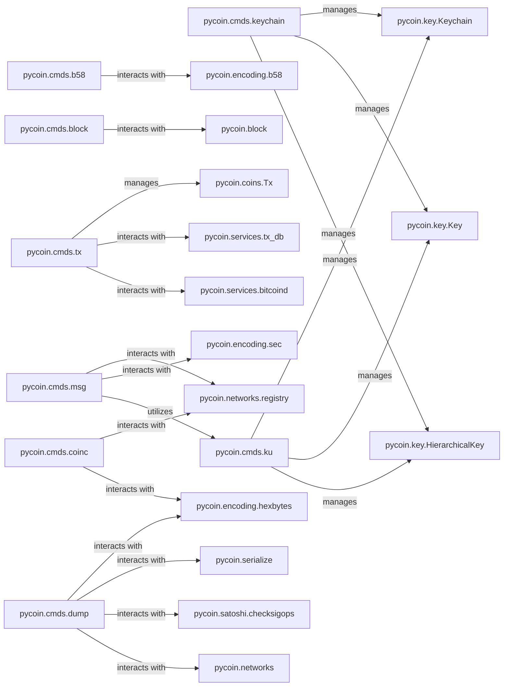

## Details

The `pycoin.cmds` subsystem serves as the command-line interface layer for the `pycoin` project, providing direct user access to core cryptocurrency functionalities. It orchestrates interactions with various underlying `pycoin` libraries to perform tasks such as Base58 encoding/decoding, blockchain block inspection, coin property queries, cryptographic key management, message signing/verification, transaction data dumping, and the full lifecycle management of cryptocurrency transactions. This modular design ensures a clear separation between the user-facing tools and the core cryptographic and blockchain logic.

### pycoin.cmds.b58
Handles Base58 encoding and decoding operations, providing command-line access to these cryptographic utility functions.

**Related Classes/Methods**:

- <a href="https://github.com/richardkiss/pycoin/blob/main/pycoin/encoding/b58.py" target="_blank" rel="noopener noreferrer">`pycoin.encoding.b58`</a>

### pycoin.cmds.block
Manages blockchain block inspection and dumping, allowing users to view detailed information about blocks from the command line.

**Related Classes/Methods**:

- <a href="https://github.com/richardkiss/pycoin/blob/main/pycoin/block.py" target="_blank" rel="noopener noreferrer">`pycoin.block`</a>

### pycoin.cmds.coinc
Provides command-line utilities for querying and displaying coin properties and information, acting as an interface to various coin-specific details.

**Related Classes/Methods**:

- <a href="https://github.com/richardkiss/pycoin/blob/main/pycoin/networks/registry.py" target="_blank" rel="noopener noreferrer">`pycoin.networks.registry`</a>
- <a href="https://github.com/richardkiss/pycoin/blob/main/pycoin/encoding/hexbytes.py" target="_blank" rel="noopener noreferrer">`pycoin.encoding.hexbytes`</a>

### pycoin.cmds.keychain
Manages cryptographic keychains, enabling users to create, derive, and manage hierarchical deterministic (HD) keys and their associated addresses via the command line.

**Related Classes/Methods**:

- <a href="https://github.com/richardkiss/pycoin/blob/main/pycoin/key/keychain.py" target="_blank" rel="noopener noreferrer">`pycoin.key.Keychain`</a>
- <a href="https://github.com/richardkiss/pycoin/blob/main/pycoin/key/key.py" target="_blank" rel="noopener noreferrer">`pycoin.key.Key`</a>
- <a href="https://github.com/richardkiss/pycoin/blob/main/pycoin/key/HierarchicalKey.py" target="_blank" rel="noopener noreferrer">`pycoin.key.HierarchicalKey`</a>

### pycoin.cmds.msg
Facilitates message signing and verification using cryptographic keys, providing a command-line interface for these security-critical operations.

**Related Classes/Methods**:

- <a href="https://github.com/richardkiss/pycoin/blob/main/pycoin/networks/registry.py" target="_blank" rel="noopener noreferrer">`pycoin.networks.registry`</a>
- <a href="https://github.com/richardkiss/pycoin/blob/main/pycoin/encoding/sec.py" target="_blank" rel="noopener noreferrer">`pycoin.encoding.sec`</a>
- <a href="https://github.com/richardkiss/pycoin/blob/main/pycoin/cmds/ku.py" target="_blank" rel="noopener noreferrer">`pycoin.cmds.ku`</a>

### pycoin.cmds.dump
Dumps detailed structures of transactions and other blockchain data, offering a diagnostic tool for inspecting raw data formats.

**Related Classes/Methods**:

- <a href="https://github.com/richardkiss/pycoin/blob/main/pycoin/encoding/hexbytes.py" target="_blank" rel="noopener noreferrer">`pycoin.encoding.hexbytes`</a>
- <a href="https://github.com/richardkiss/pycoin/blob/main/pycoin/serialize" target="_blank" rel="noopener noreferrer">`pycoin.serialize`</a>
- <a href="https://github.com/richardkiss/pycoin/blob/main/pycoin/satoshi/checksigops.py" target="_blank" rel="noopener noreferrer">`pycoin.satoshi.checksigops`</a>
- <a href="https://github.com/richardkiss/pycoin/blob/main/pycoin/networks" target="_blank" rel="noopener noreferrer">`pycoin.networks`</a>

### pycoin.cmds.ku
Offers a comprehensive suite of key-related utilities, including key generation, conversion between formats, and address derivation, serving as a versatile key management tool.

**Related Classes/Methods**:

- <a href="https://github.com/richardkiss/pycoin/blob/main/pycoin/key/keychain.py" target="_blank" rel="noopener noreferrer">`pycoin.key.Keychain`</a>
- <a href="https://github.com/richardkiss/pycoin/blob/main/pycoin/key/key.py" target="_blank" rel="noopener noreferrer">`pycoin.key.Key`</a>
- <a href="https://github.com/richardkiss/pycoin/blob/main/pycoin/key/HierarchicalKey.py" target="_blank" rel="noopener noreferrer">`pycoin.key.HierarchicalKey`</a>

### pycoin.cmds.tx
Manages the transaction lifecycle, including creation, signing, validation, and broadcasting of cryptocurrency transactions from the command line.

**Related Classes/Methods**:

- <a href="https://github.com/richardkiss/pycoin/blob/main/pycoin/coins/tx.py" target="_blank" rel="noopener noreferrer">`pycoin.coins.Tx`</a>
- <a href="https://github.com/richardkiss/pycoin/blob/main/pycoin/services/tx_db.py" target="_blank" rel="noopener noreferrer">`pycoin.services.tx_db`</a>
- <a href="https://github.com/richardkiss/pycoin/blob/main/pycoin/services/bitcoind.py" target="_blank" rel="noopener noreferrer">`pycoin.services.bitcoind`</a>

### pycoin.encoding.b58
Provides functions for Base58 encoding and decoding, essential for handling Bitcoin addresses and other data.

**Related Classes/Methods**:

- <a href="https://github.com/richardkiss/pycoin/blob/main/pycoin/encoding/b58.py" target="_blank" rel="noopener noreferrer">`pycoin.encoding.b58`</a>

### pycoin.block
Defines the structure and methods for interacting with blockchain blocks, including serialization and deserialization.

**Related Classes/Methods**:

- <a href="https://github.com/richardkiss/pycoin/blob/main/pycoin/block.py" target="_blank" rel="noopener noreferrer">`pycoin.block`</a>

### pycoin.key.Keychain
Manages collections of cryptographic keys, often used for hierarchical deterministic (HD) key derivation.

**Related Classes/Methods**:

- <a href="https://github.com/richardkiss/pycoin/blob/main/pycoin/key/keychain.py" target="_blank" rel="noopener noreferrer">`pycoin.key.Keychain`</a>

### pycoin.key.Key
Represents a single cryptographic key, providing functionalities for public/private key operations, signing, and address generation.

**Related Classes/Methods**:

- <a href="https://github.com/richardkiss/pycoin/blob/main/pycoin/key/key.py" target="_blank" rel="noopener noreferrer">`pycoin.key.Key`</a>

### pycoin.key.HierarchicalKey
Extends the Key class to support hierarchical deterministic (HD) key derivation, allowing for the generation of child keys from a parent key.

**Related Classes/Methods**:

- <a href="https://github.com/richardkiss/pycoin/blob/main/pycoin/key/HierarchicalKey.py" target="_blank" rel="noopener noreferrer">`pycoin.key.HierarchicalKey`</a>

### pycoin.coins.Tx
Represents a cryptocurrency transaction, encapsulating its inputs, outputs, and methods for serialization, signing, and validation.

**Related Classes/Methods**:

- <a href="https://github.com/richardkiss/pycoin/blob/main/pycoin/coins/tx.py" target="_blank" rel="noopener noreferrer">`pycoin.coins.Tx`</a>

### pycoin.services.tx_db
Provides an interface for interacting with a transaction database, allowing retrieval and storage of transaction data.

**Related Classes/Methods**:

- <a href="https://github.com/richardkiss/pycoin/blob/main/pycoin/services/tx_db.py" target="_blank" rel="noopener noreferrer">`pycoin.services.tx_db`</a>

### pycoin.services.bitcoind
Offers an interface to interact with a Bitcoin daemon (bitcoind), enabling operations like broadcasting transactions and querying blockchain data.

**Related Classes/Methods**:

- <a href="https://github.com/richardkiss/pycoin/blob/main/pycoin/services/bitcoind.py" target="_blank" rel="noopener noreferrer">`pycoin.services.bitcoind`</a>

### pycoin.networks.registry
Manages the registration and retrieval of different cryptocurrency network configurations.

**Related Classes/Methods**:

- <a href="https://github.com/richardkiss/pycoin/blob/main/pycoin/networks/registry.py" target="_blank" rel="noopener noreferrer">`pycoin.networks.registry`</a>

### pycoin.encoding.hexbytes
Provides utilities for converting between bytes and hexadecimal strings.

**Related Classes/Methods**:

- <a href="https://github.com/richardkiss/pycoin/blob/main/pycoin/encoding/hexbytes.py" target="_blank" rel="noopener noreferrer">`pycoin.encoding.hexbytes`</a>

### pycoin.encoding.sec
Implements functionalities related to the SEC (Standards for Efficient Cryptography) format, particularly for public key operations.

**Related Classes/Methods**:

- <a href="https://github.com/richardkiss/pycoin/blob/main/pycoin/encoding/sec.py" target="_blank" rel="noopener noreferrer">`pycoin.encoding.sec`</a>

### pycoin.serialize
Handles the serialization and deserialization of various pycoin data structures, such as transactions and blocks.

**Related Classes/Methods**:

- <a href="https://github.com/richardkiss/pycoin/blob/main/pycoin/serialize" target="_blank" rel="noopener noreferrer">`pycoin.serialize`</a>

### pycoin.satoshi.checksigops
Provides functions for checking signature operations, crucial for transaction validation in the Bitcoin protocol.

**Related Classes/Methods**:

- <a href="https://github.com/richardkiss/pycoin/blob/main/pycoin/satoshi/checksigops.py" target="_blank" rel="noopener noreferrer">`pycoin.satoshi.checksigops`</a>

### pycoin.networks
A top-level package encompassing various network-specific definitions and utilities.

**Related Classes/Methods**:

- <a href="https://github.com/richardkiss/pycoin/blob/main/pycoin/networks" target="_blank" rel="noopener noreferrer">`pycoin.networks`</a>

### [FAQ](https://github.com/CodeBoarding/GeneratedOnBoardings/tree/main?tab=readme-ov-file#faq)