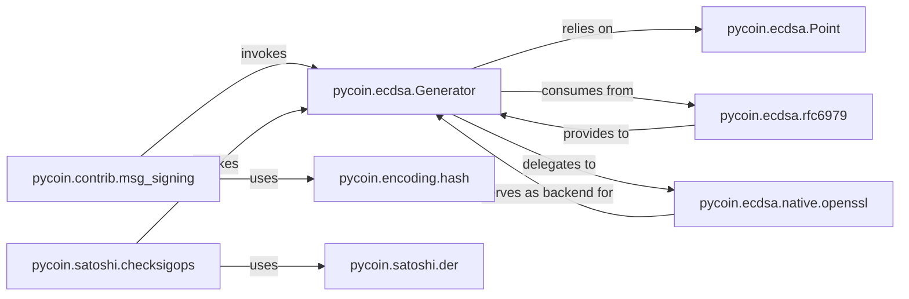

## Details

The `pycoin` ECDSA subsystem is designed around the `pycoin.ecdsa.Generator` component, which serves as the central orchestrator for all elliptic curve digital signature operations. It relies on `pycoin.ecdsa.Point` for fundamental elliptic curve point arithmetic, ensuring the mathematical correctness of cryptographic computations. For enhanced security and deterministic signature generation, `pycoin.ecdsa.Generator` consumes input from `pycoin.ecdsa.rfc6979`, which implements RFC 6979. Performance is optimized by delegating intensive cryptographic computations to `pycoin.ecdsa.native.openssl`, leveraging native C libraries. Higher-level functionalities like Bitcoin-specific message signing (`pycoin.contrib.msg_signing`) and signature verification within Bitcoin scripts (`pycoin.satoshi.checksigops`) invoke the `pycoin.ecdsa.Generator`. Additionally, `pycoin.contrib.msg_signing` utilizes `pycoin.encoding.hash` for message preparation, while `pycoin.satoshi.checksigops` depends on `pycoin.satoshi.der` for handling DER-encoded signatures. This architecture ensures a modular, secure, and efficient implementation of ECDSA within the `pycoin` project.

### pycoin.ecdsa.Generator
Performs core ECDSA operations including signing, verification, and elliptic curve point arithmetic (addition, multiplication). It is the central engine for digital signatures within the subsystem.

**Related Classes/Methods**:

- <a href="https://github.com/richardkiss/pycoin/blob/main/pycoin/ecdsa/Generator.py" target="_blank" rel="noopener noreferrer">`pycoin.ecdsa.Generator`</a>

### pycoin.ecdsa.rfc6979
Implements RFC 6979 for deterministic generation of the k value in ECDSA, which is critical for security and preventing signature malleability.

**Related Classes/Methods**:

- <a href="https://github.com/richardkiss/pycoin/blob/main/pycoin/ecdsa/rfc6979.py" target="_blank" rel="noopener noreferrer">`pycoin.ecdsa.rfc6979`</a>

### pycoin.ecdsa.native.openssl
Offers performance optimizations for ECDSA operations by leveraging native C libraries like OpenSSL or libsecp256k1, providing a faster backend for cryptographic computations.

**Related Classes/Methods**:

- <a href="https://github.com/richardkiss/pycoin/blob/main/pycoin/ecdsa/native/openssl.py" target="_blank" rel="noopener noreferrer">`pycoin.ecdsa.native.openssl`</a>

### pycoin.ecdsa.Point
Represents a point on an elliptic curve, providing methods for fundamental point arithmetic (addition, doubling, multiplication) that are essential for all ECDSA operations.

**Related Classes/Methods**:

- <a href="https://github.com/richardkiss/pycoin/blob/main/pycoin/ecdsa/Point.py" target="_blank" rel="noopener noreferrer">`pycoin.ecdsa.Point`</a>

### pycoin.encoding.hash
Provides fundamental cryptographic hashing functions (e.g., SHA-256, RIPEMD-160) that are essential for preparing messages before digital signing and for various other cryptographic tasks.

**Related Classes/Methods**:

- <a href="https://github.com/richardkiss/pycoin/blob/main/pycoin/encoding/hash.py" target="_blank" rel="noopener noreferrer">`pycoin.encoding.hash`</a>

### pycoin.contrib.msg_signing
Handles Bitcoin-specific message signing and verification protocols, including message formatting and orchestrating the signing process using core ECDSA functions.

**Related Classes/Methods**:

- <a href="https://github.com/richardkiss/pycoin/blob/main/pycoin/contrib/msg_signing.py" target="_blank" rel="noopener noreferrer">`pycoin.contrib.msg_signing`</a>

### pycoin.satoshi.checksigops
Manages operations related to checking signatures within the Bitcoin script context, such as OP_CHECKSIG, ensuring the validity of transaction signatures.

**Related Classes/Methods**:

- <a href="https://github.com/richardkiss/pycoin/blob/main/pycoin/satoshi/checksigops.py" target="_blank" rel="noopener noreferrer">`pycoin.satoshi.checksigops`</a>

### pycoin.satoshi.der
Manages the encoding and decoding of cryptographic signatures and public keys using the Distinguished Encoding Rules (DER) format, which is crucial for standard representation and interoperability.

**Related Classes/Methods**:

- <a href="https://github.com/richardkiss/pycoin/blob/main/pycoin/satoshi/der.py" target="_blank" rel="noopener noreferrer">`pycoin.satoshi.der`</a>

### [FAQ](https://github.com/CodeBoarding/GeneratedOnBoardings/tree/main?tab=readme-ov-file#faq)