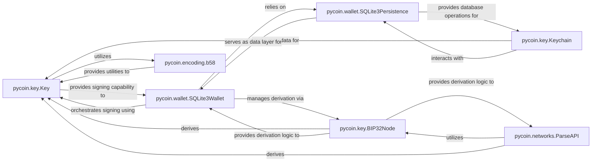

## Details

The `Key & Wallet Management` subsystem is responsible for the complete lifecycle of cryptographic keys, including generation, hierarchical derivation (BIP32/49/84), serialization, and secure management. It also encompasses the storage and retrieval of wallet-related data such as keys, UTXOs, and blockchain state, primarily utilizing an SQLite database for persistence.

### pycoin.key.Key
Represents a fundamental cryptographic key (private or public). Manages key properties, derives various representations (WIF, SEC, hash160, address), and performs core cryptographic operations like signing and verification.

**Related Classes/Methods**:

- <a href="https://github.com/richardkiss/pycoin/blob/main/pycoin/key/Key.py" target="_blank" rel="noopener noreferrer">`pycoin.key.Key`</a>

### pycoin.key.BIP32Node
Implements the BIP32 standard for hierarchical deterministic key derivation. Derives child keys (private and public) from a parent node and handles serialization/deserialization of BIP32 nodes.

**Related Classes/Methods**:

- <a href="https://github.com/richardkiss/pycoin/blob/main/pycoin/key/BIP32Node.py" target="_blank" rel="noopener noreferrer">`pycoin.key.BIP32Node`</a>

### pycoin.key.Keychain
Manages a persistent store for key-related metadata, such as hash160 values, key derivation paths, and P2S scripts. Provides methods for adding, retrieving, and managing these associations.

**Related Classes/Methods**:

- <a href="https://github.com/richardkiss/pycoin/blob/main/pycoin/key/Keychain.py" target="_blank" rel="noopener noreferrer">`pycoin.key.Keychain`</a>

### pycoin.wallet.SQLite3Persistence
Provides the concrete implementation for persisting various wallet-related data (BIP32 nodes, global settings, UTXOs, keychains) to an SQLite database. It acts as the low-level data access layer.

**Related Classes/Methods**:

- <a href="https://github.com/richardkiss/pycoin/blob/main/pycoin/wallet/SQLite3Persistence.py" target="_blank" rel="noopener noreferrer">`pycoin.wallet.SQLite3Persistence`</a>

### pycoin.wallet.SQLite3Wallet
The high-level wallet component that orchestrates key management, UTXO tracking, and transaction creation (`create_unsigned_send_tx`). It provides a unified interface for common wallet operations.

**Related Classes/Methods**:

- <a href="https://github.com/richardkiss/pycoin/blob/main/pycoin/wallet/SQLite3Wallet.py" target="_blank" rel="noopener noreferrer">`pycoin.wallet.SQLite3Wallet`</a>
- <a href="https://github.com/richardkiss/pycoin/blob/main/pycoin/wallet/SQLite3Wallet.py" target="_blank" rel="noopener noreferrer">`pycoin.wallet.SQLite3Wallet:create_unsigned_send_tx`</a>

### pycoin.encoding.b58
Provides essential Base58Check encoding/decoding utilities (`b2a_hashed_base58`) for representing cryptographic keys, addresses, and other blockchain-related data in a human-readable format.

**Related Classes/Methods**:

- <a href="https://github.com/richardkiss/pycoin/blob/main/pycoin/encoding/b58.py" target="_blank" rel="noopener noreferrer">`pycoin.encoding.b58`</a>
- <a href="https://github.com/richardkiss/pycoin/blob/main/pycoin/encoding/b58.py" target="_blank" rel="noopener noreferrer">`pycoin.encoding.b58:b2a_hashed_base58`</a>

### pycoin.networks.ParseAPI
Acts as an entry point for parsing various hierarchical key formats (BIP32, BIP49, BIP84, Electrum seeds/keys) from string representations. It abstracts the parsing logic for different network standards.

**Related Classes/Methods**:

- <a href="https://github.com/richardkiss/pycoin/blob/main/pycoin/networks/ParseAPI.py" target="_blank" rel="noopener noreferrer">`pycoin.networks.ParseAPI`</a>

### [FAQ](https://github.com/CodeBoarding/GeneratedOnBoardings/tree/main?tab=readme-ov-file#faq)