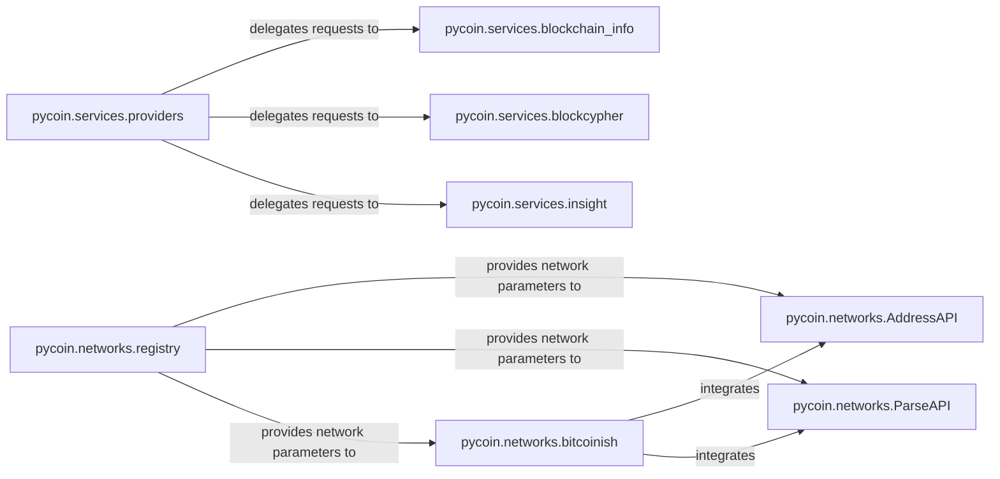

## Details

The `pycoin` project's architecture for handling blockchain networks and external services is distinctly modular. The `pycoin.networks` subsystem, centered around the `registry` component, defines and manages all network-specific configurations, which are then utilized by `AddressAPI` for address generation and `ParseAPI` for data interpretation. The `bitcoinish` component further consolidates these functionalities for Bitcoin-like chains. Complementing this, the `pycoin.services` subsystem, fronted by the `providers` component, provides a unified interface for interacting with various external blockchain APIs. This `providers` component intelligently delegates requests to specialized implementations such as `blockchain_info`, `blockcypher`, and `insight`, ensuring flexible and extensible integration with diverse external data sources. This design promotes a clear separation of concerns, allowing for independent evolution of network definitions and external service integrations.

### pycoin.networks.registry
Acts as the central repository for all registered network configurations. It stores and provides network-specific parameters such as magic bytes, address prefixes, and other network constants. This component is fundamental as it defines the characteristics of each supported blockchain network.

**Related Classes/Methods**:

- <a href="https://github.com/richardkiss/pycoin/blob/main/pycoin/networks/registry.py#L1-L99999" target="_blank" rel="noopener noreferrer">`pycoin.networks.registry`:1-99999</a>

### pycoin.networks.AddressAPI
Provides a high-level API for generating various types of blockchain addresses (e.g., P2PKH, P2SH) compatible with different networks. It abstracts the complexities of address formatting across diverse network specifications.

**Related Classes/Methods**:

- <a href="https://github.com/richardkiss/pycoin/blob/main/pycoin/networks/AddressAPI.py#L1-L99999" target="_blank" rel="noopener noreferrer">`pycoin.networks.AddressAPI`:1-99999</a>

### pycoin.networks.ParseAPI
Handles the parsing of various string representations related to blockchain data, including addresses, private keys, and public keys. It also supports hierarchical key derivation (BIP32), making it crucial for interpreting and deriving cryptographic data.

**Related Classes/Methods**:

- <a href="https://github.com/richardkiss/pycoin/blob/main/pycoin/networks/ParseAPI.py#L1-L99999" target="_blank" rel="noopener noreferrer">`pycoin.networks.ParseAPI`:1-99999</a>

### pycoin.networks.bitcoinish
Functions as a factory for creating network objects and APIs specifically tailored for Bitcoin-like cryptocurrencies. It integrates `AddressAPI`, `ParseAPI`, and `ContractAPI` instances for specific networks, providing a cohesive interface for common Bitcoin-derived chains.

**Related Classes/Methods**:

- <a href="https://github.com/richardkiss/pycoin/blob/main/pycoin/networks/bitcoinish.py#L1-L99999" target="_blank" rel="noopener noreferrer">`pycoin.networks.bitcoinish`:1-99999</a>

### pycoin.services.providers
Serves as an abstraction layer or facade for interacting with various external blockchain service providers (e.g., BlockCypher, Blockchain.info, Insight). It provides a unified API for common operations like fetching spendables, transaction data, or broadcasting transactions, delegating the actual calls to specific provider implementations. This component is key for external data integration.

**Related Classes/Methods**:

- <a href="https://github.com/richardkiss/pycoin/blob/main/pycoin/services/providers.py#L1-L99999" target="_blank" rel="noopener noreferrer">`pycoin.services.providers`:1-99999</a>

### pycoin.services.blockchain_info
Implements the concrete logic for interacting with the Blockchain.info external blockchain API. It handles API requests, responses, and error handling specific to this service, providing the actual mechanism for data retrieval from Blockchain.info.

**Related Classes/Methods**:

- <a href="https://github.com/richardkiss/pycoin/blob/main/pycoin/services/blockchain_info.py#L1-L99999" target="_blank" rel="noopener noreferrer">`pycoin.services.blockchain_info`:1-99999</a>

### pycoin.services.blockcypher
Implements the concrete logic for interacting with the BlockCypher external blockchain API. Similar to `blockchain_info`, it manages API requests and responses specific to the BlockCypher service.

**Related Classes/Methods**:

- <a href="https://github.com/richardkiss/pycoin/blob/main/pycoin/services/blockcypher.py#L1-L99999" target="_blank" rel="noopener noreferrer">`pycoin.services.blockcypher`:1-99999</a>

### pycoin.services.insight
Implements the concrete logic for interacting with the Insight external blockchain API. It handles API requests and responses specific to the Insight service, completing the set of primary external service integrations.

**Related Classes/Methods**:

- <a href="https://github.com/richardkiss/pycoin/blob/main/pycoin/services/insight.py#L1-L99999" target="_blank" rel="noopener noreferrer">`pycoin.services.insight`:1-99999</a>

### [FAQ](https://github.com/CodeBoarding/GeneratedOnBoardings/tree/main?tab=readme-ov-file#faq)