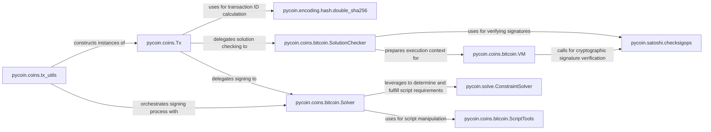

## Details

The `pycoin` transaction subsystem is designed around a core `Tx` object, which represents a Bitcoin transaction. The `tx_utils` module provides high-level functions for creating and signing these transactions, abstracting away the complexities of script generation and signature verification. The `BitcoinVM` acts as the execution engine for Bitcoin scripts, validating transaction inputs by processing script opcodes. `BitcoinScriptTools` assists in the compilation and disassembly of these scripts. Signature verification is handled by `checksigops`, a critical cryptographic utility. The `BitcoinSolutionChecker` orchestrates the validation process, preparing the execution context for the `BitcoinVM` and leveraging `checksigops`. Finally, the `BitcoinSolver`, built upon a generic `ConstraintSolver`, is responsible for generating the necessary signatures to fulfill script requirements, interacting with `BitcoinScriptTools` for script manipulation. The `double_sha256` function is a foundational utility for cryptographic hashing, essential for transaction ID calculation.

### pycoin.coins.Tx
The fundamental data structure for transactions, responsible for serialization, deserialization, ID calculation, and basic validation. It acts as the central data model for transactions within the subsystem. It also provides methods for signing (`sign`) and checking solutions (`check_solution`), delegating these tasks to `Solver` and `SolutionChecker` instances, respectively.

**Related Classes/Methods**:

- <a href="https://github.com/richardkiss/pycoin/blob/main/pycoin/coins/Tx.py" target="_blank" rel="noopener noreferrer">`pycoin.coins.Tx`</a>

### pycoin.coins.tx_utils
A high-level utility module that orchestrates transaction creation and signing. It provides functions like `create_tx` to construct `Tx` objects and `sign_tx` to manage the signing process, abstracting the complexities of underlying operations. It serves as the primary interface for constructing and manipulating transactions.

**Related Classes/Methods**:

- <a href="https://github.com/richardkiss/pycoin/blob/main/pycoin/coins/tx_utils.py" target="_blank" rel="noopener noreferrer">`pycoin.coins.tx_utils`</a>

### pycoin.coins.bitcoin.VM
The core Bitcoin Script virtual machine (`BitcoinVM`). Its responsibility is to execute script bytecode, manage the execution stack, and process opcodes, forming the heart of script validation. It interacts with `checksigops` for cryptographic signature verification.

**Related Classes/Methods**:

- <a href="https://github.com/richardkiss/pycoin/blob/main/pycoin/coins/bitcoin/VM.py" target="_blank" rel="noopener noreferrer">`pycoin.coins.bitcoin.VM`</a>

### pycoin.coins.bitcoin.ScriptTools
Provides essential utilities for compiling human-readable script expressions into bytecode and disassembling bytecode back into a readable format. This component (`BitcoinScriptTools`) supports both development and analysis of scripts and is used by the `Solver` for script manipulation.

**Related Classes/Methods**:

- <a href="https://github.com/richardkiss/pycoin/blob/main/pycoin/coins/bitcoin/ScriptTools.py" target="_blank" rel="noopener noreferrer">`pycoin.coins.bitcoin.ScriptTools`</a>

### pycoin.satoshi.checksigops
Implements the critical cryptographic operations required for signature verification within Bitcoin scripts, such as `OP_CHECKSIG` and `OP_CHECKMULTISIG`. It is directly called by the `BitcoinVM` during script execution and by the `BitcoinSolutionChecker` for verifying signatures.

**Related Classes/Methods**:

- <a href="https://github.com/richardkiss/pycoin/blob/main/pycoin/satoshi/checksigops.py" target="_blank" rel="noopener noreferrer">`pycoin.satoshi.checksigops`</a>

### pycoin.solve.ConstraintSolver
A generic framework for solving constraints. Within this subsystem, it provides the foundational mechanism upon which Bitcoin script-specific constraint solving is built, leveraged by the `BitcoinSolver`.

**Related Classes/Methods**:

- <a href="https://github.com/richardkiss/pycoin/blob/main/pycoin/solve/ConstraintSolver.py" target="_blank" rel="noopener noreferrer">`pycoin.solve.ConstraintSolver`</a>

### pycoin.coins.bitcoin.SolutionChecker
Contains Bitcoin-specific logic for verifying the validity of transaction input solutions (scripts). It prepares the execution context for the `BitcoinVM` and ensures that the scripts correctly unlock the associated funds, utilizing `checksigops` for signature verification.

**Related Classes/Methods**:

- <a href="https://github.com/richardkiss/pycoin/blob/main/pycoin/coins/bitcoin/SolutionChecker.py" target="_blank" rel="noopener noreferrer">`pycoin.coins.bitcoin.SolutionChecker`</a>

### pycoin.coins.bitcoin.Solver
A specialized solver for Bitcoin scripts (`BitcoinSolver`). Its responsibility is to generate the necessary signatures for transaction inputs by determining and solving the script constraints. It leverages `ConstraintSolver` for the core solving mechanism and uses `BitcoinScriptTools` for script manipulation.

**Related Classes/Methods**:

- <a href="https://github.com/richardkiss/pycoin/blob/main/pycoin/coins/bitcoin/Solver.py" target="_blank" rel="noopener noreferrer">`pycoin.coins.bitcoin.Solver`</a>

### pycoin.encoding.hash.double_sha256
Provides the essential double SHA-256 hashing algorithm, which is critical for calculating transaction IDs (txids) and ensuring data integrity across the blockchain.

**Related Classes/Methods**:

- <a href="https://github.com/richardkiss/pycoin/blob/main/pycoin/encoding/hash.py#L51-L53" target="_blank" rel="noopener noreferrer">`pycoin.encoding.hash.double_sha256`:51-53</a>

### [FAQ](https://github.com/CodeBoarding/GeneratedOnBoardings/tree/main?tab=readme-ov-file#faq)