```mermaid
graph LR
    CLI_Interface["CLI Interface"]
    Key_Wallet_Management["Key & Wallet Management"]
    Core_Cryptography["Core Cryptography"]
    Transaction_Scripting_Engine["Transaction & Scripting Engine"]
    Blockchain_Data_Utilities["Blockchain Data & Utilities"]
    Network_External_Services["Network & External Services"]
    CLI_Interface -- "initiates operations on" --> Key_Wallet_Management
    CLI_Interface -- "initiates operations on" --> Transaction_Scripting_Engine
    CLI_Interface -- "initiates operations on" --> Network_External_Services
    Key_Wallet_Management -- "utilizes" --> Core_Cryptography
    Key_Wallet_Management -- "utilizes" --> Blockchain_Data_Utilities
    Key_Wallet_Management -- "interacts with" --> Network_External_Services
    Key_Wallet_Management -- "provides keys and spendables to" --> Transaction_Scripting_Engine
    Core_Cryptography -- "provides signature and verification services to" --> Key_Wallet_Management
    Core_Cryptography -- "provides signature verification services to" --> Transaction_Scripting_Engine
    Core_Cryptography -- "relies on" --> Blockchain_Data_Utilities
    Transaction_Scripting_Engine -- "requests keys from" --> Key_Wallet_Management
    Transaction_Scripting_Engine -- "utilizes" --> Core_Cryptography
    Transaction_Scripting_Engine -- "relies heavily on" --> Blockchain_Data_Utilities
    Transaction_Scripting_Engine -- "provides signed transactions to" --> Network_External_Services
    Blockchain_Data_Utilities -- "provides encoding, hashing, and serialization services to" --> Key_Wallet_Management
    Blockchain_Data_Utilities -- "provides data structures and utilities to" --> Transaction_Scripting_Engine
    Blockchain_Data_Utilities -- "provides foundational primitives to" --> Core_Cryptography
    Blockchain_Data_Utilities -- "receives block and header data from" --> Network_External_Services
    Network_External_Services -- "receives transaction broadcast requests from" --> Transaction_Scripting_Engine
    Network_External_Services -- "provides transaction data and blockchain information to" --> Key_Wallet_Management
    Network_External_Services -- "relies on" --> Blockchain_Data_Utilities
    click CLI_Interface href "https://github.com/CodeBoarding/GeneratedOnBoardings/blob/main/pycoin/CLI_Interface.md" "Details"
    click Key_Wallet_Management href "https://github.com/CodeBoarding/GeneratedOnBoardings/blob/main/pycoin/Key_Wallet_Management.md" "Details"
    click Core_Cryptography href "https://github.com/CodeBoarding/GeneratedOnBoardings/blob/main/pycoin/Core_Cryptography.md" "Details"
    click Transaction_Scripting_Engine href "https://github.com/CodeBoarding/GeneratedOnBoardings/blob/main/pycoin/Transaction_Scripting_Engine.md" "Details"
    click Blockchain_Data_Utilities href "https://github.com/CodeBoarding/GeneratedOnBoardings/blob/main/pycoin/Blockchain_Data_Utilities.md" "Details"
    click Network_External_Services href "https://github.com/CodeBoarding/GeneratedOnBoardings/blob/main/pycoin/Network_External_Services.md" "Details"
```

## Details

The `pycoin` architecture is designed as a modular toolkit for cryptocurrency operations, centered around a robust `Core Cryptography` engine and comprehensive `Blockchain Data & Utilities`. User interaction primarily occurs through the `CLI Interface`, which orchestrates operations across the `Key & Wallet Management` for secure key handling and persistence, and the `Transaction & Scripting Engine` for building, signing, and validating blockchain transactions. The system interacts with the broader blockchain ecosystem via the `Network & External Services` component, enabling data retrieval and transaction broadcasting. This layered design ensures a clear separation of concerns, facilitating both standalone library usage and command-line utility functions, with foundational cryptographic and data handling capabilities underpinning all operations.

### CLI Interface [[Expand]](./CLI_Interface.md)
The primary user interface for `pycoin`, providing command-line utilities for various operations. It acts as the entry point for user interaction with the library's core functionalities.

**Related Classes/Methods**:

- <a href="https://github.com/richardkiss/pycoin/blob/main/pycoin/cmds/b58.py" target="_blank" rel="noopener noreferrer">`pycoin.cmds.b58`</a>
- <a href="https://github.com/richardkiss/pycoin/blob/main/pycoin/cmds/block.py" target="_blank" rel="noopener noreferrer">`pycoin.cmds.block`</a>
- <a href="https://github.com/richardkiss/pycoin/blob/main/pycoin/cmds/coinc.py" target="_blank" rel="noopener noreferrer">`pycoin.cmds.coinc`</a>
- <a href="https://github.com/richardkiss/pycoin/blob/main/pycoin/cmds/keychain.py" target="_blank" rel="noopener noreferrer">`pycoin.cmds.keychain`</a>
- <a href="https://github.com/richardkiss/pycoin/blob/main/pycoin/cmds/msg.py" target="_blank" rel="noopener noreferrer">`pycoin.cmds.msg`</a>
- <a href="https://github.com/richardkiss/pycoin/blob/main/pycoin/cmds/dump.py" target="_blank" rel="noopener noreferrer">`pycoin.cmds.dump`</a>
- <a href="https://github.com/richardkiss/pycoin/blob/main/pycoin/cmds/ku.py" target="_blank" rel="noopener noreferrer">`pycoin.cmds.ku`</a>
- <a href="https://github.com/richardkiss/pycoin/blob/main/pycoin/cmds/tx.py" target="_blank" rel="noopener noreferrer">`pycoin.cmds.tx`</a>
- <a href="https://github.com/richardkiss/pycoin/blob/main/pycoin/cmds/keychain.py#L66-L69" target="_blank" rel="noopener noreferrer">`pycoin.cmds.keychain.main`:66-69</a>
- <a href="https://github.com/richardkiss/pycoin/blob/main/pycoin/cmds/ku.py#L226-L229" target="_blank" rel="noopener noreferrer">`pycoin.cmds.ku.main`:226-229</a>
- <a href="https://github.com/richardkiss/pycoin/blob/main/pycoin/cmds/tx.py#L710-L713" target="_blank" rel="noopener noreferrer">`pycoin.cmds.tx.main`:710-713</a>
- <a href="https://github.com/richardkiss/pycoin/blob/main/pycoin/cmds/dump.py#L118-L141" target="_blank" rel="noopener noreferrer">`pycoin.cmds.dump.dump_tx`:118-141</a>
- <a href="https://github.com/richardkiss/pycoin/blob/main/pycoin/cmds/coinc.py#L54-L57" target="_blank" rel="noopener noreferrer">`pycoin.cmds.coinc.main`:54-57</a>

### Key & Wallet Management [[Expand]](./Key_Wallet_Management.md)
Handles the lifecycle of cryptographic keys, including generation, hierarchical derivation (BIP32/49/84), serialization, and secure management. It also manages the storage and retrieval of wallet-related data, including keys, unspent transaction outputs (UTXOs), and blockchain state, typically using an SQLite database.

**Related Classes/Methods**:

- <a href="https://github.com/richardkiss/pycoin/blob/main/pycoin/key/BIP32Node.py" target="_blank" rel="noopener noreferrer">`pycoin.key.BIP32Node`</a>
- <a href="https://github.com/richardkiss/pycoin/blob/main/pycoin/key/Key.py" target="_blank" rel="noopener noreferrer">`pycoin.key.Key`</a>
- <a href="https://github.com/richardkiss/pycoin/blob/main/pycoin/key/Keychain.py" target="_blank" rel="noopener noreferrer">`pycoin.key.Keychain`</a>
- <a href="https://github.com/richardkiss/pycoin/blob/main/pycoin/wallet/SQLite3Persistence.py" target="_blank" rel="noopener noreferrer">`pycoin.wallet.SQLite3Persistence`</a>
- <a href="https://github.com/richardkiss/pycoin/blob/main/pycoin/wallet/SQLite3Wallet.py" target="_blank" rel="noopener noreferrer">`pycoin.wallet.SQLite3Wallet`</a>
- <a href="https://github.com/richardkiss/pycoin/blob/main/pycoin/key/Key.py#L181-L190" target="_blank" rel="noopener noreferrer">`pycoin.key.Key.sign`:181-190</a>
- <a href="https://github.com/richardkiss/pycoin/blob/main/pycoin/encoding/b58.py#L28-L36" target="_blank" rel="noopener noreferrer">`pycoin.encoding.b58.b2a_hashed_base58`:28-36</a>
- <a href="https://github.com/richardkiss/pycoin/blob/main/pycoin/networks/ParseAPI.py#L376-L386" target="_blank" rel="noopener noreferrer">`pycoin.networks.ParseAPI.hierarchical_key`:376-386</a>
- <a href="https://github.com/richardkiss/pycoin/blob/main/pycoin/wallet/SQLite3Wallet.py#L42-L67" target="_blank" rel="noopener noreferrer">`pycoin.wallet.SQLite3Wallet.create_unsigned_send_tx`:42-67</a>

### Core Cryptography [[Expand]](./Core_Cryptography.md)
Implements fundamental cryptographic algorithms, primarily Elliptic Curve Digital Signature Algorithm (ECDSA) for signing and verification. It also includes general cryptographic utilities like message signing and signature analysis, leveraging both native Python and optimized C-library backends (OpenSSL/libsecp256k1).

**Related Classes/Methods**:

- <a href="https://github.com/richardkiss/pycoin/blob/main/pycoin/ecdsa/Generator.py" target="_blank" rel="noopener noreferrer">`pycoin.ecdsa.Generator`</a>
- <a href="https://github.com/richardkiss/pycoin/blob/main/pycoin/ecdsa/rfc6979.py" target="_blank" rel="noopener noreferrer">`pycoin.ecdsa.rfc6979`</a>
- <a href="https://github.com/richardkiss/pycoin/blob/main/pycoin/ecdsa/native/openssl.py" target="_blank" rel="noopener noreferrer">`pycoin.ecdsa.native.openssl`</a>
- <a href="https://github.com/richardkiss/pycoin/blob/main/pycoin/contrib/msg_signing.py" target="_blank" rel="noopener noreferrer">`pycoin.contrib.msg_signing`</a>
- <a href="https://github.com/richardkiss/pycoin/blob/main/pycoin/contrib/who_signed.py" target="_blank" rel="noopener noreferrer">`pycoin.contrib.who_signed`</a>
- <a href="https://github.com/richardkiss/pycoin/blob/main/pycoin/key/Key.py#L181-L190" target="_blank" rel="noopener noreferrer">`pycoin.key.Key.sign`:181-190</a>
- <a href="https://github.com/richardkiss/pycoin/blob/main/pycoin/ecdsa/Generator.py#L192-L205" target="_blank" rel="noopener noreferrer">`pycoin.ecdsa.Generator.sign`:192-205</a>
- <a href="https://github.com/richardkiss/pycoin/blob/main/pycoin/satoshi/checksigops.py#L165-L168" target="_blank" rel="noopener noreferrer">`pycoin.satoshi.checksigops.do_OP_CHECKSIG`:165-168</a>
- <a href="https://github.com/richardkiss/pycoin/blob/main/pycoin/encoding/hash.py#L51-L53" target="_blank" rel="noopener noreferrer">`pycoin.encoding.hash.double_sha256`:51-53</a>

### Transaction & Scripting Engine [[Expand]](./Transaction_Scripting_Engine.md)
Manages the creation, validation, signing, and serialization of cryptocurrency transactions. It incorporates the Bitcoin Script virtual machine for executing transaction scripts, along with tools for script analysis and constraint solving.

**Related Classes/Methods**:

- <a href="https://github.com/richardkiss/pycoin/blob/main/pycoin/coins/Tx.py" target="_blank" rel="noopener noreferrer">`pycoin.coins.Tx`</a>
- <a href="https://github.com/richardkiss/pycoin/blob/main/pycoin/coins/tx_utils.py" target="_blank" rel="noopener noreferrer">`pycoin.coins.tx_utils`</a>
- <a href="https://github.com/richardkiss/pycoin/blob/main/pycoin/coins/bitcoin/Tx.py" target="_blank" rel="noopener noreferrer">`pycoin.coins.bitcoin.Tx`</a>
- <a href="https://github.com/richardkiss/pycoin/blob/main/pycoin/vm/VM.py" target="_blank" rel="noopener noreferrer">`pycoin.vm.VM`</a>
- <a href="https://github.com/richardkiss/pycoin/blob/main/pycoin/vm/ScriptTools.py" target="_blank" rel="noopener noreferrer">`pycoin.vm.ScriptTools`</a>
- <a href="https://github.com/richardkiss/pycoin/blob/main/pycoin/satoshi/checksigops.py" target="_blank" rel="noopener noreferrer">`pycoin.satoshi.checksigops`</a>
- <a href="https://github.com/richardkiss/pycoin/blob/main/pycoin/solve/ConstraintSolver.py" target="_blank" rel="noopener noreferrer">`pycoin.solve.ConstraintSolver`</a>
- <a href="https://github.com/richardkiss/pycoin/blob/main/pycoin/coins/tx_utils.py#L134-L158" target="_blank" rel="noopener noreferrer">`pycoin.coins.tx_utils.create_signed_tx`:134-158</a>
- <a href="https://github.com/richardkiss/pycoin/blob/main/pycoin/vm/VM.py#L75-L91" target="_blank" rel="noopener noreferrer">`pycoin.vm.VM.eval_script`:75-91</a>
- <a href="https://github.com/richardkiss/pycoin/blob/main/pycoin/satoshi/checksigops.py#L165-L168" target="_blank" rel="noopener noreferrer">`pycoin.satoshi.checksigops.do_OP_CHECKSIG`:165-168</a>
- <a href="https://github.com/richardkiss/pycoin/blob/main/pycoin/coins/Tx.py#L62-L71" target="_blank" rel="noopener noreferrer">`pycoin.coins.Tx.as_bin`:62-71</a>
- <a href="https://github.com/richardkiss/pycoin/blob/main/pycoin/encoding/hash.py#L51-L53" target="_blank" rel="noopener noreferrer">`pycoin.encoding.hash.double_sha256`:51-53</a>

### Blockchain Data & Utilities [[Expand]](./Blockchain_Data_Utilities.md)
Defines and manages core blockchain data structures such as blocks and headers. It provides foundational utilities for various encoding schemes (Base58, Hex, Bech32m), cryptographic hashing (SHA256, RIPEMD160), data serialization/deserialization, and probabilistic data structures like Bloom filters and Merkle trees, which are essential for blockchain operations.

**Related Classes/Methods**:

- <a href="https://github.com/richardkiss/pycoin/blob/main/pycoin/block.py" target="_blank" rel="noopener noreferrer">`pycoin.block`</a>
- <a href="https://github.com/richardkiss/pycoin/blob/main/pycoin/blockchain/BlockChain.py" target="_blank" rel="noopener noreferrer">`pycoin.blockchain.BlockChain`</a>
- <a href="https://github.com/richardkiss/pycoin/blob/main/pycoin/encoding/b58.py" target="_blank" rel="noopener noreferrer">`pycoin.encoding.b58`</a>
- <a href="https://github.com/richardkiss/pycoin/blob/main/pycoin/encoding/hash.py" target="_blank" rel="noopener noreferrer">`pycoin.encoding.hash`</a>
- <a href="https://github.com/richardkiss/pycoin/blob/main/pycoin/encoding/hexbytes.py" target="_blank" rel="noopener noreferrer">`pycoin.encoding.hexbytes`</a>
- <a href="https://github.com/richardkiss/pycoin/blob/main/pycoin/serialize/streamer.py" target="_blank" rel="noopener noreferrer">`pycoin.serialize.streamer`</a>
- <a href="https://github.com/richardkiss/pycoin/blob/main/pycoin/bloomfilter.py" target="_blank" rel="noopener noreferrer">`pycoin.bloomfilter`</a>
- <a href="https://github.com/richardkiss/pycoin/blob/main/pycoin/merkle.py" target="_blank" rel="noopener noreferrer">`pycoin.merkle`</a>
- <a href="https://github.com/richardkiss/pycoin/blob/main/pycoin/contrib/bech32m.py" target="_blank" rel="noopener noreferrer">`pycoin.contrib.bech32m`</a>
- <a href="https://github.com/richardkiss/pycoin/blob/main/pycoin/encoding/b58.py#L28-L36" target="_blank" rel="noopener noreferrer">`pycoin.encoding.b58.b2a_hashed_base58`:28-36</a>
- <a href="https://github.com/richardkiss/pycoin/blob/main/pycoin/encoding/hash.py#L51-L53" target="_blank" rel="noopener noreferrer">`pycoin.encoding.hash.double_sha256`:51-53</a>
- <a href="https://github.com/richardkiss/pycoin/blob/main/pycoin/coins/Tx.py#L62-L71" target="_blank" rel="noopener noreferrer">`pycoin.coins.Tx.as_bin`:62-71</a>
- <a href="https://github.com/richardkiss/pycoin/blob/main/pycoin/networks/AddressAPI.py#L27-L53" target="_blank" rel="noopener noreferrer">`pycoin.networks.AddressAPI.for_script_info`:27-53</a>

### Network & External Services [[Expand]](./Network_External_Services.md)
Manages network-specific parameters (e.g., magic bytes, address prefixes) and provides APIs for address generation, parsing, and hierarchical key derivation, ensuring compatibility across different blockchain networks. It also provides interfaces for interacting with external blockchain services and APIs (e.g., BlockCypher, Insight, Blockchain.info) to fetch transaction data, balances, and broadcast transactions.

**Related Classes/Methods**:

- <a href="https://github.com/richardkiss/pycoin/blob/main/pycoin/networks/AddressAPI.py" target="_blank" rel="noopener noreferrer">`pycoin.networks.AddressAPI`</a>
- <a href="https://github.com/richardkiss/pycoin/blob/main/pycoin/networks/ParseAPI.py" target="_blank" rel="noopener noreferrer">`pycoin.networks.ParseAPI`</a>
- <a href="https://github.com/richardkiss/pycoin/blob/main/pycoin/networks/registry.py" target="_blank" rel="noopener noreferrer">`pycoin.networks.registry`</a>
- <a href="https://github.com/richardkiss/pycoin/blob/main/pycoin/services/providers.py" target="_blank" rel="noopener noreferrer">`pycoin.services.providers`</a>
- <a href="https://github.com/richardkiss/pycoin/blob/main/pycoin/services/blockchain_info.py" target="_blank" rel="noopener noreferrer">`pycoin.services.blockchain_info`</a>
- <a href="https://github.com/richardkiss/pycoin/blob/main/pycoin/services/blockcypher.py" target="_blank" rel="noopener noreferrer">`pycoin.services.blockcypher`</a>
- <a href="https://github.com/richardkiss/pycoin/blob/main/pycoin/services/providers.py#L33-L57" target="_blank" rel="noopener noreferrer">`pycoin.services.providers.spendables_for_address`:33-57</a>
- <a href="https://github.com/richardkiss/pycoin/blob/main/pycoin/networks/AddressAPI.py#L27-L53" target="_blank" rel="noopener noreferrer">`pycoin.networks.AddressAPI.for_script_info`:27-53</a>
- <a href="https://github.com/richardkiss/pycoin/blob/main/pycoin/networks/ParseAPI.py#L376-L386" target="_blank" rel="noopener noreferrer">`pycoin.networks.ParseAPI.hierarchical_key`:376-386</a>

### [FAQ](https://github.com/CodeBoarding/GeneratedOnBoardings/tree/main?tab=readme-ov-file#faq)