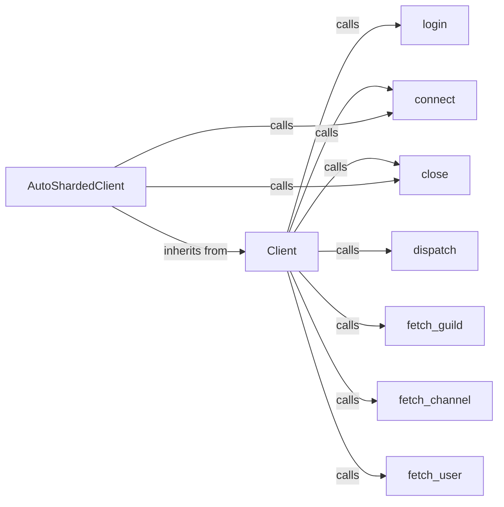

## Component Details

The Core Client manages the connection to Discord, handles authentication, and dispatches events. It provides a high-level interface for interacting with the Discord API, including logging in, connecting to the gateway, closing the connection, dispatching events, and fetching data. The AutoShardedClient extends the Client to automatically manage sharding for larger guilds.

### Client
The Client class is the core component responsible for managing the connection to Discord. It handles authentication, establishes and maintains the WebSocket connection, dispatches events to listeners, and provides methods for interacting with the Discord API. It serves as the base class for more specialized client implementations.
- **Related Classes/Methods**: `pycord.discord.client.Client`

### AutoShardedClient
The AutoShardedClient extends the Client class to automatically manage sharding, distributing the bot's connections across multiple shards to handle larger guilds. It is responsible for launching and managing shards, and providing methods for accessing shards. It simplifies the process of scaling a bot to handle a large number of guilds.
- **Related Classes/Methods**: `pycord.discord.shard.AutoShardedClient`

### login
The login function authenticates the client with Discord's servers using the provided token. It prepares the client for establishing a connection by setting up the necessary authentication headers and information.
- **Related Classes/Methods**: `pycord.discord.client.Client:login`

### connect
The connect function establishes a connection to the Discord gateway. It handles the WebSocket connection and starts listening for events. It also manages heartbeating to keep the connection alive.
- **Related Classes/Methods**: `pycord.discord.client.Client:connect`, `pycord.discord.shard.AutoShardedClient:connect`

### close
The close function gracefully closes the connection to Discord. It terminates the WebSocket connection, cleans up resources, and prevents memory leaks. It ensures a clean shutdown of the client.
- **Related Classes/Methods**: `pycord.discord.client.Client:close`, `pycord.discord.shard.AutoShardedClient:close`

### dispatch
The dispatch function is responsible for distributing events received from the Discord gateway to the appropriate listeners. It identifies the event type and calls the corresponding event handlers, allowing the bot to respond to events such as message creation, guild member updates, and more.
- **Related Classes/Methods**: `pycord.discord.client.Client:dispatch`

### fetch_guild
The fetch_guild function retrieves a guild from Discord's API using its ID. It allows the bot to access information about a specific guild, such as its name, members, and channels.
- **Related Classes/Methods**: `pycord.discord.client.Client:fetch_guild`

### fetch_channel
The fetch_channel function retrieves a channel from Discord's API using its ID. It allows the bot to access information about a specific channel, such as its name, topic, and message history.
- **Related Classes/Methods**: `pycord.discord.client.Client:fetch_channel`

### fetch_user
The fetch_user function retrieves a user from Discord's API using their ID. It allows the bot to access information about a specific user, such as their username, avatar, and presence.
- **Related Classes/Methods**: `pycord.discord.client.Client:fetch_user`
