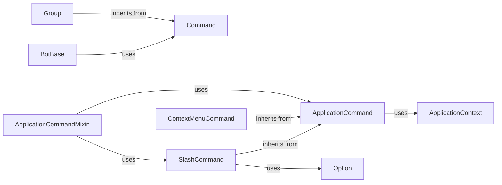

## Component Details

The Extension Framework in discord.py provides a structured way to add functionality to bots through commands and other extensions. It supports both prefix-based commands (using `discord.ext.commands`) and application commands (slash commands, user commands, message commands) via `discord.commands`. The framework handles command registration, argument parsing, permission checks, and invocation, offering a flexible and extensible architecture for bot development.

### Command
Represents a prefix-based command. It stores the command's callback, name, aliases, and other relevant information. It handles argument parsing, checks, and error dispatching.
- **Related Classes/Methods**: `discord.ext.commands.core.Command`

### Group
Represents a group of prefix-based commands, inheriting from both `Command` and `GroupMixin`. It functions as both a command and a container for subcommands.
- **Related Classes/Methods**: `discord.ext.commands.core.Group`

### BotBase
The base class for bot implementations using the `discord.ext.commands` extension. It handles command registration, message processing, and command invocation for prefix-based commands.
- **Related Classes/Methods**: `discord.ext.commands.bot.BotBase`

### ApplicationCommandMixin
Provides functionality for registering and processing application commands (slash commands, user commands, message commands). It handles command synchronization, context creation, and invocation.
- **Related Classes/Methods**: `discord.bot.ApplicationCommandMixin`

### ApplicationCommand
Represents a base class for application commands. It manages cooldowns, permission checks, and error handling.
- **Related Classes/Methods**: `discord.commands.core.ApplicationCommand`

### SlashCommand
Represents a slash command. It handles option parsing, validation, and invocation of the command callback.
- **Related Classes/Methods**: `discord.commands.core.SlashCommand`

### ContextMenuCommand
Represents a context menu command (user or message command). It handles parameter validation and invocation of the command callback.
- **Related Classes/Methods**: `discord.commands.core.ContextMenuCommand`

### Option
Represents an option for a slash command. It defines the option's name, description, type, and other attributes.
- **Related Classes/Methods**: `discord.commands.options.Option`

### ApplicationContext
Represents the context in which an application command is invoked. It provides methods for responding to the interaction, sending messages, and deferring the response.
- **Related Classes/Methods**: `discord.commands.context.ApplicationContext`
