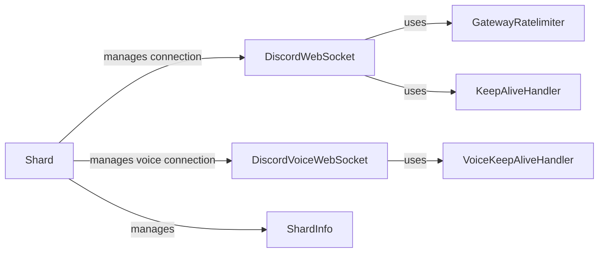

## Component Details

The Gateway Management component is responsible for establishing and maintaining a stable connection to Discord's Gateway. It encompasses the management of WebSocket connections for both the main Discord gateway and voice communication. This involves handling authentication, heartbeats, event reception, and ratelimiting to ensure reliable communication with Discord's servers. The component utilizes shards to distribute the load and manage multiple connections efficiently.

### DiscordWebSocket
Handles the primary WebSocket connection to Discord's gateway. It manages sending and receiving messages, handling heartbeats, identifying/resuming sessions, managing presence, and handling ratelimits. It uses GatewayRatelimiter and KeepAliveHandler to ensure reliable communication.
- **Related Classes/Methods**: `pycord.discord.gateway.DiscordWebSocket`

### DiscordVoiceWebSocket
Manages the WebSocket connection for voice communication. It handles voice state, selects the protocol, connects to the voice server, and manages sending and receiving voice data. It uses VoiceKeepAliveHandler to maintain the connection.
- **Related Classes/Methods**: `pycord.discord.gateway.DiscordVoiceWebSocket`

### Shard
Represents a single shard, which is a connection to Discord's gateway. It's responsible for launching a worker to manage the connection, handling disconnections and reconnections, and re-identifying with the gateway. It manages ShardInfo and uses DiscordWebSocket for the main gateway connection.
- **Related Classes/Methods**: `pycord.discord.shard.Shard`

### GatewayRatelimiter
Manages ratelimits for sending messages to the Discord gateway to prevent abuse and ensure reliable communication. It is used by DiscordWebSocket.
- **Related Classes/Methods**: `pycord.discord.gateway.GatewayRatelimiter`

### KeepAliveHandler
Handles sending heartbeats to the Discord gateway to keep the connection alive. It is used by DiscordWebSocket.
- **Related Classes/Methods**: `pycord.discord.gateway.KeepAliveHandler`

### VoiceKeepAliveHandler
Handles sending heartbeats to the Discord voice gateway to keep the connection alive. It is used by DiscordVoiceWebSocket.
- **Related Classes/Methods**: `pycord.discord.gateway.VoiceKeepAliveHandler`

### ShardInfo
Stores information about a shard, such as its ID and status. It is managed by Shard.
- **Related Classes/Methods**: `pycord.discord.shard.ShardInfo`
