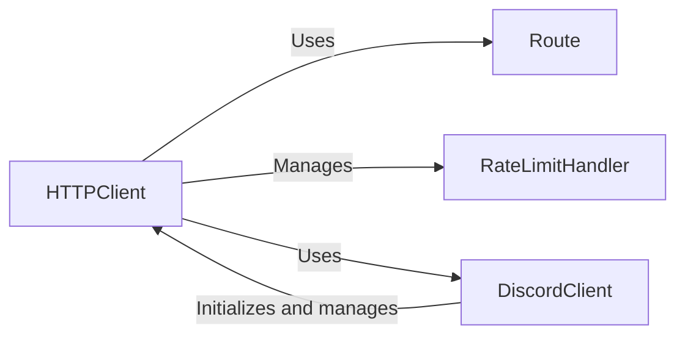

## Component Details

The HTTP API Handling subsystem is responsible for managing communication with the Discord API. It encompasses request construction, authentication, rate limiting, and response processing. The core components work together to provide a reliable and efficient way to interact with the Discord REST API, enabling the application to perform actions such as sending messages, managing channels, and handling user data.

### HTTPClient
The HTTPClient class is the central component for interacting with the Discord API. It handles request construction, authentication (via token), and response processing. It also integrates with the RateLimitHandler to ensure compliance with Discord's rate limits. It exposes methods for various API endpoints, such as sending messages, editing channels, and managing guilds.
- **Related Classes/Methods**: `discord.http.HTTPClient`

### Route
The Route class represents a specific API endpoint. It encapsulates the HTTP method (e.g., GET, POST, PUT, DELETE), the API path, and other relevant information for constructing API requests. It's used by HTTPClient to define the target endpoint for each request.
- **Related Classes/Methods**: `discord.http.Route`

### DiscordClient
The DiscordClient class represents the main client interface for interacting with Discord. It initializes and manages the HTTPClient, providing a higher-level abstraction for performing actions on Discord. It holds the authentication token and other global state.
- **Related Classes/Methods**: `discord.client.Client`

### RateLimitHandler
The RateLimitHandler class is responsible for managing rate limits imposed by the Discord API. It tracks the remaining requests and reset times for different API endpoints, ensuring that the application doesn't exceed the limits and get rate-limited. It uses a bucket-based approach to track rate limits for different routes.
- **Related Classes/Methods**: `discord.http.HTTPClient`
