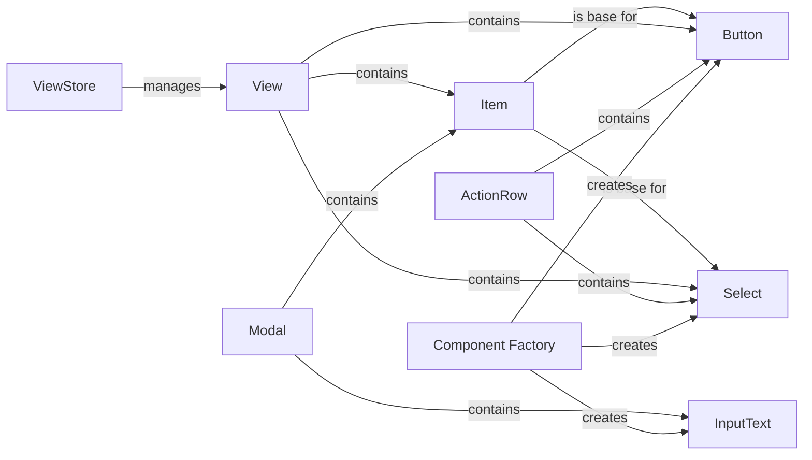

## Component Details

The Interactive UI subsystem provides a set of classes for creating interactive UI elements within Discord messages, enabling users to engage with bots in a more dynamic and engaging way. The core components include Views, which act as containers for UI elements, and various interactive elements like Buttons, Select menus, InputText fields within Modals. These components are managed by the ViewStore and ModalStore, which handle event dispatch and lifecycle management. The ActionRow component is used for layout purposes, grouping related components together. The _component_factory is responsible for creating UI components from their dictionary representation.

### View
The View class acts as a container for interactive UI elements (items) such as buttons and select menus. It is responsible for managing the layout and behavior of these items within a Discord message. It handles interactions with the items, dispatches events to the appropriate callbacks, and manages the view's lifecycle, including timeouts. Views are added to messages to enable interactivity.
- **Related Classes/Methods**: `pycord.discord.ui.view.View`, `pycord.discord.ui.view._ViewWeights`

### ViewStore
The ViewStore class is responsible for storing and managing active views. It acts as a central registry for views within the application. Its primary function is to dispatch interactions to the appropriate view based on the component's custom_id and update views based on message updates. It ensures that interactions are correctly routed to the intended view instance.
- **Related Classes/Methods**: `pycord.discord.ui.view.ViewStore`

### Button
The Button class represents a clickable button UI element. It defines the button's appearance (style, label, emoji), behavior (disabled state), and the callback function to be executed when the button is clicked. Buttons are added to Views to provide users with interactive options.
- **Related Classes/Methods**: `pycord.discord.ui.button.Button`

### Select
The Select class represents a select menu UI element, allowing users to choose from a list of options. It defines the available options, the selection behavior (single or multiple selections), and the callback function to be executed when a selection is made. Select menus are added to Views to provide users with a list of choices.
- **Related Classes/Methods**: `pycord.discord.ui.select.Select`

### InputText
The InputText class represents a text input field within a modal. It allows users to enter text data. It defines the input field's attributes such as style, label, placeholder, and whether it's required. InputText fields are added to Modals to collect user input.
- **Related Classes/Methods**: `pycord.discord.ui.input_text.InputText`

### Modal
The Modal class represents a pop-up window containing UI elements, including input fields. It's used to gather information from users in a structured way. It manages the layout and behavior of the items, dispatches events, and manages the modal's lifecycle, including timeouts. Modals are triggered by user interactions, such as button clicks, and provide a focused interface for data input.
- **Related Classes/Methods**: `pycord.discord.ui.modal.Modal`, `pycord.discord.ui.modal._ModalWeights`, `pycord.discord.ui.modal.ModalStore`

### ActionRow
The ActionRow class represents a row of UI components, such as buttons or select menus, within a message or modal. It's used to group related components together for layout purposes. ActionRows are added to Views or Modals to structure the arrangement of UI elements.
- **Related Classes/Methods**: `pycord.discord.components.ActionRow`

### Item
The Item class is a base class for UI elements that can be added to a View or Modal. It defines common attributes and methods for all UI elements, such as the ability to be disabled and a custom ID for identifying the component during interactions.
- **Related Classes/Methods**: `pycord.discord.ui.item.Item`

### Component Factory
The component factory function is responsible for creating UI components from their dictionary representation. This is used when processing interactions and reconstructing UI elements from data received from Discord. It supports creating instances of Button, Select, and InputText.
- **Related Classes/Methods**: `pycord.discord.components:_component_factory`
