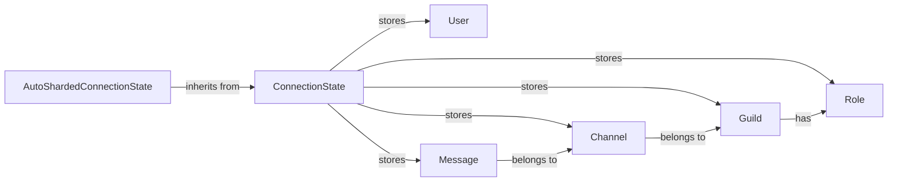

## Component Details

The State and Data Caching component is responsible for maintaining a local, in-memory cache of Discord objects. This cache is populated and updated based on events received from the Discord Gateway, ensuring the client has a consistent and readily available representation of the Discord state. The component provides methods for retrieving these cached objects, offering a fast and efficient alternative to repeatedly querying the Discord API. It represents data as data models.

### ConnectionState
The ConnectionState class is the central hub for managing the Discord client's internal state. It receives events from the Gateway, parses them, and updates the cache accordingly. It provides methods for accessing cached data, such as users, guilds, and channels. It also handles event dispatching to registered listeners.
- **Related Classes/Methods**: `discord.state.ConnectionState`

### AutoShardedConnectionState
AutoShardedConnectionState is a subclass of ConnectionState designed for sharded clients. It extends ConnectionState's functionality to manage multiple shards, enabling the client to connect to several Discord shards simultaneously. It inherits the caching and event handling mechanisms from ConnectionState, adapting them for a sharded environment.
- **Related Classes/Methods**: `discord.state.AutoShardedConnectionState`

### User
The User class represents a Discord user. It stores information such as the user's ID, username, and avatar. User objects are cached and managed by the ConnectionState, providing a readily accessible representation of users within the Discord environment.
- **Related Classes/Methods**: `discord.user.User`

### Guild
The Guild class represents a Discord guild (server). It stores information about the guild, such as its name, ID, members, channels, and roles. Guild objects are cached and managed by the ConnectionState, providing a readily accessible representation of guilds within the Discord environment.
- **Related Classes/Methods**: `discord.guild.Guild`

### Channel
The Channel class represents a Discord channel. It stores information about the channel, such as its name, ID, type, and guild association. Channel objects are cached and managed by the ConnectionState, providing a readily accessible representation of channels within the Discord environment.
- **Related Classes/Methods**: `discord.channel.Channel`

### Role
The Role class represents a Discord role. It stores information about the role, such as its name, ID, and permissions. Role objects are cached and managed by the ConnectionState, providing a readily accessible representation of roles within the Discord environment.
- **Related Classes/Methods**: `discord.role.Role`

### Message
The Message class represents a Discord message. It stores information about the message, such as its content, author, channel, and timestamp. Message objects are cached and managed by the ConnectionState, providing a readily accessible representation of messages within the Discord environment.
- **Related Classes/Methods**: `discord.message.Message`
