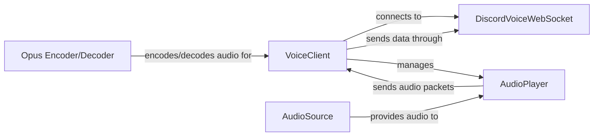

## Component Details

The Voice Integration component enables Discord bots to connect to voice channels, transmit and receive audio, and manage voice settings. It orchestrates the process of encoding audio, sending it to Discord via WebSockets, and decoding audio received from other users in the voice channel. The core functionality revolves around managing the voice connection, handling audio encoding/decoding, and playing audio through appropriate sources.

### VoiceClient
Manages the voice connection to Discord, handling WebSocket connections, encryption, and audio sending/receiving. It is responsible for establishing and maintaining the connection with Discord's voice server, managing encryption keys, and coordinating the sending and receiving of audio data. It interacts with DiscordVoiceWebSocket for low-level communication and AudioPlayer for audio playback.
- **Related Classes/Methods**: `pycord.discord.voice_client.VoiceClient`

### DiscordVoiceWebSocket
Handles the WebSocket connection to Discord's voice server, sending and receiving voice data. It is responsible for the low-level communication with Discord's voice server, including sending audio packets and receiving voice data. It interacts with VoiceClient to manage the connection and send audio packets.
- **Related Classes/Methods**: `pycord.discord.gateway.DiscordVoiceWebSocket`

### Opus Encoder/Decoder
Encodes and decodes audio using the Opus codec. The encoder prepares audio for transmission by compressing it into a format suitable for streaming, while the decoder reconstructs audio received from Discord into a playable format. DecodeManager manages the decoders.
- **Related Classes/Methods**: `pycord.discord.opus.Encoder`, `pycord.discord.opus.Decoder`, `pycord.discord.opus.DecodeManager`, `pycord.discord.opus:load_opus`, `pycord.discord.opus:_load_default`

### AudioPlayer
Manages the playback of audio, including starting, stopping, pausing, and resuming. It retrieves audio data from an AudioSource, encodes it using the Opus encoder, and sends it to the VoiceClient for transmission to Discord. It also handles events related to audio playback, such as when the audio finishes playing.
- **Related Classes/Methods**: `pycord.discord.player.AudioPlayer`

### AudioSource
Provides the audio data to be played. Different audio sources exist, such as FFmpegAudio, FFmpegPCMAudio, and FFmpegOpusAudio, which handle different audio formats. PCMVolumeTransformer can adjust the volume of the audio before it is passed to the AudioPlayer.
- **Related Classes/Methods**: `pycord.discord.player.AudioSource`, `pycord.discord.player.FFmpegAudio`, `pycord.discord.player.FFmpegPCMAudio`, `pycord.discord.player.FFmpegOpusAudio`, `pycord.discord.player.PCMVolumeTransformer`
