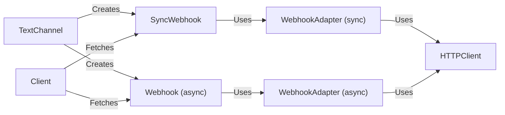

## Component Details

The Webhook Support component enables external services to send messages to Discord channels without needing a bot account. It encompasses both synchronous and asynchronous operations for creating, editing, and executing webhooks. The core flow involves a client or text channel initiating a webhook request, which is then handled by either a synchronous or asynchronous webhook adapter. These adapters use an HTTP client to interact with the Discord API, allowing for the creation, modification, and execution of webhooks. The webhook objects themselves provide a high-level interface for sending messages and managing webhook settings.

### HTTPClient
Handles the low-level HTTP requests to the Discord API for webhook-related operations. It provides methods for creating, retrieving, and modifying webhooks.
- **Related Classes/Methods**: `pycord.discord.http.HTTPClient`

### WebhookAdapter (sync)
An adapter for synchronous webhook operations. It encapsulates the HTTP requests for executing, editing, deleting webhooks and messages, using the HTTPClient.
- **Related Classes/Methods**: `pycord.discord.webhook.sync.WebhookAdapter`

### WebhookAdapter (async)
An adapter for asynchronous webhook operations. It encapsulates the HTTP requests for executing, editing, deleting webhooks and messages, using the HTTPClient.
- **Related Classes/Methods**: `pycord.discord.webhook.async_.AsyncWebhookAdapter`

### SyncWebhook
Represents a synchronous webhook object. It provides methods for sending messages, fetching, editing, and deleting messages, and interacts with the WebhookAdapter to perform these operations.
- **Related Classes/Methods**: `pycord.discord.webhook.sync.SyncWebhook`

### Webhook (async)
Represents an asynchronous webhook object. It provides methods for sending messages, fetching, editing, and deleting messages, and interacts with the WebhookAdapter to perform these operations.
- **Related Classes/Methods**: `pycord.discord.webhook.async_.Webhook`

### TextChannel
Represents a Discord text channel. It provides methods for creating webhooks associated with the channel.
- **Related Classes/Methods**: `pycord.discord.channel.TextChannel`

### Client
Represents the Discord client. It provides methods for fetching webhooks.
- **Related Classes/Methods**: `pycord.discord.client.Client`
