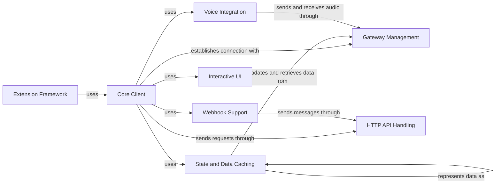

## Component Details

The pycord library provides a comprehensive interface for interacting with the Discord API. It manages the connection to Discord, handles authentication, and provides methods for interacting with various aspects of the Discord platform, such as managing guilds, channels, users, and messages. The library also includes features for creating interactive UI elements, handling voice communication, and moderating guilds.

### Core Client
The Core Client component is the main entry point for interacting with the Discord API. It manages the connection to Discord, handles authentication, and dispatches events to registered listeners. It provides a high-level interface for interacting with the Discord API.
- **Related Classes/Methods**: `discord.client.Client`, `discord.shard.AutoShardedClient`

### Gateway Management
The Gateway Management component manages the WebSocket connection to Discord's Gateway. It handles authentication, heartbeats, and the reception and parsing of events from Discord. It ensures a stable and reliable connection to the Discord Gateway.
- **Related Classes/Methods**: `discord.gateway.DiscordWebSocket`, `discord.gateway.DiscordVoiceWebSocket`, `discord.shard.Shard`

### State and Data Caching
The State and Data Caching component maintains a local cache of Discord objects, such as users, guilds, channels, and messages. It updates this cache based on events received from the Gateway and provides methods for retrieving objects from the cache. This component provides a fast and efficient way to access Discord objects and represents data as data models.
- **Related Classes/Methods**: `discord.state.ConnectionState`, `discord.state.AutoShardedConnectionState`, `discord.user.User`, `discord.guild.Guild`, `discord.channel.Channel`, `discord.message.Message`, `discord.role.Role`

### HTTP API Handling
The HTTP API Handling component handles making HTTP requests to Discord's REST API. It provides methods for performing various actions, such as sending messages, creating channels, and managing users. It provides a reliable way to interact with the Discord REST API.
- **Related Classes/Methods**: `discord.http.HTTPClient`

### Extension Framework
The Extension Framework component provides a framework for creating and registering commands and other extensions that can be added to a bot. It handles parsing command arguments, dispatching commands to their corresponding handlers, and providing help messages. It provides a flexible way to extend the functionality of a bot.
- **Related Classes/Methods**: `discord.ext.commands.core.Command`, `discord.ext.commands.bot.BotBase`, `discord.commands.core.SlashCommand`, `discord.bot.ApplicationCommandMixin`

### Voice Integration
The Voice Integration component handles establishing and managing voice connections to Discord. It provides methods for joining voice channels, sending and receiving audio, and managing voice settings. It provides a seamless way to integrate voice communication into a bot.
- **Related Classes/Methods**: `discord.voice_client.VoiceClient`, `discord.opus.Encoder`, `discord.opus.Decoder`, `discord.player.AudioSource`

### Interactive UI
The Interactive UI component provides classes for creating interactive UI elements, such as buttons, select menus, and modals, that can be embedded in messages. These components allow users to interact with bots in a more engaging way. It provides a way to create interactive and engaging user experiences.
- **Related Classes/Methods**: `discord.ui.view.View`, `discord.ui.button.Button`, `discord.ui.select.Select`, `discord.ui.modal.Modal`

### Webhook Support
The Webhook Support component provides functionality for creating, editing, and executing webhooks. Webhooks allow external services to send messages to Discord channels without requiring a bot account. It provides a way for external services to send messages to Discord channels.
- **Related Classes/Methods**: `discord.webhook.async_.Webhook`, `discord.webhook.sync.SyncWebhook`