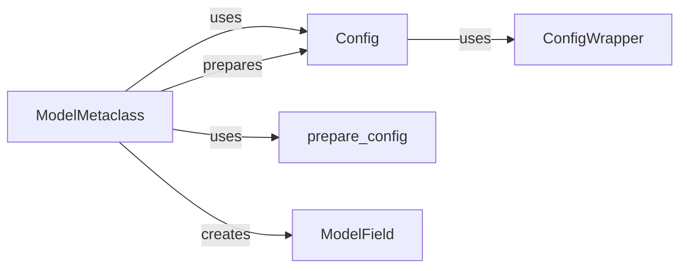

## Component Details

The Configuration Management System in Pydantic is responsible for defining, preparing, inheriting, and accessing configuration settings for Pydantic models. It allows customization of model behavior and validation rules. The system revolves around the `Config` class, which specifies configuration options, and the `ConfigWrapper`, which provides a convenient way to access these settings. The `prepare_config` function handles the inheritance and preparation of the configuration, while `ModelMetaclass` uses these components to set up the configuration during model creation. `ModelField` uses the configuration to infer properties of the model fields.

### ModelMetaclass
The `ModelMetaclass` is a metaclass that intercepts class creation to inject Pydantic's logic for field validation and configuration. It orchestrates configuration inheritance, validator extraction, field inference, and signature generation.

**Related Classes/Methods**:

- <a href="https://github.com/pydantic/pydantic/blob/master/pydantic/v1/main.py#L123-L302" target="_blank" rel="noopener noreferrer">`pydantic.v1.main.ModelMetaclass:__new__` (123:302)</a>

### Config
The `Config` component defines configuration settings for Pydantic models, controlling aspects like field alias generation, extra field handling, and JSON schema customization. It's used to prepare and inherit configurations.

**Related Classes/Methods**:

- <a href="https://github.com/pydantic/pydantic/blob/master/pydantic/v1/config.py#L186-L191" target="_blank" rel="noopener noreferrer">`pydantic.v1.config:prepare_config` (186:191)</a>
- <a href="https://github.com/pydantic/pydantic/blob/master/pydantic/v1/config.py#L169-L183" target="_blank" rel="noopener noreferrer">`pydantic.v1.config.inherit_config` (169:183)</a>
- `pydantic.config.BaseConfig` (full file reference)

### ConfigWrapper
The `ConfigWrapper` component manages and provides access to configuration settings for Pydantic models. It encapsulates configuration data and provides methods for retrieving specific configuration values.

**Related Classes/Methods**:

- <a href="https://github.com/pydantic/pydantic/blob/master/pydantic/_internal/_config.py#L94-L98" target="_blank" rel="noopener noreferrer">`pydantic._internal._config.ConfigWrapper:__init__` (94:98)</a>
- <a href="https://github.com/pydantic/pydantic/blob/master/pydantic/_internal/_config.py#L101-L144" target="_blank" rel="noopener noreferrer">`pydantic._internal._config.ConfigWrapper:for_model` (101:144)</a>
- <a href="https://github.com/pydantic/pydantic/blob/master/pydantic/_internal/_config.py#L158-L228" target="_blank" rel="noopener noreferrer">`pydantic._internal._config.ConfigWrapper:core_config` (158:228)</a>

### prepare_config
The `prepare_config` function prepares the configuration for a Pydantic model, handling inheritance and deprecation checks.

**Related Classes/Methods**:

- <a href="https://github.com/pydantic/pydantic/blob/master/pydantic/_internal/_config.py#L310-L328" target="_blank" rel="noopener noreferrer">`pydantic._internal._config:prepare_config` (310:328)</a>

### ModelField
The `ModelField` component represents a single field within a Pydantic model, storing information about its type, default value, required status, and validators. It infers field properties and ensures value conformance.

**Related Classes/Methods**:

- <a href="https://github.com/pydantic/pydantic/blob/master/pydantic/v1/fields.py#L484-L514" target="_blank" rel="noopener noreferrer">`pydantic.v1.fields.ModelField.infer` (484:514)</a>