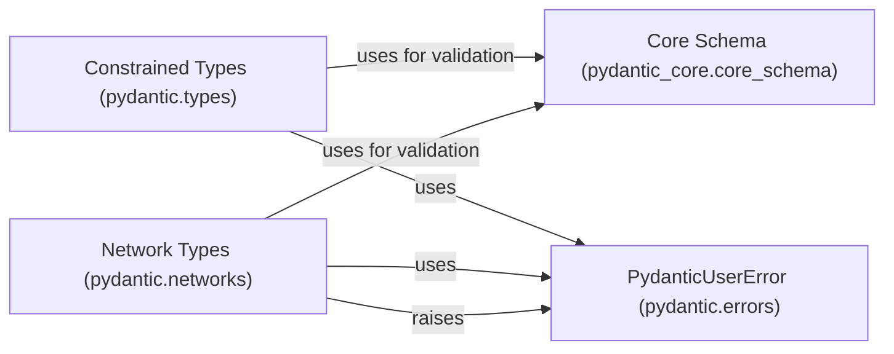

## Component Details

This component defines data types with constraints, including strings, numbers, and URLs. It provides classes for constrained types (e.g., `constr`, `conint`) and network-related types (e.g., `EmailStr`, `AnyUrl`). It offers pre-built types for common data formats and validation rules, leveraging `pydantic_core` for schema generation and validation. The component uses `PydanticUserError` to raise exceptions when validation fails.

### Constrained Types (pydantic.types)
Defines constrained types like `conint`, `confloat`, `constr`, etc., allowing specification of validation rules such as minimum/maximum values and regex patterns. It uses `pydantic_core` for schema generation and validation.

**Related Classes/Methods**:

- <a href="https://github.com/pydantic/pydantic/blob/master/pydantic/types.py#L151-L235" target="_blank" rel="noopener noreferrer">`pydantic.types:conint` (151:235)</a>
- <a href="https://github.com/pydantic/pydantic/blob/master/pydantic/types.py#L411-L497" target="_blank" rel="noopener noreferrer">`pydantic.types:confloat` (411:497)</a>
- <a href="https://github.com/pydantic/pydantic/blob/master/pydantic/types.py#L663-L683" target="_blank" rel="noopener noreferrer">`pydantic.types:conbytes` (663:683)</a>
- <a href="https://github.com/pydantic/pydantic/blob/master/pydantic/types.py#L694-L746" target="_blank" rel="noopener noreferrer">`pydantic.types.StringConstraints` (694:746)</a>
- <a href="https://github.com/pydantic/pydantic/blob/master/pydantic/types.py#L749-L828" target="_blank" rel="noopener noreferrer">`pydantic.types:constr` (749:828)</a>
- <a href="https://github.com/pydantic/pydantic/blob/master/pydantic/types.py#L1041-L1132" target="_blank" rel="noopener noreferrer">`pydantic.types:condecimal` (1041:1132)</a>

### Network Types (pydantic.networks)
Defines network-related types like `EmailStr` and `AnyUrl`, providing validation for email addresses and URLs. It uses `pydantic_core` for schema definition and validation and may rely on external libraries like `email_validator` for email validation.

**Related Classes/Methods**:

- <a href="https://github.com/pydantic/pydantic/blob/master/pydantic/networks.py#L71-L120" target="_blank" rel="noopener noreferrer">`pydantic.networks.UrlConstraints` (71:120)</a>
- <a href="https://github.com/pydantic/pydantic/blob/master/pydantic/networks.py#L123-L340" target="_blank" rel="noopener noreferrer">`pydantic.networks._BaseUrl` (123:340)</a>
- <a href="https://github.com/pydantic/pydantic/blob/master/pydantic/networks.py#L343-L526" target="_blank" rel="noopener noreferrer">`pydantic.networks._BaseMultiHostUrl` (343:526)</a>
- <a href="https://github.com/pydantic/pydantic/blob/master/pydantic/networks.py#L1002-L1088" target="_blank" rel="noopener noreferrer">`pydantic.networks.NameEmail` (1002:1088)</a>
- <a href="https://github.com/pydantic/pydantic/blob/master/pydantic/networks.py#L1264-L1309" target="_blank" rel="noopener noreferrer">`pydantic.networks:validate_email` (1264:1309)</a>
- <a href="https://github.com/pydantic/pydantic/blob/master/pydantic/networks.py#L943-L950" target="_blank" rel="noopener noreferrer">`pydantic.networks.import_email_validator` (943:950)</a>

### Core Schema (pydantic_core.core_schema)
Provides the core schema definitions used for validation and serialization within Pydantic. It includes schemas for various data types and validation strategies, acting as the foundation for defining how data should be validated and processed.

**Related Classes/Methods**:

- `pydantic_core.core_schema.no_info_wrap_validator_function` (full file reference)
- `pydantic_core.core_schema.url_schema` (full file reference)
- `pydantic_core.core_schema.plain_serializer_function_ser_schema` (full file reference)
- `pydantic_core.core_schema.multi_host_url_schema` (full file reference)
- `pydantic_core.core_schema.no_info_after_validator_function` (full file reference)
- `pydantic_core.core_schema.json_or_python_schema` (full file reference)
- `pydantic_core.core_schema.str_schema` (full file reference)
- `pydantic_core.core_schema.union_schema` (full file reference)
- `pydantic_core.core_schema.is_instance_schema` (full file reference)
- `pydantic_core.core_schema.to_string_ser_schema` (full file reference)
- `pydantic_core.core_schema.uuid_schema` (full file reference)
- `pydantic_core.core_schema.with_info_after_validator_function` (full file reference)
- `pydantic_core.core_schema.int_schema` (full file reference)
- `pydantic_core.core_schema.any_schema` (full file reference)
- `pydantic_core.core_schema.with_default_schema` (full file reference)
- `pydantic_core.core_schema.lax_or_strict_schema` (full file reference)
- `pydantic_core.core_schema.tagged_union_schema` (full file reference)

### PydanticUserError (pydantic.errors)
Represents custom exception raised by pydantic when validation fails or when there are user-related errors. It provides a way to signal specific error conditions to the user.

**Related Classes/Methods**:

- <a href="https://github.com/pydantic/pydantic/blob/master/pydantic/errors.py#L101-L102" target="_blank" rel="noopener noreferrer">`pydantic.errors.PydanticUserError` (101:102)</a>