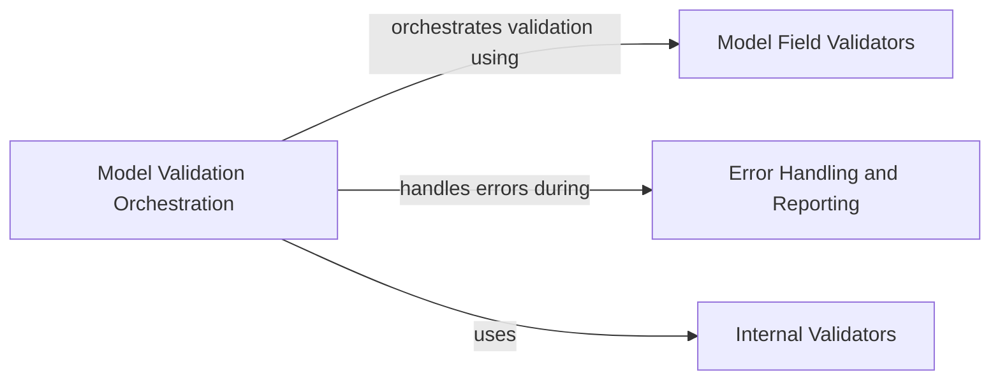

## Component Details

The Data Validation Engine is responsible for ensuring that input data conforms to the defined data models. It leverages pydantic's validation capabilities, including custom validators and error handling, to guarantee data integrity. The engine's core functionality revolves around the `validate_model` function, which orchestrates the validation process, and the `ModelField.validate` method, which applies validators to individual fields. Errors encountered during validation are captured and managed by the `ValidationError` class, providing detailed information about validation failures.

### Model Validation Orchestration
This component serves as the entry point for the validation process. It uses `validate_model` to coordinate the validation of the entire model and `ModelField.validate` to validate individual fields within the model. It orchestrates the application of validators and handles the overall flow of the validation process.

**Related Classes/Methods**:

- `pydantic.main.validate_model` (full file reference)
- `pydantic.fields.ModelField.validate` (full file reference)

### Error Handling and Reporting
This component is responsible for capturing, aggregating, and reporting errors that occur during the validation process. The `ValidationError` class is used to collect individual errors, providing a structured way to access and analyze validation failures. ErrorWrapper wraps the errors.

**Related Classes/Methods**:

- `pydantic.error_wrappers.ValidationError` (full file reference)

### Internal Validators
This component encapsulates the internal validators used by pydantic for various data types and constraints. These validators are essential for enforcing the rules defined in the data models.

**Related Classes/Methods**:

- `pydantic._internal._validators` (full file reference)

### Model Field Validators
This component contains the methods responsible for applying validators to model fields. These methods include `_apply_validators`, `_validate_singleton`, `_validate_mapping_like`, `_validate_tuple`, `_validate_iterable`, and `_validate_sequence_like`.

**Related Classes/Methods**:

- <a href="https://github.com/pydantic/pydantic/blob/master/pydantic/v1/fields.py#L1149-L1157" target="_blank" rel="noopener noreferrer">`.mnt.e.StartUp.pydantic.pydantic.v1.fields.ModelField._apply_validators` (1149:1157)</a>
- <a href="https://github.com/pydantic/pydantic/blob/master/pydantic/v1/fields.py#L1053-L1098" target="_blank" rel="noopener noreferrer">`.mnt.e.StartUp.pydantic.pydantic.v1.fields.ModelField._validate_singleton` (1053:1098)</a>
- <a href="https://github.com/pydantic/pydantic/blob/master/pydantic/v1/fields.py#L1000-L1033" target="_blank" rel="noopener noreferrer">`.mnt.e.StartUp.pydantic.pydantic.v1.fields.ModelField._validate_mapping_like` (1000:1033)</a>
- <a href="https://github.com/pydantic/pydantic/blob/master/pydantic/v1/fields.py#L970-L998" target="_blank" rel="noopener noreferrer">`.mnt.e.StartUp.pydantic.pydantic.v1.fields.ModelField._validate_tuple` (970:998)</a>
- <a href="https://github.com/pydantic/pydantic/blob/master/pydantic/v1/fields.py#L955-L968" target="_blank" rel="noopener noreferrer">`.mnt.e.StartUp.pydantic.pydantic.v1.fields.ModelField._validate_iterable` (955:968)</a>
- <a href="https://github.com/pydantic/pydantic/blob/master/pydantic/v1/fields.py#L898-L953" target="_blank" rel="noopener noreferrer">`.mnt.e.StartUp.pydantic.pydantic.v1.fields.ModelField._validate_sequence_like` (898:953)</a>