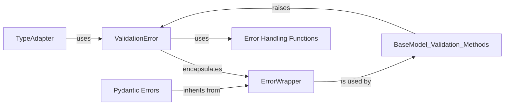

## Component Details

The Error Reporting and Handling component in Pydantic is responsible for managing and representing validation errors that occur during data validation. It defines the error hierarchy, provides classes for different error types, and offers utilities for formatting and displaying error messages. The component ensures that users receive detailed and actionable feedback when data validation fails, enabling them to identify and correct issues effectively.

### ValidationError
ValidationError is the primary exception raised when Pydantic model validation fails. It contains a list of ErrorWrapper objects, each representing a specific validation error. It provides methods for formatting these errors as JSON or a string representation, making it easier to handle and display validation issues.

**Related Classes/Methods**:

- <a href="https://github.com/pydantic/pydantic/blob/master/pydantic/v1/error_wrappers.py#L50-L79" target="_blank" rel="noopener noreferrer">`pydantic.v1.error_wrappers.ValidationError` (50:79)</a>
- <a href="https://github.com/pydantic/pydantic/blob/master/pydantic/v1/error_wrappers.py#L58-L65" target="_blank" rel="noopener noreferrer">`pydantic.v1.error_wrappers.ValidationError:errors` (58:65)</a>
- <a href="https://github.com/pydantic/pydantic/blob/master/pydantic/v1/error_wrappers.py#L67-L68" target="_blank" rel="noopener noreferrer">`pydantic.v1.error_wrappers.ValidationError:json` (67:68)</a>
- <a href="https://github.com/pydantic/pydantic/blob/master/pydantic/v1/error_wrappers.py#L70-L76" target="_blank" rel="noopener noreferrer">`pydantic.v1.error_wrappers.ValidationError:__str__` (70:76)</a>
- <a href="https://github.com/pydantic/pydantic/blob/master/pydantic/v1/error_wrappers.py#L78-L79" target="_blank" rel="noopener noreferrer">`pydantic.v1.error_wrappers.ValidationError:__repr_args__` (78:79)</a>

### ErrorWrapper
ErrorWrapper encapsulates a single validation error, storing the error's location (loc), the exception raised (exc), and the error type. It provides context for individual errors within a ValidationError, allowing for precise error reporting.

**Related Classes/Methods**:

- <a href="https://github.com/pydantic/pydantic/blob/master/pydantic/v1/error_wrappers.py#L28-L42" target="_blank" rel="noopener noreferrer">`pydantic.v1.error_wrappers.ErrorWrapper` (28:42)</a>
- <a href="https://github.com/pydantic/pydantic/blob/master/pydantic/v1/error_wrappers.py#L41-L42" target="_blank" rel="noopener noreferrer">`pydantic.v1.error_wrappers.ErrorWrapper:__repr_args__` (41:42)</a>

### Pydantic Errors
These classes define specific types of validation errors, such as type errors, value errors, and missing errors. They inherit from PydanticErrorMixin and provide specific error messages and contexts for different validation scenarios, enabling detailed and informative error reporting.

**Related Classes/Methods**:

- <a href="https://github.com/pydantic/pydantic/blob/master/pydantic/errors.py#L113-L115" target="_blank" rel="noopener noreferrer">`pydantic.errors.PydanticUndefinedAnnotation:__init__` (113:115)</a>
- <a href="https://github.com/pydantic/pydantic/blob/master/pydantic/errors.py#L118-L131" target="_blank" rel="noopener noreferrer">`pydantic.errors.PydanticUndefinedAnnotation:from_name_error` (118:131)</a>
- <a href="https://github.com/pydantic/pydantic/blob/master/pydantic/errors.py#L141-L142" target="_blank" rel="noopener noreferrer">`pydantic.errors.PydanticImportError:__init__` (141:142)</a>
- <a href="https://github.com/pydantic/pydantic/blob/master/pydantic/errors.py#L152-L153" target="_blank" rel="noopener noreferrer">`pydantic.errors.PydanticSchemaGenerationError:__init__` (152:153)</a>
- <a href="https://github.com/pydantic/pydantic/blob/master/pydantic/errors.py#L163-L164" target="_blank" rel="noopener noreferrer">`pydantic.errors.PydanticInvalidForJsonSchema:__init__` (163:164)</a>
- <a href="https://github.com/pydantic/pydantic/blob/master/pydantic/errors.py#L179-L186" target="_blank" rel="noopener noreferrer">`pydantic.errors.PydanticForbiddenQualifier:__init__` (179:186)</a>
- <a href="https://github.com/pydantic/pydantic/blob/master/pydantic/v1/errors.py#L205-L206" target="_blank" rel="noopener noreferrer">`pydantic.v1.errors.UrlSchemePermittedError:__init__` (205:206)</a>
- <a href="https://github.com/pydantic/pydantic/blob/master/pydantic/v1/errors.py#L255-L256" target="_blank" rel="noopener noreferrer">`pydantic.v1.errors._PathValueError:__init__` (255:256)</a>
- <a href="https://github.com/pydantic/pydantic/blob/master/pydantic/v1/errors.py#L310-L311" target="_blank" rel="noopener noreferrer">`pydantic.v1.errors.TupleLengthError:__init__` (310:311)</a>
- <a href="https://github.com/pydantic/pydantic/blob/master/pydantic/v1/errors.py#L318-L319" target="_blank" rel="noopener noreferrer">`pydantic.v1.errors.ListMinLengthError:__init__` (318:319)</a>
- <a href="https://github.com/pydantic/pydantic/blob/master/pydantic/v1/errors.py#L326-L327" target="_blank" rel="noopener noreferrer">`pydantic.v1.errors.ListMaxLengthError:__init__` (326:327)</a>
- <a href="https://github.com/pydantic/pydantic/blob/master/pydantic/v1/errors.py#L339-L340" target="_blank" rel="noopener noreferrer">`pydantic.v1.errors.SetMinLengthError:__init__` (339:340)</a>
- <a href="https://github.com/pydantic/pydantic/blob/master/pydantic/v1/errors.py#L347-L348" target="_blank" rel="noopener noreferrer">`pydantic.v1.errors.SetMaxLengthError:__init__` (347:348)</a>
- <a href="https://github.com/pydantic/pydantic/blob/master/pydantic/v1/errors.py#L355-L356" target="_blank" rel="noopener noreferrer">`pydantic.v1.errors.FrozenSetMinLengthError:__init__` (355:356)</a>
- <a href="https://github.com/pydantic/pydantic/blob/master/pydantic/v1/errors.py#L363-L364" target="_blank" rel="noopener noreferrer">`pydantic.v1.errors.FrozenSetMaxLengthError:__init__` (363:364)</a>
- <a href="https://github.com/pydantic/pydantic/blob/master/pydantic/v1/errors.py#L371-L372" target="_blank" rel="noopener noreferrer">`pydantic.v1.errors.AnyStrMinLengthError:__init__` (371:372)</a>
- <a href="https://github.com/pydantic/pydantic/blob/master/pydantic/v1/errors.py#L379-L380" target="_blank" rel="noopener noreferrer">`pydantic.v1.errors.AnyStrMaxLengthError:__init__` (379:380)</a>
- <a href="https://github.com/pydantic/pydantic/blob/master/pydantic/v1/errors.py#L391-L392" target="_blank" rel="noopener noreferrer">`pydantic.v1.errors.StrRegexError:__init__` (391:392)</a>
- <a href="https://github.com/pydantic/pydantic/blob/master/pydantic/v1/errors.py#L396-L397" target="_blank" rel="noopener noreferrer">`pydantic.v1.errors._NumberBoundError:__init__` (396:397)</a>
- <a href="https://github.com/pydantic/pydantic/blob/master/pydantic/v1/errors.py#L429-L430" target="_blank" rel="noopener noreferrer">`pydantic.v1.errors.NumberNotMultipleError:__init__` (429:430)</a>
- <a href="https://github.com/pydantic/pydantic/blob/master/pydantic/v1/errors.py#L446-L447" target="_blank" rel="noopener noreferrer">`pydantic.v1.errors.DecimalMaxDigitsError:__init__` (446:447)</a>
- <a href="https://github.com/pydantic/pydantic/blob/master/pydantic/v1/errors.py#L454-L455" target="_blank" rel="noopener noreferrer">`pydantic.v1.errors.DecimalMaxPlacesError:__init__` (454:455)</a>
- <a href="https://github.com/pydantic/pydantic/blob/master/pydantic/v1/errors.py#L462-L463" target="_blank" rel="noopener noreferrer">`pydantic.v1.errors.DecimalWholeDigitsError:__init__` (462:463)</a>
- <a href="https://github.com/pydantic/pydantic/blob/master/pydantic/v1/errors.py#L504-L505" target="_blank" rel="noopener noreferrer">`pydantic.v1.errors.UUIDVersionError:__init__` (504:505)</a>
- <a href="https://github.com/pydantic/pydantic/blob/master/pydantic/v1/errors.py#L512-L513" target="_blank" rel="noopener noreferrer">`pydantic.v1.errors.ArbitraryTypeError:__init__` (512:513)</a>
- <a href="https://github.com/pydantic/pydantic/blob/master/pydantic/v1/errors.py#L525-L526" target="_blank" rel="noopener noreferrer">`pydantic.v1.errors.SubclassError:__init__` (525:526)</a>
- <a href="https://github.com/pydantic/pydantic/blob/master/pydantic/v1/errors.py#L641-L646" target="_blank" rel="noopener noreferrer">`pydantic.v1.errors.InvalidDiscriminator:__init__` (641:646)</a>

### Error Handling Functions
These functions provide utilities for processing and formatting errors. `flatten_errors` transforms a nested error structure into a flat list. `error_dict` converts errors into a dictionary format. `get_exc_type` retrieves the exception type. `display_errors` formats errors for display, aiding in debugging and user communication.

**Related Classes/Methods**:

- <a href="https://github.com/pydantic/pydantic/blob/master/pydantic/v1/error_wrappers.py#L82-L83" target="_blank" rel="noopener noreferrer">`pydantic.v1.error_wrappers:display_errors` (82:83)</a>
- <a href="https://github.com/pydantic/pydantic/blob/master/pydantic/v1/error_wrappers.py#L99-L116" target="_blank" rel="noopener noreferrer">`pydantic.v1.error_wrappers:flatten_errors` (99:116)</a>
- <a href="https://github.com/pydantic/pydantic/blob/master/pydantic/v1/error_wrappers.py#L119-L133" target="_blank" rel="noopener noreferrer">`pydantic.v1.error_wrappers:error_dict` (119:133)</a>
- <a href="https://github.com/pydantic/pydantic/blob/master/pydantic/v1/error_wrappers.py#L139-L146" target="_blank" rel="noopener noreferrer">`pydantic.v1.error_wrappers:get_exc_type` (139:146)</a>