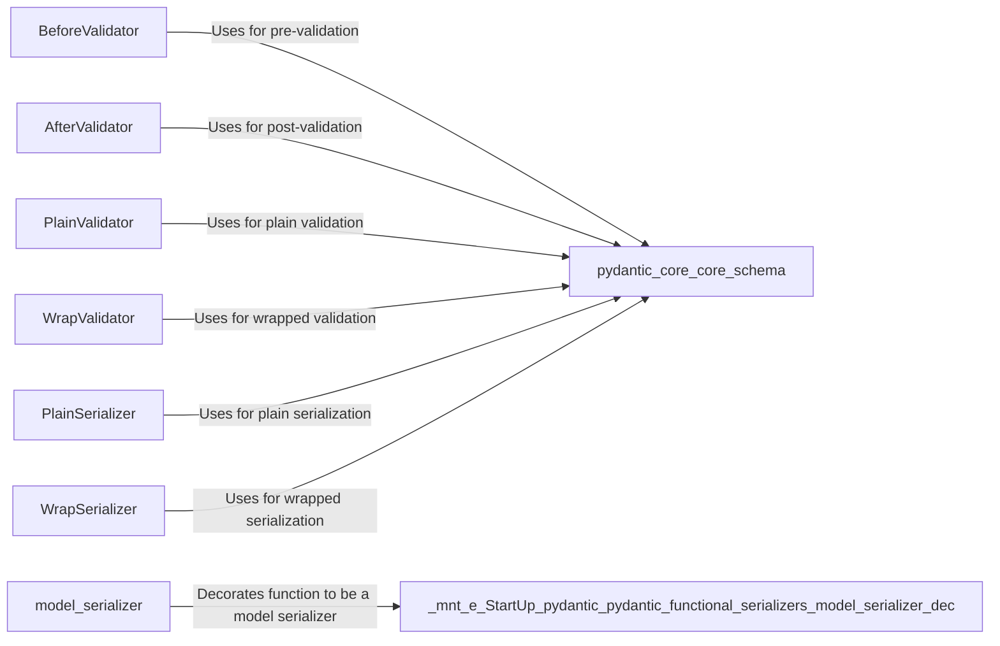

## Component Details

The Functional Validation and Serialization component in Pydantic provides a flexible way to customize data validation and serialization using functions. It includes classes and decorators that allow developers to define pre-validation, post-validation, and custom serialization logic. These utilities enable the transformation and validation of data as it enters and exits Pydantic models, ensuring data integrity and adaptability.

### BeforeValidator
The `BeforeValidator` class adapts a Python function to act as a pre-validation step. It allows for modifications or checks on the input data before it is validated by Pydantic. It uses `pydantic_core` schemas to integrate the function into the validation process.

**Related Classes/Methods**:

- <a href="https://github.com/pydantic/pydantic/blob/master/pydantic/functional_validators.py#L88-L151" target="_blank" rel="noopener noreferrer">`pydantic.functional_validators.BeforeValidator` (88:151)</a>
- <a href="https://github.com/pydantic/pydantic/blob/master/pydantic/functional_validators.py#L124-L144" target="_blank" rel="noopener noreferrer">`pydantic.functional_validators.BeforeValidator:__get_pydantic_core_schema__` (124:144)</a>
- <a href="https://github.com/pydantic/pydantic/blob/master/pydantic/functional_validators.py#L147-L151" target="_blank" rel="noopener noreferrer">`pydantic.functional_validators.BeforeValidator:_from_decorator` (147:151)</a>

### AfterValidator
The `AfterValidator` class defines a validator that executes after the main validation process. It adapts a Python function to act as a post-validation step, allowing for modifications or checks on the validated data. It uses `pydantic_core` schemas to integrate the function into the validation process.

**Related Classes/Methods**:

- <a href="https://github.com/pydantic/pydantic/blob/master/pydantic/functional_validators.py#L27-L84" target="_blank" rel="noopener noreferrer">`pydantic.functional_validators.AfterValidator` (27:84)</a>
- <a href="https://github.com/pydantic/pydantic/blob/master/pydantic/functional_validators.py#L72-L80" target="_blank" rel="noopener noreferrer">`pydantic.functional_validators.AfterValidator:__get_pydantic_core_schema__` (72:80)</a>
- <a href="https://github.com/pydantic/pydantic/blob/master/pydantic/functional_validators.py#L83-L84" target="_blank" rel="noopener noreferrer">`pydantic.functional_validators.AfterValidator:_from_decorator` (83:84)</a>

### PlainValidator
The `PlainValidator` class adapts a plain Python function for validation within Pydantic. It converts the function into a `pydantic-core` schema, enabling its use as a validator for Pydantic models. It interacts with `pydantic_core.core_schema` to create the schema.

**Related Classes/Methods**:

- <a href="https://github.com/pydantic/pydantic/blob/master/pydantic/functional_validators.py#L155-L247" target="_blank" rel="noopener noreferrer">`pydantic.functional_validators.PlainValidator` (155:247)</a>
- <a href="https://github.com/pydantic/pydantic/blob/master/pydantic/functional_validators.py#L201-L240" target="_blank" rel="noopener noreferrer">`pydantic.functional_validators.PlainValidator:__get_pydantic_core_schema__` (201:240)</a>
- <a href="https://github.com/pydantic/pydantic/blob/master/pydantic/functional_validators.py#L243-L247" target="_blank" rel="noopener noreferrer">`pydantic.functional_validators.PlainValidator:_from_decorator` (243:247)</a>

### WrapValidator
The `WrapValidator` class adapts a Python function that wraps the validation process. It converts the function into a `pydantic-core` schema, enabling its use as a validator for Pydantic models. It interacts with `pydantic_core.core_schema` to create the schema.

**Related Classes/Methods**:

- <a href="https://github.com/pydantic/pydantic/blob/master/pydantic/functional_validators.py#L251-L322" target="_blank" rel="noopener noreferrer">`pydantic.functional_validators.WrapValidator` (251:322)</a>
- <a href="https://github.com/pydantic/pydantic/blob/master/pydantic/functional_validators.py#L293-L315" target="_blank" rel="noopener noreferrer">`pydantic.functional_validators.WrapValidator:__get_pydantic_core_schema__` (293:315)</a>
- <a href="https://github.com/pydantic/pydantic/blob/master/pydantic/functional_validators.py#L318-L322" target="_blank" rel="noopener noreferrer">`pydantic.functional_validators.WrapValidator:_from_decorator` (318:322)</a>

### PlainSerializer
The `PlainSerializer` class adapts a plain Python function for serialization within Pydantic. It converts the function into a `pydantic-core` schema, enabling its use as a serializer for Pydantic models. It interacts with `pydantic_core.core_schema` to create the schema.

**Related Classes/Methods**:

- <a href="https://github.com/pydantic/pydantic/blob/master/pydantic/functional_serializers.py#L19-L85" target="_blank" rel="noopener noreferrer">`pydantic.functional_serializers.PlainSerializer` (19:85)</a>
- <a href="https://github.com/pydantic/pydantic/blob/master/pydantic/functional_serializers.py#L53-L85" target="_blank" rel="noopener noreferrer">`pydantic.functional_serializers.PlainSerializer:__get_pydantic_core_schema__` (53:85)</a>

### WrapSerializer
The `WrapSerializer` class adapts a Python function that wraps the serialization process. It converts the function into a `pydantic-core` schema, enabling its use as a serializer for Pydantic models. It interacts with `pydantic_core.core_schema` to create the schema.

**Related Classes/Methods**:

- <a href="https://github.com/pydantic/pydantic/blob/master/pydantic/functional_serializers.py#L89-L188" target="_blank" rel="noopener noreferrer">`pydantic.functional_serializers.WrapSerializer` (89:188)</a>
- <a href="https://github.com/pydantic/pydantic/blob/master/pydantic/functional_serializers.py#L156-L188" target="_blank" rel="noopener noreferrer">`pydantic.functional_serializers.WrapSerializer:__get_pydantic_core_schema__` (156:188)</a>

### model_serializer
The `model_serializer` decorator marks a function as a serializer for a Pydantic model. It transforms the decorated function into a format compatible with Pydantic's serialization process, allowing for custom serialization logic to be applied to models.

**Related Classes/Methods**:

- <a href="https://github.com/pydantic/pydantic/blob/master/pydantic/functional_serializers.py#L328-L328" target="_blank" rel="noopener noreferrer">`pydantic.functional_serializers:model_serializer` (328:328)</a>
- `.mnt.e.StartUp.pydantic.pydantic.functional_serializers.model_serializer.dec` (full file reference)